> **TL;DR**: Every time you train a neural network, you're solving an optimization problem in a space with millions of dimensions. This is the story of how we went from basic SGD taking baby steps to Adam's intelligent adaptive learning—and why choosing the right optimizer can make or break your model.

> These paper reviews are written more for me and less for others. LLMs have been used in formatting!
{: .prompt-tip }

## The Mountain Climbing Problem: Why Optimization is Hard

### Imagine Being Lost in the Dark

Picture yourself on a mountainous landscape at night, trying to find the lowest valley with only a flashlight. You can see the immediate slope under your feet, but the entire terrain is invisible. This is exactly what **neural network optimization** looks like.

**The challenge:**
- **Millions of parameters** = millions of dimensions
- **No global view** = only local gradient information
- **Multiple valleys** = many local minima to get trapped in
- **Noisy terrain** = stochastic gradients from mini-batches


### The Classical Methods Hit a Wall

**Newton's Method** uses second-order information (curvature):
$$\theta_{t+1} = \theta_t - H^{-1} \nabla J(\theta_t)$$

**Perfect in theory, impossible in practice:**
- Computing the Hessian $H$ for millions of parameters? 
- Inverting it? 
- Storage requirements? 

**The Revolution:** What if we don't need perfect information? What if **good enough** gradients from small batches could guide us to excellent solutions?

---

## SGD: The Foundation That Changed Everything

### The Breakthrough Insight

Instead of using the entire dataset to compute gradients:

$$\nabla J(\theta) = \frac{1}{N} \sum_{i=1}^{N} \nabla J_i(\theta)$$

**Stochastic Gradient Descent** uses random mini-batches:

$$\theta_{t+1} = \theta_t - \eta \nabla J_{\text{batch}}(\theta_t)$$

**Why this works (the statistical magic):**
- Each mini-batch gradient is an **unbiased estimator** of the true gradient
- The noise actually **helps escape sharp minima**
- Computational cost becomes **independent of dataset size**

### The Mini-Batch Sweet Spot


**The Goldilocks principle:**
- **Too small**: Noisy, erratic updates
- **Too large**: Expensive, may get stuck
- **Just right**: 32-256 examples usually optimal

### SGD's Fundamental Limitations

**The Narrow Valley Problem:**


1. **Learning rate sensitivity**: Too high → divergence, too low → crawling
2. **Uniform treatment**: Same learning rate for all parameters
3. **Ravine oscillations**: Bounces between steep walls instead of following the valley

---

## Momentum: Adding Physics to Optimization

### The Ball Rolling Down a Hill

**Key insight:** Treat parameter updates like physics—build up velocity over time.

$$v_t = \beta v_{t-1} + \eta \nabla J(\theta_t)$$

$$\theta_{t+1} = \theta_t - v_t$$

**Physical intuition:**
- $v_t$ is **velocity** (momentum term)
- $\beta$ is **friction** (typically 0.9)
- Gradients apply **force** to change velocity

### Why Momentum Works Magic

**Acceleration in Consistent Directions:**


**Damping Oscillations:**


### Nesterov's Lookahead Trick

**Standard momentum:** Look at current position, then step
**Nesterov momentum:** Look ahead, then decide

$$v_t = \beta v_{t-1} + \eta \nabla J(\theta_t - \beta v_{t-1})$$

**Result:** Better convergence properties, especially near the minimum.

### The Momentum Evolution

| Method | Formula | Key Benefit | Limitation |
|--------|---------|-------------|------------|
| **SGD** | $\theta \leftarrow \theta - \eta \nabla J$ | Simple, reliable | Slow, oscillates |
| **Momentum** | $v \leftarrow \beta v + \eta \nabla J$ | Faster, smoother | Still uniform LR |
| **Nesterov** | Lookahead gradient | Better near minimum | More complex |

---

## AdaGrad: The First Adaptive Revolution

### The Eureka Moment

**What if different parameters need different learning rates?**

AdaGrad's insight: Parameters with large historical gradients should get smaller learning rates.

  $$G_t = G_{t-1} + \nabla J(\theta_t)^2$$

  $$\theta_{t+1} = \theta_t - \frac{\eta}{\sqrt{G_t + \epsilon}} \nabla J(\theta_t)$$

### Why Adaptive Learning Rates Work

**The Sparse Data Problem:**


**In NLP contexts:**
- Common words appear frequently → accumulate large $G_t$ → get smaller updates
- Rare words appear seldom → small $G_t$ → get larger updates when they do appear
- **Result:** Balanced learning across vocabulary

### AdaGrad's Fatal Flaw

**The Monotonic Accumulation Problem:**

$$G_t = G_{t-1} + \nabla J(\theta_t)^2 \quad \text{(only grows, never shrinks)}$$


**The death sentence:** Eventually, $\frac{\eta}{\sqrt{G_t}} \rightarrow 0$ for all parameters.

---

## RMSProp: The Elegant Fix

### Forgetting the Distant Past

**Hinton's insight:** Use exponential moving average instead of accumulating everything.

$$G_t = \beta G_{t-1} + (1-\beta) \nabla J(\theta_t)^2$$

**The magic of exponential decay:**
- Recent gradients get weight $(1-\beta)$
- Gradients from $k$ steps ago get weight $(1-\beta)\beta^k$
- Old gradients fade away gracefully


**Mathematical insight:**

  $$\lim_{t \rightarrow \infty} G_t^{\text{AdaGrad}} = \infty$$

  $$\lim_{t \rightarrow \infty} G_t^{\text{RMSProp}} = \text{bounded}$$

### The Practical Success Story

RMSProp became popular not through academic papers, but through **Geoffrey Hinton's Coursera course**—a testament to its practical effectiveness over theoretical elegance.

---

## Adam: The Convergence of Ideas

### Best of All Worlds

**Adam** combines momentum (first moment) with RMSProp (second moment):

  $$m_t = \beta_1 m_{t-1} + (1-\beta_1) \nabla J(\theta_t) \quad \text{(momentum)}$$

  $$v_t = \beta_2 v_{t-1} + (1-\beta_2) \nabla J(\theta_t)^2 \quad \text{(RMSProp)}$$

### The Bias Correction Breakthrough

**The early training problem:**
- Both $m_t$ and $v_t$ start at zero
- Early estimates are **biased toward zero**
- Without correction: tiny steps initially

**The solution:**
$$\hat{m}_t = \frac{m_t}{1 - \beta_1^t}, \quad \hat{v}_t = \frac{v_t}{1 - \beta_2^t}$$

**Final update:**
$$\theta_{t+1} = \theta_t - \frac{\eta}{\sqrt{\hat{v}_t} + \epsilon} \hat{m}_t$$

### Bias Correction Visualization

| Iteration | $1-\beta_1^t$ | $1-\beta_2^t$ | Effect |
|-----------|---------------|---------------|---------|
| $t=1$ | $0.1$ | $0.001$ | **Huge correction** |
| $t=10$ | $0.65$ | $0.01$ | Moderate correction |
| $t=100$ | $0.99997$ | $0.63$ | Minimal correction |
| $t→∞$ | $1.0$ | $1.0$ | No correction needed |

**The beautiful result:** Adam takes appropriately-sized steps from iteration 1, not after a "warm-up" period.

### Why Adam Became King

**The quadruple advantage:**
1. ✅ **Momentum** for smooth progress
2. ✅ **Adaptive learning rates** per parameter  
3. ✅ **Bias correction** for good early steps
4. ✅ **Robust defaults** that work across problems

**Default hyperparameters that just work:**
- $\beta_1 = 0.9$ (momentum decay)
- $\beta_2 = 0.999$ (second moment decay)  
- $\eta = 0.001$ (learning rate)
- $\epsilon = 10^{-8}$ (numerical stability)

---

## AdamW: The Weight Decay Fix

### The Subtle but Critical Problem

**Standard Adam with L2 regularization:**
$$\theta_{t+1} = \theta_t - \frac{\eta}{\sqrt{\hat{v}_t} + \epsilon} (\hat{m}_t + \lambda \theta_t)$$

**The issue:** Weight decay gets scaled by the adaptive learning rates, causing **inconsistent regularization**.

### Decoupled Weight Decay

**AdamW's fix:**
$$\theta_{t+1} = \theta_t - \frac{\eta}{\sqrt{\hat{v}_t} + \epsilon} \hat{m}_t - \eta \lambda \theta_t$$

**Key difference:** Weight decay is **separated** from gradient-based updates.

### Why This Matters for Large Models


**Impact:** AdamW became the optimizer behind most state-of-the-art language models (GPT, BERT, etc.).

---

## The Optimizer Family Tree


---

## Learning Rate Scheduling: The Temporal Dimension

### Why Constant Rates Aren't Optimal

**The training phases:**
1. **Early**: Large steps to find good regions quickly
2. **Middle**: Moderate steps for steady progress  
3. **Late**: Small steps for fine-tuning

### Popular Scheduling Strategies

**Step Decay:**
$$\eta_t = \eta_0 \times \gamma^{\lfloor t/s \rfloor}$$

**Cosine Annealing:**
$$\eta_t = \eta_{\min} + \frac{\eta_{\max} - \eta_{\min}}{2}(1 + \cos(\frac{\pi t}{T}))$$

**Warmup + Decay:**

```mermaid
graph LR
   A[Linear Warmup<br/>0 → η_max] --> B[Cosine Decay<br/>η_max → η_min]
   
   style A fill:#dd6b20,color:#fff
   style B fill:#3182ce,color:#fff
```


### The Warmup Phenomenon

**Why warmup helps large models:**
- Random initialization → gradients can be very large/small
- Gradual LR increase → optimizer finds good initial direction
- Prevents early instability in large batch training

---

## The Modern Optimization Landscape

### When to Use What: The Decision Matrix

| Scenario | Recommended Optimizer | Learning Rate | Schedule | Why |
|----------|----------------------|---------------|----------|-----|
| **Getting Started** | AdamW | 0.001 | Cosine | Robust defaults |
| **Computer Vision** | SGD + Momentum | 0.01-0.1 | Step decay | Often better final accuracy |
| **NLP/Transformers** | AdamW | 1e-4 to 5e-4 | Warmup + decay | Field standard |
| **RNNs/LSTMs** | Adam/RMSProp | 0.001 | Reduce on plateau | Handles gradients well |
| **Limited Compute** | SGD + Momentum | 0.01 | Step decay | Lower memory overhead |

### Performance Comparison Matrix

| Optimizer | Speed | Memory | Robustness | Final Quality | Best For |
|-----------|-------|--------|------------|---------------|----------|
| **SGD** | ⭐⭐⭐ | ⭐⭐⭐ | ⭐⭐ | ⭐⭐⭐ | CV, when tuned well |
| **Momentum** | ⭐⭐⭐ | ⭐⭐⭐ | ⭐⭐⭐ | ⭐⭐⭐ | Most CV tasks |
| **AdaGrad** | ⭐⭐ | ⭐⭐ | ⭐⭐ | ⭐⭐ | Sparse data, short runs |
| **RMSProp** | ⭐⭐ | ⭐⭐ | ⭐⭐⭐ | ⭐⭐⭐ | RNNs, non-stationary |
| **Adam** | ⭐⭐ | ⭐⭐ | ⭐⭐⭐⭐ | ⭐⭐⭐ | General purpose |
| **AdamW** | ⭐⭐ | ⭐⭐ | ⭐⭐⭐⭐ | ⭐⭐⭐⭐ | Large models, NLP |

---

## Debugging Training: The Troubleshooting Guide

### Loss Patterns and Solutions


### The Hyperparameter Hierarchy

**Priority order for tuning:**
1. **Learning Rate** (biggest impact, tune first)
2. **Batch Size** (affects dynamics and memory)
3. **Learning Rate Schedule** (can dramatically improve convergence)
4. **Optimizer Choice** (try Adam/AdamW first, then SGD)
5. **Optimizer Parameters** (usually keep defaults)

---

## The Philosophical Impact

### What Optimization Taught Us About Learning

**Key insights from the optimization journey:**

1. **🚀 Noise can be beneficial** (SGD's stochastic nature helps escape bad minima)
2. **📈 Adaptation beats fixed rules** (adaptive learning rates outperform constant ones)
3. **🔄 History matters** (momentum and moving averages provide crucial context)
4. **⚖️ Balance is key** (trade-offs between speed, stability, and final quality)

### The Meta-Lesson

**Optimization isn't just about math—it's about understanding the learning process itself.**

The evolution from SGD to Adam mirrors how we learn:
- Start with big, exploratory steps
- Build momentum when making progress  
- Adapt based on experience
- Fine-tune as we approach mastery

---

## Implementation Deep Dive

### PyTorch Quick Reference

```python
# The essentials
import torch.optim as optim

# SGD with momentum (CV standard)
optimizer = optim.SGD(model.parameters(), 
                     lr=0.01, momentum=0.9, weight_decay=1e-4)

# Adam (general purpose)
optimizer = optim.Adam(model.parameters(), 
                      lr=0.001, betas=(0.9, 0.999))

# AdamW (modern default)
optimizer = optim.AdamW(model.parameters(), 
                       lr=0.001, weight_decay=0.01)

# With scheduling
scheduler = optim.lr_scheduler.CosineAnnealingLR(optimizer, T_max=epochs)
```

### The Training Loop Template

```python
for epoch in range(epochs):
    for batch in dataloader:
        # Forward pass
        outputs = model(batch.x)
        loss = criterion(outputs, batch.y)
        
        # Backward pass
        optimizer.zero_grad()  # Clear gradients
        loss.backward()        # Compute gradients
        
        # Optional: gradient clipping
        torch.nn.utils.clip_grad_norm_(model.parameters(), max_norm=1.0)
        
        optimizer.step()       # Update parameters
    
    scheduler.step()          # Update learning rate
```

---

## Empirical Wisdom: What Really Works

### The 80/20 Rules

**80% of optimization success comes from:**
1. ✅ **Choosing the right learning rate**
2. ✅ **Using a learning rate schedule**  
3. ✅ **Picking AdamW for most problems**
4. ✅ **Adding warmup for large models**

**The remaining 20%:**
- Fine-tuning momentum/beta parameters
- Specialized optimizers for specific domains
- Advanced techniques like gradient clipping
- Problem-specific architectural choices

### Battle-Tested Configurations

**Computer Vision (ResNet/EfficientNet):**
```python
optimizer = optim.SGD(lr=0.1, momentum=0.9, weight_decay=1e-4)
scheduler = optim.lr_scheduler.StepLR(step_size=30, gamma=0.1)
```

**Transformers (BERT/GPT style):**
```python
optimizer = optim.AdamW(lr=5e-4, weight_decay=0.01)
# Warmup for 10% of steps, then linear decay
```

**RNNs/LSTMs:**
```python
optimizer = optim.Adam(lr=0.001)
scheduler = optim.lr_scheduler.ReduceLROnPlateau(patience=5)
```

---

## Conclusion: The Optimization Odyssey

### The Journey We've Taken

From SGD's simple steps to Adam's adaptive intelligence, we've witnessed a **40-year evolution** in how machines learn:


### The Meta-Insights

**What optimization taught us about machine learning:**

1. **🎯 Simple ideas scale:** SGD's basic concept still powers trillion-parameter models
2. **🔄 Iteration beats perfection:** Practical improvements matter more than theoretical optimality
3. **📊 Empirical validation rules:** What works in practice often surprises theory
4. **⚖️ Trade-offs are everywhere:** Speed vs. stability, simplicity vs. performance

### The Practical Truth

**For most practitioners today:**
- **Start with AdamW** and cosine annealing
- **Tune learning rate first**, everything else second  
- **Use warmup** for large models or large batch sizes
- **Try SGD+momentum** for computer vision if you have time
- **Focus on architecture and data** more than optimizer tweaking

### Looking Forward

The field keeps evolving. **Future directions:**
- **Learned optimizers** that adapt to your specific problem
- **Distributed optimization** for models too large for single machines
- **Problem-aware** optimization that understands your domain
- **Meta-learning** approaches that learn how to learn

**The eternal truth:** No matter how sophisticated our optimizers become, the fundamental challenge remains the same—navigating high-dimensional landscapes toward better solutions, one step at a time.

---

## Further Reading & References

### Foundational Papers
- **SGD**: [Robbins & Monro (1951)](https://projecteuclid.org/euclid.aoms/1177729586) - The original stochastic approximation
- **Momentum**: [Polyak (1964)](https://www.sciencedirect.com/science/article/abs/pii/0041555364901375) - Heavy ball method
- **AdaGrad**: [Duchi et al. (2011)](https://jmlr.org/papers/v12/duchi11a.html) - Adaptive subgradient methods
- **Adam**: [Kingma & Ba (2014)](https://arxiv.org/abs/1412.6980) - Adam: A method for stochastic optimization
- **AdamW**: [Loshchilov & Hutter (2017)](https://arxiv.org/abs/1711.05101) - Decoupled weight decay regularization


---

*Happy optimizing! 🎯*