> **TL;DR**: Dropout started as a simple trick to prevent overfitting—randomly turn off neurons during training. But it evolved into something profound: a gateway to understanding uncertainty in deep learning. From Hinton's original binary dropout to modern variational methods, this is the story of how "controlled noise" became the foundation for reliable AI.

> These paper reviews are written more for me and less for others. LLMs have been used in formatting!
{: .prompt-tip }

## The Overfitting Crisis That Started It All

### When Smart Networks Become Too Smart

Picture this: You've trained a neural network that achieves 99% accuracy on training data but crashes to 60% on real-world data. **Welcome to overfitting hell.**

Before 2012, deep networks were notorious for this problem. They would memorize training examples like students cramming for exams—perfect recall, zero understanding.

```mermaid
flowchart LR
    A["Training Data<br/>99% Accuracy"] --> B["Overfitted Model<br/>Memorizes Everything"]
    B --> C["Real World Data<br/>60% Accuracy 💥"]
    
    style A fill:#e1f5fe,stroke:#01579b,stroke-width:2px,color:#000
    style B fill:#fff3e0,stroke:#e65100,stroke-width:2px,color:#000
    style C fill:#ffebee,stroke:#c62828,stroke-width:2px,color:#000
```



### The Old Guard: L1/L2 and Their Limitations

Traditional regularization methods tried to solve this by **constraining weights**:

| Method | How It Works | The Problem |
|--------|-------------|-------------|
| **L2 (Ridge)** | $\mathcal{L} = \mathcal{L}_{original} + \lambda \sum w_i^2$ | Shrinks weights but doesn't stop **co-adaptation** |
| **L1 (Lasso)** | $\mathcal{L} = \mathcal{L}_{original} + \lambda \sum \|w_i\|$ | Creates sparsity but limited in deep networks |
| **Early Stopping** | Stop when validation error increases | Requires careful tuning, may stop too early |

**The fundamental problem they missed**: Neurons were forming **conspiracies**—complex dependencies where removing any single neuron would break the entire network.

---

## Hinton's Revolutionary Insight: Embrace the Chaos

### The Dropout Breakthrough (2012)

Geoffrey Hinton had a deceptively simple idea:

> **"What if we randomly shut off neurons during training to prevent them from co-adapting?"**

This wasn't just regularization—it was **forced independence**. By randomly removing neurons, the network couldn't rely on complex conspiracies between units.

### The Binary Dropout Mechanism

```python
def dropout_forward(x, p=0.5, training=True):
    if training:
        # Bernoulli coin flip for each neuron
        mask = np.random.binomial(1, p, size=x.shape) / p
        return x * mask
    else:
        return x  # No dropout during inference
```

**The magic happens in that simple mask:**

```mermaid
graph LR
    A["Input Layer<br/>[2.0, 3.0, 1.5, 4.0]"] --> B["Dropout Mask<br/>[1, 0, 1, 0] → [2, 0, 2, 0]"]
    B --> C["Output<br/>[4.0, 0.0, 3.0, 0.0]"]
    
    style A fill:#e8f5e8,stroke:#2e7d32,stroke-width:2px,color:#000
    style B fill:#fff3e0,stroke:#f57c00,stroke-width:2px,color:#000
    style C fill:#e3f2fd,stroke:#1976d2,stroke-width:2px,color:#000
```



**Why the `/p` scaling?** To maintain the **expected output value**:
- Without scaling: E[output] changes between training and inference
- With scaling: E[scaled_output] = E[original_output]

### The Ensemble Interpretation

Here's the profound insight: **Dropout trains an exponential ensemble of networks simultaneously.**

With $n$ neurons and dropout probability $p$, you're training $2^n$ different sub-networks, each sampled with probability $p^k(1-p)^{n-k}$ where $k$ is the number of active neurons.

---

## Beyond Binary: The Gaussian Revolution

### Why Continuous Noise?

Binary dropout is like using a sledgehammer—neurons are either **completely on** or **completely off**. But what about gradual noise?

**Gaussian Dropout** replaces binary masks with continuous noise:

$$\tilde{y} = y \cdot (1 + \sqrt{\alpha} \cdot \epsilon)$$

where $\epsilon \sim \mathcal{N}(0, 1)$ and $\alpha$ controls noise intensity.

### Gaussian vs Binary: The Showdown

| Aspect | Binary Dropout | Gaussian Dropout |
|--------|----------------|------------------|
| **Gradient Flow** | Completely blocked for masked units | **Smooth, continuous gradients** |
| **Information** | All-or-nothing | **Partial information preserved** |
| **Optimization** | Discrete, harder | **Smooth, easier** |
| **Adaptivity** | Fixed noise pattern | **Learnable noise level** |


**Gaussian Dropout:**
```python
# Training: Add Gaussian noise
# Testing: No scaling needed!
if training:
    output = input * (1 + sqrt(alpha) * noise)
else:
    output = input  # Already properly normalized
```

The $(1 + \sqrt{\alpha} \cdot \epsilon)$ term naturally has expectation 1, so **no test-time scaling required**.

---

## The Bayesian Revolution: From Regularization to Uncertainty

### Enter Variational Dropout

This is where dropout transforms from a **regularization trick** to a **principled Bayesian method**.

Instead of learning single weight values, **learn weight distributions**:

$$q(w_{ij}) = \mathcal{N}(\mu_{ij}, \sigma_{ij}^2)$$

### Bayesian Concepts Made Simple

**Prior**: Your belief before seeing data
- "Weights should be small" → $w \sim \mathcal{N}(0, 1)$

**Posterior**: Your belief after seeing training data  
- "After seeing cat images, this edge detector weight should be around 2.3 ± 0.5"

**KL Divergence**: How much your beliefs changed
- Measures distance between prior and posterior distributions

### The Variational Objective

$$\mathcal{L} = \underbrace{\mathbb{E}_{q(w)}[\log p(y|x,w)]}_{\text{Fit data well}} - \underbrace{\text{KL}[q(w)||p(w)]}_{\text{Stay close to prior}}$$

**Translation:**
1. **First term**: Sample weights from learned distributions, predict training data well
2. **Second term**: Don't deviate too much from prior beliefs (regularization)

### The Amazing Connection

**Mind-blowing discovery**: Variational dropout with specific priors is **mathematically equivalent** to Gaussian dropout!

The noise parameter $\alpha_{ij} = \frac{\sigma_{ij}^2}{\mu_{ij}^2}$ represents the **signal-to-noise ratio** for each weight.

When $\alpha_{ij} > 3$, the weight effectively becomes zero → **Automatic sparsity!**

---

## Monte Carlo Dropout: Uncertainty Quantification

### The Test-Time Revolution

Traditional approach:
- **Training**: Use dropout
- **Inference**: Turn dropout off

Monte Carlo Dropout:
- **Training**: Use dropout  
- **Inference**: **Keep dropout ON** and sample multiple times

```python
def predict_with_uncertainty(model, x, n_samples=100):
    model.train()  # Keep dropout active!
    predictions = []
    
    for _ in range(n_samples):
        with torch.no_grad():
            pred = model(x)
            predictions.append(pred)
    
    predictions = torch.stack(predictions)
    mean_pred = predictions.mean(dim=0)
    uncertainty = predictions.var(dim=0)
    
    return mean_pred, uncertainty
```

### Two Types of Uncertainty

**Epistemic Uncertainty** (Model uncertainty):
- "Am I using the right model?"
- Reducible with more training data
- $\text{Var}[\hat{y}]$ across different dropout samples

**Aleatoric Uncertainty** (Data uncertainty):
- "Is this problem inherently ambiguous?"
- Irreducible—it's just how the world works
- $\mathbb{E}[\text{Var}[y \mid x]]$

**Total Predictive Uncertainty:**
$$\sigma_{pred}^2 = \underbrace{\text{Var}[\hat{y}]}_{\text{Model uncertainty}} + \underbrace{\mathbb{E}[\text{Var}[y|x]]}_{\text{Data uncertainty}}$$

### Real-World Example: Medical Diagnosis

```python
# Patient symptoms → Disease probability
predictions = [model(symptoms) for _ in range(100)]
mean_diagnosis = np.mean(predictions)      # 0.7 (70% disease probability)
epistemic = np.var(predictions)            # 0.02 (model confidence)
aleatoric = mean_diagnosis * (1 - mean_diagnosis)  # 0.21 (inherent ambiguity)

total_uncertainty = epistemic + aleatoric   # 0.23
```

**Interpretation:**
- **Low epistemic uncertainty**: Model is confident in its parameters
- **High aleatoric uncertainty**: Symptoms are inherently ambiguous
- **Decision**: Be cautious—high uncertainty suggests getting more tests

---

## The Evolution Timeline


---

## Practical Implementation Guide

### When to Use What?


### Hyperparameter Guidelines

| Layer Type | Dropout Rate | Reasoning |
|------------|-------------|-----------|
| **Input** | 0.1-0.2 | Preserve most input information |
| **Hidden** | 0.5 | Sweet spot found empirically |
| **Output** | 0.0 | Never drop final predictions |
| **Convolutional** | 0.25 | Spatial correlation reduces need |

### Common Mistakes to Avoid

#### ❌ Mistake 1: Forgetting Inference Scaling
```python
# WRONG
def forward(self, x):
    if self.training:
        return x * dropout_mask
    else:
        return x  # Missing scaling!

# CORRECT  
def forward(self, x):
    if self.training:
        return x * dropout_mask / keep_prob
    else:
        return x
```

#### ❌ Mistake 2: Dropout + Batch Norm Issues
```python
# WRONG - Dropout interferes with batch statistics
x = self.dropout(x)
x = self.batch_norm(x)

# CORRECT
x = self.batch_norm(x)  
x = self.dropout(x)
```

#### ❌ Mistake 3: Wrong MC Dropout Usage
```python
# WRONG - Model in eval mode
model.eval()
predictions = [model(x) for _ in range(100)]

# CORRECT - Keep in train mode
model.train()
predictions = [model(x) for _ in range(100)]
```

---

### Safety-Critical Systems: Medical AI

In medical diagnosis, **knowing when you don't know** can save lives:

```python
def safe_medical_prediction(model, patient_data, uncertainty_threshold=0.3):
    prediction, uncertainty = mc_dropout_predict(model, patient_data)
    
    if uncertainty > uncertainty_threshold:
        return "REFER_TO_SPECIALIST", uncertainty
    else:
        return prediction, uncertainty
```

---

## The Bigger Picture: Why Dropout Matters

### Beyond Regularization: A New Paradigm

Dropout wasn't just a better regularization technique—it fundamentally changed how we think about neural networks:

1. **From deterministic to stochastic**: Networks became probabilistic entities
2. **From point estimates to distributions**: Weights became uncertain quantities
3. **From confidence to humility**: Models learned to say "I don't know"
---