> **TL;DR**: Before normalization, training deep networks was like trying to stack cards in a hurricane—one small change would topple everything. BatchNorm (2015) changed the game by stabilizing training. LayerNorm (2016) made Transformers possible. RMSNorm (2019) proved simpler can be better. This is the story of how three techniques revolutionized deep learning.

> These paper reviews are written more for me and less for others. LLMs have been used in formatting
{: .prompt-tip }

## The Dark Ages: When Deep Networks Refused to Train

### The Vanishing Gradient Nightmare

Picture this: You're in 2014, trying to train a 20-layer neural network. You set up your architecture, hit "train," and watch as your loss... does absolutely nothing. For hours. Sometimes days.

**Welcome to the pre-normalization era** where training deep networks was more alchemy than science.


### The Internal Covariate Shift Problem

Here's what was happening: every time the first layer's weights updated, the input distribution to the second layer changed. This forced layer 2 to constantly readjust. Layer 3 then had to adapt to layer 2's changes, creating a **cascade of instability**.

**It was like trying to aim at a target while riding a roller coaster in an earthquake.**

### The Band-Aid Solutions

Before normalization, practitioners relied on:

| Method | What It Did | Why It Failed |
|--------|-------------|---------------|
| **Careful Initialization** | Xavier/He initialization | Only helped at start, not during training |
| **Tiny Learning Rates** | 0.001 or smaller | Training took forever |
| **Gradient Clipping** | Manually cap gradient magnitude | Treated symptoms, not the disease |
| **Shallow Networks** | Stick to 3-5 layers | Limited representational power |

> **Historical Note**: ResNet (2015) was partially motivated by the difficulty of training deep networks. Skip connections were a clever workaround, but normalization was the real solution.

---

## BatchNorm: The 2015 Revolution That Changed Everything

### Ioffe and Szegedy's Breakthrough

In 2015, Sergey Ioffe and Christian Szegedy dropped a paper that would transform deep learning forever. Their insight was deceptively simple:

> **"What if we normalize the inputs to each layer to have zero mean and unit variance?"**

### The Mathematical Breakthrough

For a mini-batch $\mathcal{B} = \{x_1, x_2, ..., x_m\}$:

$$\hat{x}_i = \frac{x_i - \mu_{\mathcal{B}}}{\sqrt{\sigma^2_{\mathcal{B}} + \epsilon}}$$

Where:
- $\mu_{\mathcal{B}} = \frac{1}{m} \sum_{i=1}^m x_i$ (batch mean)
- $\sigma^2_{\mathcal{B}} = \frac{1}{m} \sum_{i=1}^m (x_i - \mu_{\mathcal{B}})^2$ (batch variance)

But here's the genius part—they added **learnable parameters**:

$$y_i = \gamma \hat{x}_i + \beta$$

This allows the network to **undo the normalization** if needed. Brilliant!

### Why This Worked Like Magic

```mermaid
graph LR
    A["Unstable Activations<br/>Mean: random<br/>Variance: random"] --> B["BatchNorm<br/>Normalize → Scale → Shift"]
    B --> C["Stable Activations<br/>Mean: learnable<br/>Variance: learnable"]
    
    style A fill:#ffebee,stroke:#c62828,stroke-width:2px,color:#000
    style B fill:#fff3e0,stroke:#f57c00,stroke-width:2px,color:#000
    style C fill:#e8f5e8,stroke:#2e7d32,stroke-width:2px,color:#000
```



**The immediate benefits:**
1. **10x higher learning rates** became possible
2. **Deeper networks** (50+ layers) started working
3. **Faster convergence** - networks trained in hours, not days
4. **Less initialization sensitivity** - networks became robust

### The Implementation Reality

```python
class BatchNorm2d(nn.Module):
    def __init__(self, num_features, momentum=0.9, eps=1e-5):
        super().__init__()
        # Learnable parameters
        self.gamma = nn.Parameter(torch.ones(num_features))
        self.beta = nn.Parameter(torch.zeros(num_features))
        
        # Running statistics (for inference)
        self.register_buffer('running_mean', torch.zeros(num_features))
        self.register_buffer('running_var', torch.ones(num_features))
        
        self.momentum = momentum
        self.eps = eps
    
    def forward(self, x):
        if self.training:
            # Use batch statistics
            batch_mean = x.mean([0, 2, 3])
            batch_var = x.var([0, 2, 3], unbiased=False)
            
            # Update running statistics
            self.running_mean = self.momentum * self.running_mean + (1 - self.momentum) * batch_mean
            self.running_var = self.momentum * self.running_var + (1 - self.momentum) * batch_var
            
            x_norm = (x - batch_mean.view(1, -1, 1, 1)) / torch.sqrt(batch_var.view(1, -1, 1, 1) + self.eps)
        else:
            # Use running statistics
            x_norm = (x - self.running_mean.view(1, -1, 1, 1)) / torch.sqrt(self.running_var.view(1, -1, 1, 1) + self.eps)
        
        return self.gamma.view(1, -1, 1, 1) * x_norm + self.beta.view(1, -1, 1, 1)
```

### The Dark Side of BatchNorm

But BatchNorm wasn't perfect. It introduced new problems:

**The Batch Size Dependency:**
- Small batches → noisy statistics → poor performance
- Large batches → accurate statistics but less regularization
- **Sweet spot**: 16-32 for most applications

**The Train-Test Discrepancy:**
- Training: Uses batch statistics (stochastic)
- Inference: Uses running averages (deterministic)
- This gap could cause mysterious performance drops

---

## LayerNorm: The 2016 NLP Game Changer

### The RNN Problem

By 2016, attention was shifting to sequence models and RNNs. But BatchNorm had a fatal flaw for NLP:

> **Variable sequence lengths** made batch statistics meaningless. How do you normalize across batches when sentences have different lengths?

### Ba, Kiros, and Hinton's Solution

Jimmy Lei Ba and his colleagues had a different idea:

> **"Instead of normalizing across the batch dimension, why not normalize across the feature dimension?"**


### The Mathematical Shift

For LayerNorm, we normalize **within each example**:

$$\mu = \frac{1}{H} \sum_{i=1}^H x_i$$

$$\sigma = \sqrt{\frac{1}{H} \sum_{i=1}^H (x_i - \mu)^2 + \epsilon}$$

$$\hat{x}_i = \frac{x_i - \mu}{\sigma}$$

$$y_i = \gamma_i \hat{x}_i + \beta_i$$

**Key difference**: Statistics computed **per example, per layer**, not across the batch.

### Why This Enabled Transformers

LayerNorm was **absolutely crucial** for the Transformer revolution:

```python
class TransformerBlock(nn.Module):
    def __init__(self, d_model, n_heads):
        super().__init__()
        self.attention = MultiHeadAttention(d_model, n_heads)
        self.norm1 = nn.LayerNorm(d_model)
        self.feed_forward = FeedForward(d_model)
        self.norm2 = nn.LayerNorm(d_model)
    
    def forward(self, x):
        # Pre-norm architecture (modern preference)
        attn_out = self.attention(self.norm1(x))
        x = x + attn_out  # Residual connection
        
        ff_out = self.feed_forward(self.norm2(x))
        x = x + ff_out    # Residual connection
        return x
```

Without LayerNorm:
- Attention weights would become extreme
- Deep transformers wouldn't train
- No BERT, no GPT, no ChatGPT

---

## RMSNorm: The 2019 Simplification That Shocked Everyone

### Zhang and Sennrich's Radical Question

In 2019, researchers asked a provocative question:

> **"What if the re-centering step in LayerNorm is unnecessary? What if we only need the re-scaling?"**

This seemed crazy. Surely you need both mean and variance normalization, right?

**Wrong.**

### The Minimalist Approach

RMSNorm (Root Mean Square Normalization) strips LayerNorm down to its essence:

$$\text{RMS}(x) = \sqrt{\frac{1}{n} \sum_{i=1}^n x_i^2}$$

$$\hat{x}_i = \frac{x_i}{\text{RMS}(x)}$$

$$y_i = \gamma_i \hat{x}_i$$

**What's missing?**
- ❌ No mean subtraction ($\mu = 0$)
- ❌ No bias parameter ($\beta$ removed)
- ✅ Only RMS normalization and scaling

### The Shocking Results

**Performance**: RMSNorm **matched or exceeded** LayerNorm across tasks
**Speed**: 10-15% faster computation  
**Memory**: 50% fewer parameters (no $\beta$)
**Simplicity**: Easier to implement and debug

```python
class RMSNorm(nn.Module):
    def __init__(self, d_model, eps=1e-8):
        super().__init__()
        self.scale = nn.Parameter(torch.ones(d_model))
        self.eps = eps
    
    def forward(self, x):
        # Compute RMS (no mean subtraction!)
        rms = torch.sqrt(torch.mean(x**2, dim=-1, keepdim=True) + self.eps)
        
        # Scale only (no shift!)
        x_norm = x / rms
        return self.scale * x_norm
```

### Why This Works: The Intuition

**The insight**: In many contexts, **centering hurts more than it helps**.

- **Mean information can be valuable** - removing it loses signal
- **Scale normalization** provides most of the optimization benefits
- **Simpler computation** = fewer numerical errors

### Modern Adoption

RMSNorm has been adopted by major models:
- **LLaMA**: Meta's large language models
- **PaLM**: Google's 540B parameter model  
- **GPT-NeoX**: EleutherAI's models
- **T5**: Recent variants use RMSNorm

---

## The Normalization Dimension Wars

### Understanding What We're Normalizing

The **dimension choice** fundamentally changes what normalization does:


### The Great Comparison

| Normalization | Normalizes Across | Best For | Key Benefit |
|---------------|-------------------|----------|-------------|
| **BatchNorm** | Batch + Spatial | CNNs, Computer Vision | Training stability, higher LR |
| **LayerNorm** | Features | Transformers, NLP | Batch-size independence |
| **InstanceNorm** | Spatial (per channel) | Style transfer, GANs | Per-image statistics |
| **GroupNorm** | Channel groups + Spatial | Small batches, Object detection | Batch-size robustness |
| **RMSNorm** | Features (no centering) | Large language models | Computational efficiency |


---

## The Performance Impact: Numbers That Matter

### Training Speed Improvements

**Before vs After Normalization:**

| Network Depth | Without Normalization | With BatchNorm | Speedup |
|---------------|----------------------|----------------|---------|
| **10 layers** | 24 hours | 4 hours | **6x faster** |
| **50 layers** | Doesn't converge | 8 hours | **∞ → finite** |
| **152 layers** | Impossible | 12 hours | **Enables deep nets** |


---

## Common Pitfalls and How to Avoid Them

### BatchNorm Gotchas

#### ❌ Mistake 1: Wrong Eval Mode
```python
# WRONG: Forget to switch modes
model.train()  # BatchNorm uses batch stats during inference
accuracy = evaluate(model, test_loader)  # Wrong results!

# CORRECT: Proper mode switching
model.eval()   # BatchNorm uses running stats during inference
accuracy = evaluate(model, test_loader)
```

#### ❌ Mistake 2: Small Batch Catastrophe
```python
# WRONG: BatchNorm with tiny batches
batch_size = 2  # BatchNorm statistics will be terrible
model = ResNet50(batch_norm=True)

# CORRECT: Use GroupNorm for small batches
if batch_size < 8:
    model = ResNet50(norm_layer=nn.GroupNorm)
```

#### ❌ Mistake 3: Forgetting Running Stats
```python
# WRONG: Not letting running stats converge
for epoch in range(5):  # Too few epochs
    train(model)
# Running statistics haven't stabilized!

# CORRECT: Sufficient training
for epoch in range(50):  # Let stats converge
    train(model)
```

---

## The Future: What's Next for Normalization?

* Normalization-Free Networks: Recent breakthrough: **NFNets** (Normalization-Free Networks) achieve comparable performance without any normalization layers!
* Learnable Normalization
* Hardware-Aware Normalization

**TPU-optimized** and **mobile-optimized** normalization techniques are emerging:
- **Quantized normalization**: Lower precision for mobile deployment
- **Fused operations**: Combine normalization with other operations
- **Sparse normalization**: Skip normalization for specific patterns

---

## The Decision Framework: Choosing Your Normalization


---

## Conclusion: The Normalization Revolution

From the dark ages of careful initialization and tiny learning rates to today's effortless training of 100+ layer networks, normalization techniques have **fundamentally transformed deep learning**.

**The Evolution Timeline:**
- **2015**: BatchNorm revolutionized computer vision
- **2016**: LayerNorm enabled the Transformer revolution  
- **2019**: RMSNorm proved simpler can be better
- **2024**: Normalization-free networks emerging

**Key Takeaways:**

🎯 **Domain Matters**: CV → BatchNorm, NLP → LayerNorm/RMSNorm  
⚡ **Efficiency Counts**: RMSNorm's simplicity wins at scale  
🔧 **Placement Affects Training**: Pre-norm usually beats post-norm  
📊 **Batch Size Influences Choice**: Small batches need GroupNorm  
🚀 **Future is Adaptive**: Networks learning their own normalization

**The Bigger Picture:**

Normalization didn't just solve training instability—it **democratized deep learning**. Before BatchNorm, training deep networks required expertise, intuition, and luck. After normalization, anyone could train stable, deep networks with standard recipes.

**What started as a solution to internal covariate shift became the foundation for:**
- **ResNets** enabling 1000+ layer networks
- **Transformers** powering the AI revolution  
- **Large language models** with billions of parameters
- **Stable training** at unprecedented scales

The next time you effortlessly train a deep network, remember: you're standing on the shoulders of normalization giants who turned the art of deep learning into a reliable science.

---

## Further Reading & References

### Foundational Papers
- **[Batch Normalization: Accelerating Deep Network Training](https://arxiv.org/abs/1502.03167)** (Ioffe & Szegedy, 2015)
- **[Layer Normalization](https://arxiv.org/abs/1607.06450)** (Ba, Kiros & Hinton, 2016)  
- **[Root Mean Square Layer Normalization](https://arxiv.org/abs/1910.07467)** (Zhang & Sennrich, 2019)

*Happy regularizing* :)

---