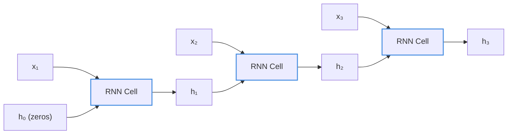
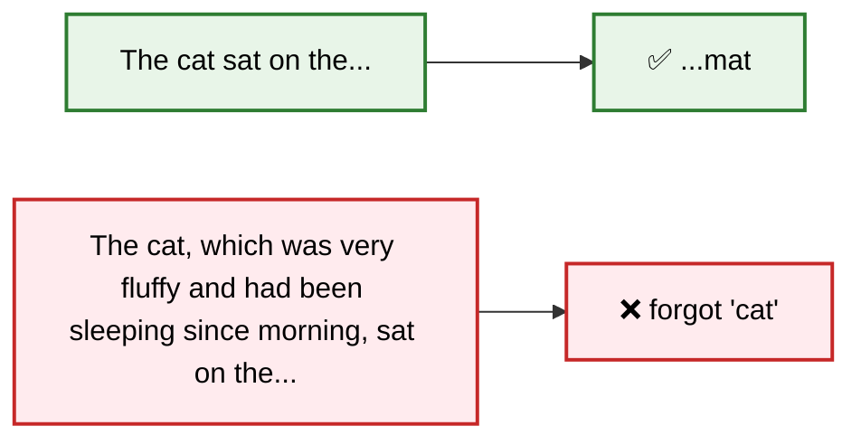
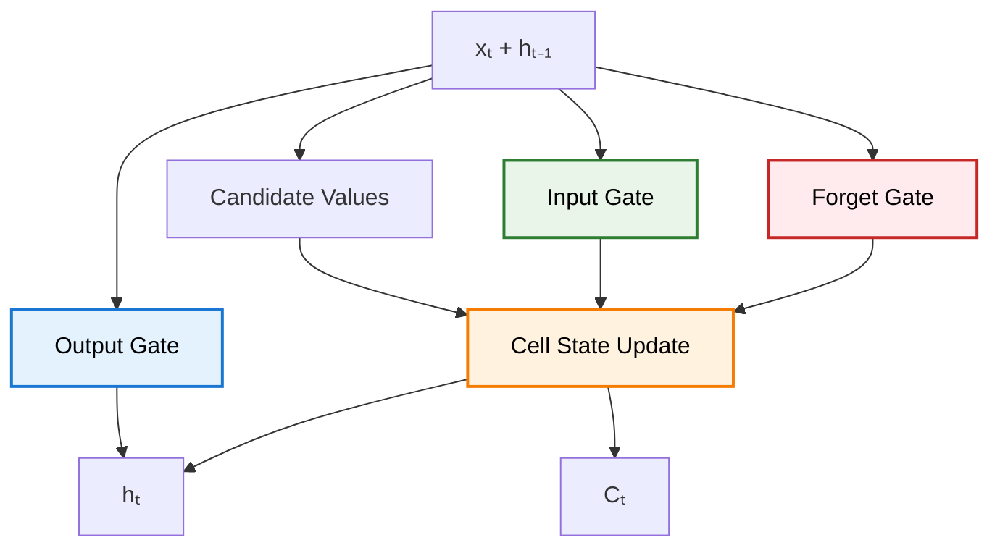
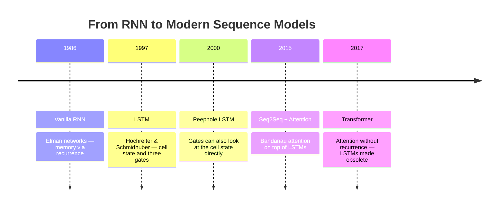
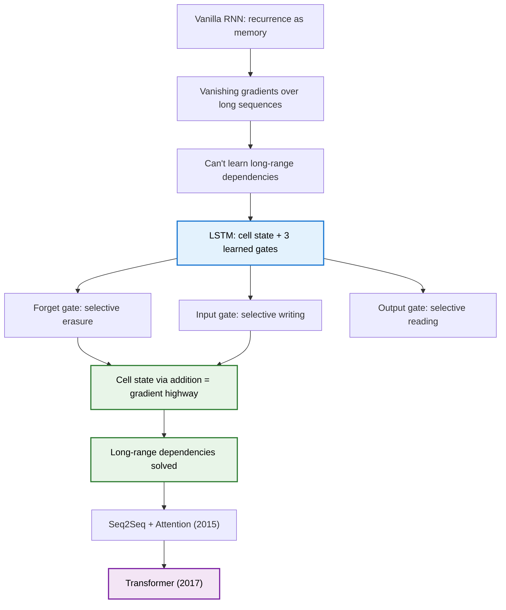

> **TL;DR**: RNNs were the first serious attempt at giving neural networks memory. The idea was elegant — feed the past into the present. But they collapsed under their own weight, literally. Gradients vanished over time, and long-range memory became impossible. LSTMs fixed this with a deceptively simple insight: **give the network explicit control over what to remember, what to forget, and what to output**. This is the story of that fix.

> These paper reviews are written more for me and less for others. LLMs have been used in formatting
{: .prompt-tip }

---

## The Problem: Language is Not a Bag of Words

### Order Matters. Context Matters.

Before sequence models, most NLP was fundamentally **stateless**. You'd take a sentence, bag the words, count them, and feed frequencies into a classifier. The sentence "The dog bit the man" and "The man bit the dog" would look identical to these models.

This is obviously broken.

Language is **deeply sequential**. The meaning of a word depends on what came before it. Understanding a paragraph requires remembering how it started. Translating a sentence requires holding the entire source in mind.

What we needed was a model with **memory**.

---

## RNNs: The First Attempt at Memory

### The Core Idea

The Recurrent Neural Network (RNN) was a clean solution. At each timestep, instead of only looking at the current input, the network also looks at its own **hidden state** from the previous step.

```
h_t = f(W_h * h_{t-1} + W_x * x_t + b)
```

That's it. The hidden state $h_t$ acts as the network's memory — a compressed summary of everything it has seen so far.



**The same cell, reused at every timestep.** The weights $W_h$ and $W_x$ are shared across all positions — the network learns a single function that it applies repeatedly.

### The Unrolled View

When we "unroll" an RNN across time, it looks like a very deep feedforward network where each layer is a timestep:

$$h_t = \tanh(W_h h_{t-1} + W_x x_t + b)$$

$$y_t = W_y h_t$$

For a sequence of length $T$, the hidden state at the end has been through $T$ layers of transformation. **This is important. Remember this.**

### Why RNNs Were Exciting

For short sequences, RNNs genuinely worked. They could:
- Model n-gram statistics without an explicit window
- Capture short-term patterns in language
- Generate coherent text for a few tokens

They were **Turing complete** in theory — given enough hidden units, they could simulate any computation. The community was optimistic.

---

## Why RNNs Failed: The Vanishing Gradient Problem

### The Fundamental Issue

Here's the brutal reality: **training an RNN on long sequences is like trying to hear a whisper at the end of a telephone chain of 100 people**. By the time the signal from the first word reaches the gradient update for the last word, it's effectively gone.

Formally, when we backpropagate through time (BPTT), gradients flow backwards through each timestep. The gradient of the loss with respect to an early hidden state $h_0$ involves a product of Jacobians:

$$\frac{\partial \mathcal{L}}{\partial h_0} = \frac{\partial \mathcal{L}}{\partial h_T} \prod_{t=1}^{T} \frac{\partial h_t}{\partial h_{t-1}}$$

Each term in that product is:

$$\frac{\partial h_t}{\partial h_{t-1}} = W_h^T \cdot \text{diag}(\tanh'(h_{t-1}))$$

And $\tanh'(x) \in (0, 1]$ — it's always less than or equal to 1.

So you're multiplying $T$ matrices together, each scaled by something $\leq 1$.

### Two Failure Modes

| Problem | What Happens | Effect on Training |
|---|---|---|
| **Vanishing Gradient** | $\|\frac{\partial h_t}{\partial h_{t-1}}\| < 1$ repeated $T$ times → 0 | Early inputs have no effect on the loss. Model can't learn long-range dependencies. |
| **Exploding Gradient** | $\|\frac{\partial h_t}{\partial h_{t-1}}\| > 1$ repeated $T$ times → ∞ | Parameters blow up, NaN everywhere, training diverges. |

Exploding gradients have a hacky fix: **gradient clipping**. Just cap the gradient norm when it gets too large.

Vanishing gradients have no such patch. The information is genuinely lost.

### The Consequence: Short-Term Memory Only



In practice, vanilla RNNs could only reliably use context from the last ~10 tokens. Anything further back was forgotten.

This wasn't a tuning problem. It was **structural**.

---

## The LSTM Solution: Explicit Memory Control

### The 1997 Paper

Hochreiter and Schmidhuber published *Long Short-Term Memory* in 1997. The paper was ignored for years, then became one of the most cited papers in deep learning history.

Their insight was simple but deep:

> **If the problem is that gradients vanish as they flow through time, what if we created a direct, unobstructed highway for gradients to travel backwards?**

The solution was the **cell state** — a separate memory vector that flows through time with minimal transformation, allowing gradients to flow back largely intact.

### The Architecture

An LSTM cell has two states instead of one:
- **$h_t$**: The hidden state (same as vanilla RNN, short-term working memory)
- **$C_t$**: The cell state (the new addition, long-term memory)

And three **gates** that control information flow:



---

## Deep Dive: The Three Gates

### Gate 1: The Forget Gate

**Question it answers**: *What from the past should we throw away?*

$$f_t = \sigma(W_f \cdot [h_{t-1}, x_t] + b_f)$$

The forget gate outputs a vector of values between 0 and 1 (sigmoid). Multiply this against the old cell state:
- **$f_t = 0$**: Completely forget this piece of memory
- **$f_t = 1$**: Keep it perfectly

**Example**: In the sentence *"I grew up in France... I speak fluent ___"*, when the subject changes to a new person, the forget gate learns to wipe out the stored nationality.

*(The forget gate is visible on the left side of both diagrams below — faded out since it's not the focus there.)*

### Gate 2: The Input Gate

**Question it answers**: *What new information should we store?*

This is actually two equations working together:

$$i_t = \sigma(W_i \cdot [h_{t-1}, x_t] + b_i)$$

$$\tilde{C}_t = \tanh(W_C \cdot [h_{t-1}, x_t] + b_C)$$

- $\tilde{C}_t$ is the **candidate** new memory (what could be written)
- $i_t$ is the **gate** (how much of the candidate to actually write)


*The green box shows the forget gate (keeping 99.7% of long-term memory this time), the orange box is the input gate deciding how much of the potential memory to write. Together they update the long-term memory from 2 → 2.96.*

### Cell State Update

Now we combine forget and input to update the cell state:

$$C_t = f_t \odot C_{t-1} + i_t \odot \tilde{C}_t$$

This is the **critical equation**. Let's read it:
- $f_t \odot C_{t-1}$: Old memory, selectively forgotten
- $i_t \odot \tilde{C}_t$: New information, selectively written

The cell state is updated by **addition**, not multiplication by a weight matrix. This is what creates the gradient highway — addition distributes gradients equally to both inputs, without the vanishing multiplication chain.

### Gate 3: The Output Gate

**Question it answers**: *What part of the cell state should we actually output?*

$$o_t = \sigma(W_o \cdot [h_{t-1}, x_t] + b_o)$$

$$h_t = o_t \odot \tanh(C_t)$$

We read from the cell state through a $\tanh$ (to squash values to $[-1,1]$), filtered by the output gate. The cell state holds everything; the hidden state is a selective, filtered read of it.


*The purple section on the right is the output gate. It reads from the updated long-term memory (2.96) and produces the new short-term memory (h_t). The cell state knows everything; the output gate decides what's relevant right now.*

---

## Why This Actually Fixes Vanishing Gradients

Going back to the core problem. In a vanilla RNN, gradients had to pass through a product of weight matrices and squashing functions at every step — an uncontrolled decay.

In an LSTM, the gradient of the loss through the cell state path is:

$$\frac{\partial C_t}{\partial C_{t-1}} = f_t$$

When $f_t \approx 1$ (don't forget), gradients flow back **perfectly**. The gradient can propagate over hundreds of timesteps without vanishing, as long as the forget gate stays open.

The LSTM doesn't solve vanishing gradients through math tricks. It solves it by **learning when to preserve information**.

| Architecture | Gradient Path | Long-Term Memory |
|---|---|---|
| **Vanilla RNN** | $\prod_t W_h \cdot \tanh'(\cdot)$ — decays exponentially | Practically impossible beyond ~10 steps |
| **LSTM** | $\prod_t f_t$ — controlled by learned gates | Hundreds to thousands of steps |

---

## A Concrete Example

```python
import torch
import torch.nn as nn

class LSTMLanguageModel(nn.Module):
    def __init__(self, vocab_size, embed_dim, hidden_dim, n_layers):
        super().__init__()
        self.embedding = nn.Embedding(vocab_size, embed_dim)
        self.lstm = nn.LSTM(embed_dim, hidden_dim, n_layers, batch_first=True)
        self.fc = nn.Linear(hidden_dim, vocab_size)

    def forward(self, x, hidden=None):
        x = self.embedding(x)                   # [B, T] -> [B, T, embed_dim]
        out, hidden = self.lstm(x, hidden)       # hidden = (h_n, c_n)
        logits = self.fc(out)                    # [B, T, vocab_size]
        return logits, hidden
```

Note: `hidden` is a **tuple** `(h_n, c_n)` — PyTorch surfaces both the hidden state and cell state separately. The cell state $c_n$ is the long-term memory; $h_n$ is the working memory passed to the next batch.

---

## The Variants That Followed

LSTMs spawned a family of gated architectures:



---

## The Honest Limitations

LSTMs fixed the vanishing gradient problem but introduced their own constraints:

### 1. Sequential Processing

An LSTM must process tokens **one at a time** — each step depends on the previous hidden state. This makes parallelization during training nearly impossible. For a sequence of length $T$, you need $T$ sequential steps. Transformers process all positions in parallel.

### 2. The Compression Bottleneck

All information from the past must be compressed into a fixed-size vector $h_t$ and $C_t$. For very long documents, this is a **lossy compression**. The network has to decide what to keep, and it doesn't always decide correctly.

Attention mechanisms solved this by allowing the model to directly look back at any past token, bypassing the bottleneck entirely.

### 3. Still Struggles on Very Long Sequences

While LSTMs handle hundreds of steps well, thousands of steps remains difficult. The forget gate can still learn to mostly forget, effectively cutting off distant context.

---

## The Legacy

LSTMs dominated sequence modeling for nearly a decade:

- **Machine Translation**: Google's production translation system ran on LSTMs until 2016
- **Speech Recognition**: Deep Speech, early Siri, Alexa
- **Text Generation**: Early language models, autocomplete systems
- **Time Series**: Anomaly detection, forecasting, sensor data

More importantly, LSTMs established a **design philosophy**:

> **Give the network explicit mechanisms to control information flow. Don't just let gradients figure it out.**

This philosophy carried forward directly into attention mechanisms. Attention is, in a sense, a generalization of the same idea — instead of a gate controlling whether to *keep* information, attention learns *which past tokens to look at* at each step.

Every Transformer you use today descends from the insight Hochreiter and Schmidhuber had in 1997.

---

## Summary



**Key Takeaways:**
- RNNs had the right idea (recurrence as memory) but broken gradient flow
- LSTMs introduced **learnable gates** — the network decides what to remember, forget, and output
- The **cell state** acts as a gradient highway, letting information travel backwards through hundreds of timesteps
- Transformers eventually superseded LSTMs by removing sequential processing entirely
- The gating philosophy lives on in every attention mechanism

---

## Further Reading

- **Original LSTM Paper**: [Long Short-Term Memory (Hochreiter & Schmidhuber, 1997)](https://www.bioinf.jku.at/publications/older/2604.pdf)
- **Visualizing LSTMs**: [Understanding LSTM Networks — Chris Olah's blog](https://colah.github.io/posts/2015-08-Understanding-LSTMs/)
- **Attention Mechanism**: [Neural Machine Translation by Jointly Learning to Align and Translate (Bahdanau et al., 2015)](https://arxiv.org/abs/1409.0473)

---
