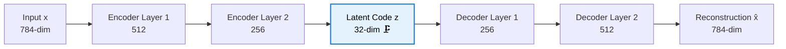
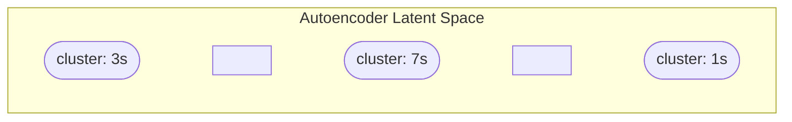
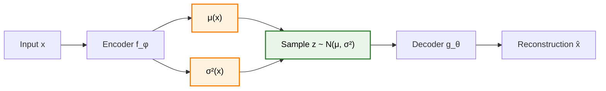
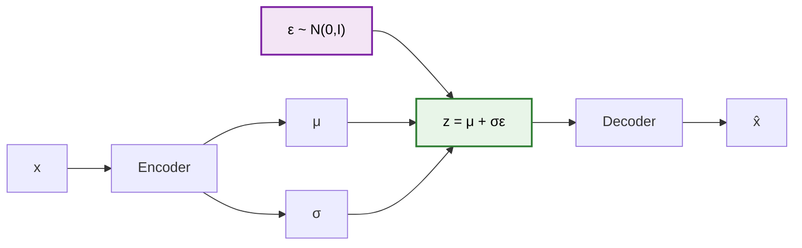
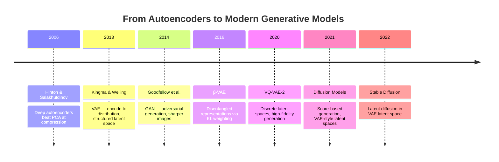
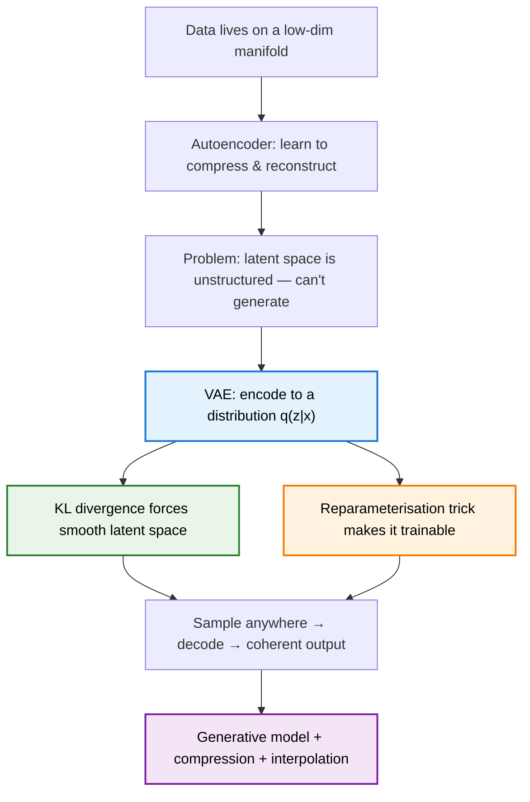

> **TL;DR**: Hinton's autoencoder taught networks to compress data into a small latent vector and reconstruct it back. It worked beautifully — but the latent space was a mess you couldn't generate from. Kingma & Welling's VAE fixed this with one elegant shift: encode to a *distribution*, not a point. That single change turned a compression tool into a generative model.

> These paper reviews are written more for me and less for others. LLMs have been used in formatting
{: .prompt-tip }

---

## The Problem: High-Dimensional Data is Redundant

### Why Compress at All?

A 28×28 grayscale image is a vector in $\mathbb{R}^{784}$. But most of that 784-dimensional space is empty — natural images don't live everywhere, they live on a low-dimensional **manifold** inside that space. A face, for instance, is defined by maybe a dozen meaningful factors: lighting, pose, expression, identity. The rest is just pixel-level detail.

If we could find that low-dimensional structure — the **latent space** — we'd have something powerful:
- **Compression**: represent data efficiently
- **Denoising**: project to manifold, reconstruct clean version
- **Generation**: sample from the latent space, decode into new data
- **Interpolation**: walk through latent space smoothly between two points

The question is how to *learn* that structure from data.

---

## Hinton's Autoencoder: Learning to Compress

### The 2006 Paper

Hinton & Salakhutdinov's *Reducing the Dimensionality of Data with Neural Networks* (Science, 2006) showed that deep neural networks could learn compact representations — better than PCA — by training them to reconstruct their own input.

The architecture is almost embarrassingly simple:



- **Encoder** $f_\phi$: maps input $x$ to a compressed code $z$
- **Decoder** $g_\theta$: maps the code $z$ back to a reconstruction $\hat{x}$
- **Bottleneck**: the narrow middle layer *forces* compression

### The Objective

Train to minimise reconstruction error:

$$\mathcal{L}_{AE} = \| x - \hat{x} \|^2 = \| x - g_\theta(f_\phi(x)) \|^2$$

That's it. No labels needed — the target is the input itself. This is **self-supervised learning** before the term existed.

### What the Latent Space Learns

This is the beautiful part. The network has no choice but to learn structure. If the bottleneck is 32-dimensional and the input is 784-dimensional, the encoder must throw away everything that isn't essential. What survives is the *semantics* — the factors that actually matter for reconstruction.

Trained on faces, the latent space organises by lighting, pose, identity. Trained on digits, it organises by digit class, thickness, slant. No one told it to — it emerged from the reconstruction pressure.

### The Problem: The Latent Space is a Mess

Here's what nobody talks about enough. The autoencoder learns to compress *the training data* well. But the latent space has no global structure — it's a collection of **islands**.



Points between clusters map to **nothing recognisable**. Sample a random point from the latent space and decode it — you get garbage. The autoencoder learned to encode and decode, but it never learned to fill the space meaningfully.

You can't generate from it. You can't interpolate smoothly. The manifold is there, but it's fragmented.

**This is the problem VAEs solve.**

---

## Variational Autoencoders: Encoding to a Distribution

### The 2013 Paper

Kingma & Welling's *Auto-Encoding Variational Bayes* (2013) reframed the problem entirely. Instead of asking "what point in latent space represents this input?", they asked:

> **"What *distribution* over latent space is consistent with this input?"**

The encoder no longer outputs a single vector $z$. It outputs the **parameters of a Gaussian** — a mean $\mu$ and a variance $\sigma^2$.

$$q_\phi(z | x) = \mathcal{N}(z; \mu_\phi(x), \sigma^2_\phi(x))$$

Then $z$ is **sampled** from that distribution, and the decoder reconstructs from the sample.



### Why This Fixes the Latent Space

By encoding to a distribution rather than a point, the VAE is forced to make nearby regions of latent space decode to similar things. The **variance** $\sigma^2$ acts as a regulariser — if the encoder tries to collapse to a point (variance → 0), the KL term in the loss penalises it.

The result: a **continuous, smooth latent space** where you can sample anywhere and get something meaningful.

### The VAE Loss: Two Terms

The VAE loss — derived from the **Evidence Lower Bound (ELBO)** — has two parts:

$$\mathcal{L}_{VAE} = \underbrace{\mathbb{E}_{q_\phi(z|x)}[\log p_\theta(x|z)]}_{\text{Reconstruction loss}} - \underbrace{D_{KL}(q_\phi(z|x) \| p(z))}_{\text{KL divergence}}$$

Reading it left to right:

- **Reconstruction loss**: on average over samples of $z$, how well does the decoder reconstruct $x$? This is the same pressure as the standard autoencoder.
- **KL divergence**: how far is the encoder's distribution $q_\phi(z\vert x)$ from the prior $p(z) = \mathcal{N}(0, I)$? This term forces the latent space to stay close to a standard Gaussian — no wild clusters, no holes.

The two terms are in tension. Reconstruction wants the encoder to be precise (low variance, sharp encoding). KL wants the encoder to stay spread out (high variance, close to prior). The network learns to balance them.

> **Intuition**: Reconstruction loss says "encode accurately." KL divergence says "but not so accurately that you create islands." The VAE learns representations that are both faithful *and* smooth.

### The Reparameterisation Trick

There's a subtle problem. The loss involves sampling $z \sim \mathcal{N}(\mu, \sigma^2)$, and sampling is not differentiable — you can't backpropagate through a random node.

Kingma & Welling's fix is elegant. Instead of sampling $z$ directly, rewrite it as:

$$z = \mu + \sigma \cdot \epsilon, \quad \epsilon \sim \mathcal{N}(0, I)$$

Now $\epsilon$ is the randomness — a fixed sample from a standard Gaussian. The parameters $\mu$ and $\sigma$ are deterministic functions of $x$. Gradients flow through $\mu$ and $\sigma$ cleanly, and $\epsilon$ is just noise.



The randomness is **moved outside the computation graph**. This is the trick that makes VAEs trainable end-to-end.

---

## PyTorch Implementation

A minimal VAE — encoder, reparameterisation, decoder, loss — in one clean block:

```python
import torch
import torch.nn as nn
import torch.nn.functional as F

class VAE(nn.Module):
    def __init__(self, input_dim=784, hidden_dim=512, latent_dim=32):
        super().__init__()
        # Encoder
        self.fc1 = nn.Linear(input_dim, hidden_dim)
        self.fc_mu = nn.Linear(hidden_dim, latent_dim)
        self.fc_logvar = nn.Linear(hidden_dim, latent_dim)  # log σ² for stability
        # Decoder
        self.fc3 = nn.Linear(latent_dim, hidden_dim)
        self.fc4 = nn.Linear(hidden_dim, input_dim)

    def encode(self, x):
        h = F.relu(self.fc1(x))
        return self.fc_mu(h), self.fc_logvar(h)

    def reparameterise(self, mu, logvar):
        std = torch.exp(0.5 * logvar)   # σ = exp(log σ² / 2)
        eps = torch.randn_like(std)     # ε ~ N(0, I)
        return mu + std * eps           # z = μ + σε

    def decode(self, z):
        h = F.relu(self.fc3(z))
        return torch.sigmoid(self.fc4(h))

    def forward(self, x):
        mu, logvar = self.encode(x)
        z = self.reparameterise(mu, logvar)
        return self.decode(z), mu, logvar


def vae_loss(recon_x, x, mu, logvar):
    # Reconstruction: binary cross-entropy pixel-wise
    recon_loss = F.binary_cross_entropy(recon_x, x, reduction='sum')
    # KL divergence: closed form for N(μ,σ²) vs N(0,I)
    kl_loss = -0.5 * torch.sum(1 + logvar - mu.pow(2) - logvar.exp())
    return recon_loss + kl_loss
```

A few things worth noticing:
- We predict `logvar` (log variance) instead of variance directly — avoids numerical issues with negative values
- The KL divergence has a **closed form** when both distributions are Gaussian (see Appendix)
- `reparameterise` is three lines — that's all the trick is

---

## What VAEs Unlocked

### 1. Generation

Sample $z \sim \mathcal{N}(0, I)$, decode. Because the latent space is smooth and continuous, you get coherent outputs everywhere — not just at training points.

### 2. Interpolation

Take two images $x_1$ and $x_2$. Encode both to $\mu_1, \mu_2$. Linearly interpolate between them and decode each point. Because the latent space is smooth, the interpolation passes through meaningful intermediate states — not garbage.

### 3. Disentanglement

With the right training pressures (e.g. $\beta$-VAE), individual dimensions of $z$ learn to control individual factors of variation — one dimension for lighting, another for pose. Manipulating a single latent dimension changes one attribute without touching others.

---

## The Honest Limitations

| Issue | What Happens | Why |
|---|---|---|
| **Blurry reconstructions** | Generated images look soft and smeared | Reconstruction loss averages over all valid decodings of a $z$ |
| **Posterior collapse** | Decoder ignores $z$ entirely | KL term can "win" — encoder collapses to prior, decoder memorises |
| **Limited expressiveness** | Can't capture very complex distributions | Gaussian assumption in both encoder and prior is restrictive |

The blurriness problem in particular held VAEs back from image generation. GANs, which came shortly after, produced sharper images by replacing the reconstruction loss with an adversarial discriminator. Diffusion models later solved it more cleanly. But VAEs remain the cleaner *theoretical* framework — principled, tractable, and interpretable.

---

## The Lineage



Note that last entry: Stable Diffusion runs its diffusion process *in the latent space of a VAE*. The VAE is doing the compression; the diffusion model is doing the generation. Kingma & Welling's 2013 latent space is powering images you're looking at today.

---

## Summary



**Key Takeaways:**
- Autoencoders learn compressed representations — but the latent space has no structure for generation
- VAEs encode to a *distribution*, not a point — the KL term keeps it globally organised
- The **reparameterisation trick** makes sampling differentiable, enabling end-to-end training
- The VAE loss is reconstruction + KL — two pressures in tension, one elegant balance
- The latent space VAEs introduced is still at the core of modern generative models

---

## Further Reading

- **Autoencoder Paper**: [Reducing the Dimensionality of Data with Neural Networks (Hinton & Salakhutdinov, 2006)](https://www.science.org/doi/10.1126/science.1127647)
- **VAE Paper**: [Auto-Encoding Variational Bayes (Kingma & Welling, 2013)](https://arxiv.org/abs/1312.6114)
- **Latent Diffusion**: [High-Resolution Image Synthesis with Latent Diffusion Models](https://arxiv.org/abs/2112.10752)

---

## Appendix

### A. Full ELBO Derivation

We want to maximise the log-likelihood of the data $\log p_\theta(x)$. This is intractable because:

$$\log p_\theta(x) = \log \int p_\theta(x|z) p(z) \, dz$$

We can't compute this integral over all $z$. So we introduce an approximate posterior $q_\phi(z\vert x)$ and derive a lower bound.

Starting from:

$$\log p_\theta(x) = \log \int p_\theta(x|z) p(z) \, dz$$

Multiply and divide by $q_\phi(z\vert x)$:

$$= \log \int q_\phi(z|x) \frac{p_\theta(x|z) p(z)}{q_\phi(z|x)} \, dz$$

Apply Jensen's inequality (log is concave, so $\log \mathbb{E}[f] \geq \mathbb{E}[\log f]$):

$$\geq \int q_\phi(z|x) \log \frac{p_\theta(x|z) p(z)}{q_\phi(z|x)} \, dz$$

Split the log:

$$= \mathbb{E}_{q_\phi(z|x)}[\log p_\theta(x|z)] + \mathbb{E}_{q_\phi(z|x)}\left[\log \frac{p(z)}{q_\phi(z|x)}\right]$$

$$= \underbrace{\mathbb{E}_{q_\phi(z|x)}[\log p_\theta(x|z)]}_{\text{Reconstruction}} - \underbrace{D_{KL}(q_\phi(z|x) \| p(z))}_{\text{KL Divergence}}$$

This is the **ELBO** — the Evidence Lower BOund. Maximising the ELBO is equivalent to maximising the log-likelihood while keeping the approximate posterior close to the prior.

The gap between the ELBO and the true log-likelihood is exactly $D_{KL}(q_\phi(z\vert x) \| p_\theta(z\vert x))$ — the KL divergence between the approximate and true posterior. Minimising this gap is what variational inference does.

---

### B. Closed-Form KL for Gaussians

When $q_\phi(z\vert x) = \mathcal{N}(\mu, \sigma^2 I)$ and $p(z) = \mathcal{N}(0, I)$, the KL divergence has a closed form. For a $d$-dimensional latent space:

$$D_{KL}(\mathcal{N}(\mu, \sigma^2 I) \| \mathcal{N}(0, I)) = \frac{1}{2} \sum_{j=1}^{d} \left( \mu_j^2 + \sigma_j^2 - \log \sigma_j^2 - 1 \right)$$

In code, using log-variance $v = \log \sigma^2$:

$$D_{KL} = -\frac{1}{2} \sum_{j=1}^{d} (1 + v_j - \mu_j^2 - e^{v_j})$$

Which is exactly the `kl_loss` in the implementation above.

---

### C. Why the Reparameterisation Trick Works

Without the trick, the forward pass is:

$$z \sim q_\phi(z\vert x) = \mathcal{N}(\mu_\phi(x), \sigma^2_\phi(x))$$

The gradient $\frac{\partial \mathcal{L}}{\partial \phi}$ requires differentiating through the sampling operation — which has no defined gradient. The sampling node is a stochastic operation; backpropagation is a deterministic algorithm.

With the reparameterisation $z = \mu + \sigma \cdot \epsilon$, $\epsilon \sim \mathcal{N}(0, I)$:

$$\frac{\partial z}{\partial \mu} = 1, \qquad \frac{\partial z}{\partial \sigma} = \epsilon$$

Now $z$ is a **deterministic function** of $\phi$ (through $\mu$ and $\sigma$) and a fixed noise variable $\epsilon$. The stochasticity is in $\epsilon$, which doesn't have parameters — we don't need its gradient. Backpropagation flows through $\mu$ and $\sigma$ as normal.

The trick generalises beyond Gaussians to any distribution that can be expressed as a deterministic transformation of a fixed noise variable — which covers most useful distributions.

---
