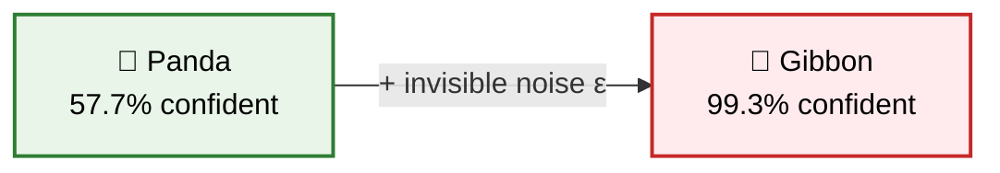
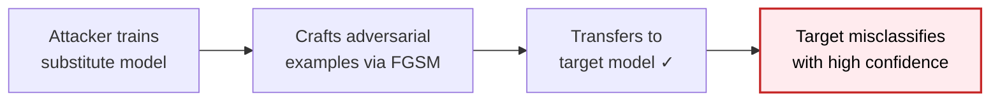
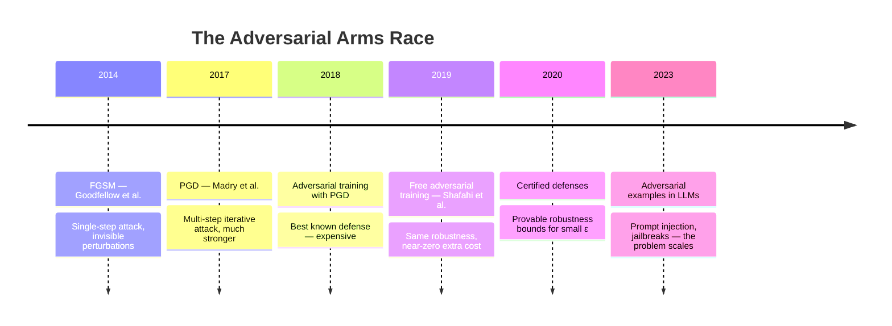
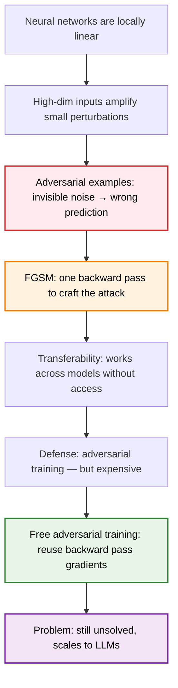

> **TL;DR**: In 2014, Goodfellow et al. showed that neural networks — no matter how accurate — can be fooled by adding tiny, invisible perturbations to their inputs. A panda becomes a gibbon. A stop sign becomes a speed limit sign. The model is completely confident. The fix they proposed (adversarial training) works, but it's brutally expensive. Shafahi et al. later made it free. The arms race is still ongoing.

> These paper reviews are written more for me and less for others. LLMs have been used in formatting
{: .prompt-tip }

---

## The Prank That Became a Crisis

### A Perfectly Confident, Perfectly Wrong Model

In 2014, Goodfellow, Shlens, and Szegedy published something that rattled the deep learning community. They took an image of a panda — correctly classified with 57.7% confidence — added a tiny matrix of noise invisible to the human eye, and fed it to the same model. The model now said: **gibbon, 99.3% confidence**.

The perturbed image looks identical to us. To the model, it couldn't be more different.

This wasn't a bug. It wasn't overfitting. It was a **fundamental property** of how neural networks learn — and it applied to every architecture, every dataset, every model that anyone had trained.

The question was: why?

---

## Why They Exist: The Linearity Hypothesis

### Goodfellow's Insight

The prevailing assumption at the time was that adversarial examples existed because neural networks were too nonlinear — complex, high-dimensional functions with strange and unpredictable decision boundaries.

Goodfellow argued the opposite. The real culprit is **linearity**.

Consider a linear model with weights $\mathbf{w}$ and input $\mathbf{x}$. If we perturb the input by $\boldsymbol{\eta}$, the output changes by:

$$\mathbf{w}^T (\mathbf{x} + \boldsymbol{\eta}) = \mathbf{w}^T \mathbf{x} + \mathbf{w}^T \boldsymbol{\eta}$$

Now suppose $\boldsymbol{\eta}$ is constrained to be small — say $\|\boldsymbol{\eta}\|_\infty \leq \epsilon$. To maximise the perturbation's effect, set each element of $\boldsymbol{\eta}$ to $\epsilon \cdot \text{sign}(w_i)$. The perturbation to the activation becomes:

$$\mathbf{w}^T \boldsymbol{\eta} = \epsilon \|\mathbf{w}\|_1$$

In high dimensions — say $n = 784$ pixels — even a tiny $\epsilon$ gets multiplied by hundreds of terms. A small per-pixel nudge accumulates into a large change in the model's output. **High dimensionality turns tiny perturbations into large effects.**

Neural networks use ReLU activations specifically because they behave linearly in their active regions. The very property that makes them easy to train makes them vulnerable.

### The Fast Gradient Sign Method (FGSM)

Goodfellow's paper didn't just diagnose the problem — it gave a dead-simple recipe to *create* adversarial examples. The **Fast Gradient Sign Method**:

$$\mathbf{x}_{adv} = \mathbf{x} + \epsilon \cdot \text{sign}(\nabla_{\mathbf{x}} \mathcal{L}(\theta, \mathbf{x}, y))$$

Reading it:
- $\nabla_{\mathbf{x}} \mathcal{L}$: the gradient of the loss with respect to the *input* (not the weights — we're asking "which direction in input space increases the loss?")
- $\text{sign}(\cdot)$: take just the direction, ignore magnitude
- $\epsilon$: scale by a small constant

One forward pass, one backward pass, done. You have an adversarial example. It's the same computation as one step of gradient descent — except instead of updating weights to reduce loss, you're updating the *input* to increase it.

---

## Why This Is Actually Terrifying

### Transferability

Here's what makes adversarial examples genuinely dangerous: **they transfer across models**.

An adversarial example crafted to fool Model A — trained on different data, with a different architecture — will also fool Model B at a surprisingly high rate. This means an attacker doesn't need access to the target model. They train their own substitute model, craft adversarial examples against it, and those examples work against the real target.

### Real-World Implications

This isn't just a benchmark curiosity:

| Domain | Attack | Consequence |
|---|---|---|
| **Autonomous vehicles** | Stop sign + sticker → speed limit sign | Car doesn't stop |
| **Face recognition** | Glasses with printed pattern → different identity | Bypass authentication |
| **Malware detection** | Perturbations to binary → classified as benign | Evasion |
| **Medical imaging** | Pixel perturbation → wrong diagnosis | Wrong treatment |

The threat model is real. And the gap between "this works in a lab" and "this works in the physical world" closed faster than anyone expected.

---

## The Fix: Adversarial Training

### Goodfellow's Proposed Defense

The most natural defense is also the most obvious one: **train on adversarial examples**. At each training step, generate adversarial versions of the current batch and include them in the training data. The model learns to classify correctly even under attack.

The modified training objective:

$$\tilde{\mathcal{L}}(\theta, \mathbf{x}, y) = \alpha \mathcal{L}(\theta, \mathbf{x}, y) + (1 - \alpha) \mathcal{L}(\theta, \mathbf{x} + \epsilon \cdot \text{sign}(\nabla_{\mathbf{x}} \mathcal{L}), y)$$

A weighted combination of the standard loss on clean inputs and the loss on adversarial inputs. The model is simultaneously pushed to be accurate *and* robust.

It works. Adversarially trained models are significantly harder to fool.

### The Cost

The problem is computational. For every training step, you now need an extra forward pass and backward pass to *generate* the adversarial example before you can train on it. Adversarial training roughly **doubles training time** at minimum — and stronger attacks (multi-step PGD instead of single-step FGSM) can multiply it by 10×.

For large models, this becomes prohibitive. The defense is known. The price is too high. Most practitioners skip it.

---

## Adversarial Training for Free: Shafahi et al. (2019)

### The Wasted Computation

Shafahi et al. noticed something being thrown away in standard adversarial training. During the backward pass to update model weights $\theta$, you compute $\nabla_\theta \mathcal{L}$ — the gradient with respect to parameters. But the computation graph also contains $\nabla_{\mathbf{x}} \mathcal{L}$ — the gradient with respect to the *input*, which is exactly what FGSM needs.

Standard training computes it and discards it.

### The Free Lunch

Their insight: **reuse the same backward pass to both update the model and update the adversarial perturbation**.

The algorithm — "Free Adversarial Training":
1. Forward pass on current $(\mathbf{x} + \boldsymbol{\delta})$, compute loss
2. Backward pass — simultaneously extract $\nabla_\theta \mathcal{L}$ (to update weights) and $\nabla_{\mathbf{x}} \mathcal{L}$ (to update $\boldsymbol{\delta}$)
3. Update weights: $\theta \leftarrow \theta - \alpha \nabla_\theta \mathcal{L}$
4. Update perturbation: $\boldsymbol{\delta} \leftarrow \boldsymbol{\delta} + \epsilon \cdot \text{sign}(\nabla_{\mathbf{x}} \mathcal{L})$, clip to $[-\epsilon, \epsilon]$
5. Repeat — reuse the same $\boldsymbol{\delta}$ for $m$ steps before refreshing

Instead of one adversarial example per image per step, the perturbation is **accumulated across multiple minibatch replays**. The computational overhead over standard training is near zero.

| Method | Extra Cost | Robustness Gain |
|---|---|---|
| Standard training | — | None |
| Adversarial training (FGSM) | ~1× extra | Moderate |
| Adversarial training (PGD-10) | ~10× extra | Strong |
| Free adversarial training | ~0× extra | Comparable to PGD |

Same robustness as expensive PGD training, at essentially the cost of standard training. The free lunch was real.

---

## The VAE Connection

This is worth pausing on. VAEs (Kingma & Welling) were designed to create smooth, continuous latent spaces — small moves in $z$ produce small, coherent changes in the output. That sounds like robustness.

It isn't. It's the opposite.

A smooth latent space means **gradients flow cleanly everywhere**. FGSM works by following the gradient of the loss with respect to the input — and in a smooth, well-structured space, those gradients are well-behaved and easy to follow. Adversarial perturbations in the input space map to clean, directed moves in latent space. The attacker has a better roadmap.

Generative models with smooth latent spaces are not more robust. They're often more exploitable.

---

## Where It Stands Today

The adversarial robustness problem remains **unsolved**. Every proposed defense has eventually been broken by a stronger attack. The arms race has a structure:

The last entry is the current frontier. The same principle — small, crafted perturbations that exploit linearity — now applies to language models. Prompt injection attacks are adversarial examples for LLMs. The math is the same. The stakes are higher.

---

## Summary

**Key Takeaways:**
- Adversarial examples exist because of **linearity**, not complexity — high dimensions amplify tiny perturbations
- **FGSM** creates adversarial examples in one step by following the input gradient
- They **transfer** across models — no access to the target required
- **Adversarial training** is the best known defense — Shafahi et al. made it computationally free
- The problem is unsolved and has scaled directly to modern LLMs

---

## Further Reading

- **Original Paper**: [Explaining and Harnessing Adversarial Examples (Goodfellow et al., 2014)](https://arxiv.org/abs/1412.6572)
- **PGD Attack**: [Towards Deep Learning Models Resistant to Adversarial Attacks (Madry et al., 2017)](https://arxiv.org/abs/1706.06083)
- **Free Training**: [Adversarial Training for Free! (Shafahi et al., 2019)](https://arxiv.org/abs/1904.12843)

---
