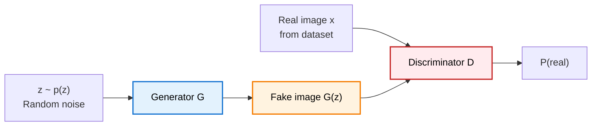
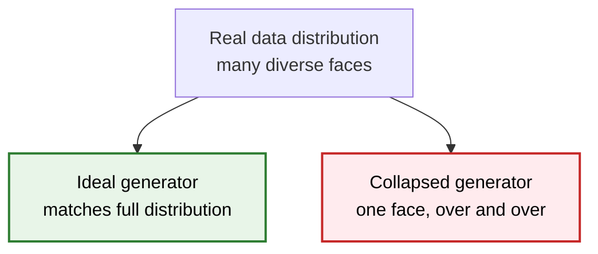
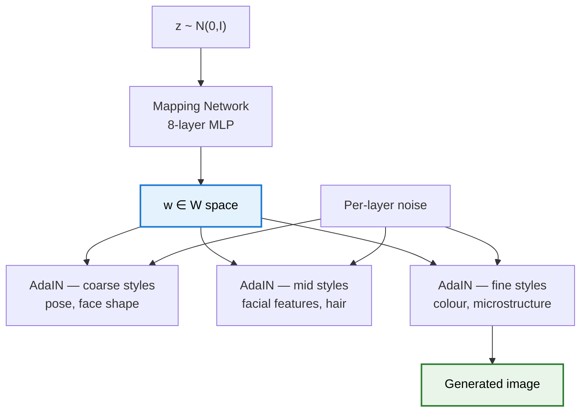
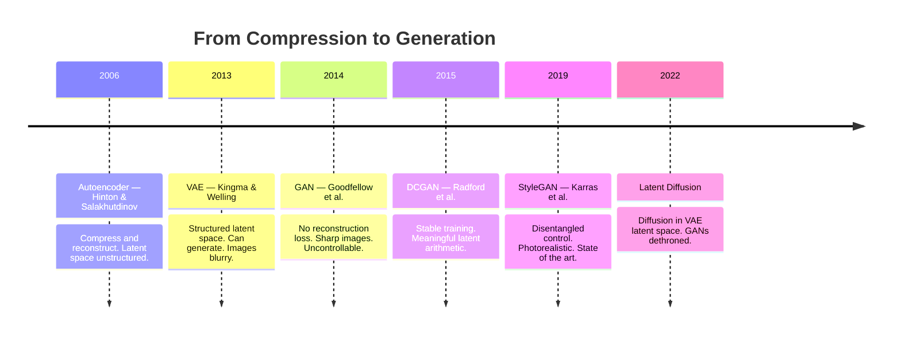
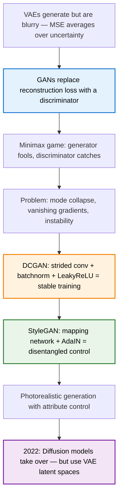

> **TL;DR**: VAEs could generate images, but they were blurry. GANs fixed that by replacing the reconstruction loss with something smarter — a second neural network whose entire job is to call out fakes. The original GAN was almost untrainable. DCGAN made it stable. StyleGAN made it photorealistic. This is that story.

> These paper reviews are written more for me and less for others. LLMs have been used in formatting
{: .prompt-tip }

---

## The Problem VAEs Left Unsolved

We covered VAEs in an [earlier post](). The short version: VAEs encode inputs to a distribution over latent space, sample from it, and decode back. The latent space is smooth and structured — you can generate from it, interpolate through it, do all the things a generative model should do.

But the images are **blurry**. Noticeably, frustratingly blurry.

The reason is the loss function. VAEs minimise reconstruction loss — typically mean squared error between the original and the reconstructed image, pixel by pixel. MSE is an average. When the model is uncertain between two plausible reconstructions, it hedges — it produces the average of the two, which is a blurry version of neither.

The model isn't wrong. It's just optimising for the wrong thing. Pixel-wise similarity is not the same as perceptual quality.

What you really want to ask is: *does this image look real?* MSE can't answer that. A discriminator can.

---

## Goodfellow's Idea: The Minimax Game

### The 2014 Paper

Ian Goodfellow came up with the GAN idea in 2014 — legend has it in a single evening after an argument at a bar. He went home, coded it up, ran it, and it worked on the first try.

The setup is a two-player game:

- **Generator** $G$: takes random noise $z \sim p(z)$ and produces a fake image $G(z)$. Wants to fool the discriminator.
- **Discriminator** $D$: takes an image (real or fake) and outputs a probability that it's real. Wants to correctly tell them apart.

They're trained simultaneously, against each other. The generator improves by learning to fool the discriminator. The discriminator improves by learning to catch the generator. Each one's loss is the other's gain.

### The Minimax Objective

$$\min_G \max_D \; \mathbb{E}_{x \sim p_{data}}[\log D(x)] + \mathbb{E}_{z \sim p(z)}[\log(1 - D(G(z)))]$$

Reading it:
- $\mathbb{E}[\log D(x)]$: discriminator should output high probability for real images
- $\mathbb{E}[\log(1 - D(G(z)))]$: discriminator should output low probability for fakes

The discriminator maximises this — it wants both terms large. The generator minimises it — it wants the second term small, meaning $D(G(z)) \approx 1$ (discriminator thinks fakes are real).

At the theoretical optimum, the generator produces images indistinguishable from real data, and the discriminator is stuck at 50/50 — no better than a coin flip.

### The Connection to VAEs

Where a VAE asks *"how close is the reconstruction to the input?"*, a GAN asks *"does this look real?"*. These are fundamentally different questions. The GAN has no reconstruction loss at all — no pixel-wise comparison, no MSE. The discriminator's verdict is the entire training signal for the generator.

This is what enables sharpness. The discriminator penalises blur directly — blurry images don't look real, so the generator learns not to produce them.

---

## Why Original GANs Were a Nightmare to Train

The theory is beautiful. The practice was chaos.

### Problem 1: Mode Collapse

The generator finds a small set of outputs that reliably fool the discriminator — and produces only those. If you're training on faces, it might generate one face. Perfectly sharp, perfectly convincing, and identical every time. The generator has "collapsed" to a single mode of the distribution.

### Problem 2: Vanishing Gradients

If the discriminator gets too good too fast, $D(G(z)) \approx 0$ for all generated images. Then $\log(1 - D(G(z))) \approx 0$ everywhere — the generator receives near-zero gradient and stops learning. The discriminator wins so hard that the generator can't recover.

### Problem 3: Training Instability

The two networks need to improve at roughly the same pace. Too much discriminator training → vanishing generator gradients. Too much generator training → discriminator can't catch up and stops being a useful signal. Finding that balance required careful hyperparameter tuning and a lot of luck.

The original GAN paper demonstrated the concept. Actually training one was a different matter.

---

## DCGAN: The Architectural Fixes

### Radford et al. (2015)

Radford, Metz, and Chintala's *Unsupervised Representation Learning with Deep Convolutional Generative Adversarial Networks* did something unglamorous but essential: it figured out what architectural choices made GANs actually train stably.

The key changes:

| Change | Why it helps |
|---|---|
| Replace pooling with **strided convolutions** | Learnable downsampling, smoother gradients |
| **Batch normalisation** in both G and D | Stabilises training, prevents mode collapse |
| **No fully connected layers** in deeper layers | Preserves spatial structure |
| **ReLU** in generator, **LeakyReLU** in discriminator | Avoids dead neurons, prevents vanishing gradients |
| **tanh** output in generator | Bounded output, matches normalised image range |

None of these are theoretically deep insights. They're engineering. But they're what turned GANs from "works in a demo" to "works reliably enough to research on."

DCGAN also demonstrated something important: the GAN's latent space had learned meaningful structure. You could do arithmetic on it:

> **vector("man with glasses") − vector("man") + vector("woman") ≈ vector("woman with glasses")**

The same geometric structure that word2vec found in word embeddings — GANs found it in image space, without any labels.

---

## StyleGAN: Separating Content from Style

### Karras et al. (2019)

By 2019, GANs could generate convincing images. StyleGAN's question was: can we *control* what gets generated?

The original GAN generator is a black box. You feed in noise $z$, you get an image. What $z$ controls is entangled — one dimension might affect both hair colour and face shape simultaneously. You can't independently control attributes.

### The Architecture Shift

StyleGAN replaced the standard generator with a **mapping network** and **adaptive instance normalisation (AdaIN)**.

Instead of feeding $z$ directly into the generator:

1. **Mapping network**: $z \mapsto w$ — an 8-layer MLP transforms the noise into an intermediate latent space $\mathcal{W}$. This space is less entangled than $z$.
2. **Style injection**: at each layer of the generator, $w$ is transformed into **style parameters** (scale $\gamma$ and shift $\beta$) that modulate the layer's activations via AdaIN:

$$\text{AdaIN}(x_i, \gamma, \beta) = \gamma \cdot \frac{x_i - \mu(x_i)}{\sigma(x_i)} + \beta$$

3. **Noise injection**: separate per-layer noise controls stochastic variation — hair texture, pore detail, freckles — independently of the style.

### What This Enabled

**Style mixing**: take $w_1$ for coarse levels (pose, face shape) and $w_2$ for fine levels (colour, texture). The result is a face with the structure of one person and the colouring of another. Clean, controllable, no bleed-over.

**Stochastic variation**: the same $w$, different noise injections → same person, different hair arrangement. The identity is preserved; the details vary.

The faces at the top of this blog post — none of those people exist. They were generated by a model in this lineage.

---

## The Connection Back to Autoencoders and VAEs

The progression here is direct:

Each model solved the previous one's core failure. Autoencoders couldn't generate. VAEs could generate but were blurry. GANs were sharp but uncontrollable. StyleGAN added control. And then diffusion models came along and largely replaced GANs for image generation — but they do it in the latent space that VAEs defined.

The threads connect.

---

## The Honest Limitations

GANs never fully escaped their training instabilities:

- **Mode collapse** remained a persistent failure mode even with architectural fixes
- **Evaluation is hard** — there's no clean loss to monitor; FID score became the proxy metric but it's imperfect
- **Training is sensitive** — learning rates, batch sizes, architecture choices all interact in fragile ways
- **No inference-time control** — once trained, you can't condition generation on arbitrary attributes without retraining

Diffusion models addressed most of these. They're slower at inference but train stably, scale predictably, and condition naturally on text prompts. The GAN era — roughly 2014–2022 — was enormously productive, but it's largely over for image generation.

What GANs gave us: the idea that **adversarial training signals are more powerful than reconstruction losses**. That idea hasn't gone away.

---

## Summary

**Key Takeaways:**
- GANs replaced pixel-wise reconstruction loss with an adversarial signal — that's why the images are sharp
- The minimax objective is elegant in theory; training it is fragile in practice
- DCGAN was engineering, not theory — but engineering is what made GANs usable
- StyleGAN's $\mathcal{W}$ space gave the first real disentangled control over generated images
- GANs are largely superseded now, but the adversarial training idea lives on

---

## Further Reading

- **Original GAN**: [Generative Adversarial Nets (Goodfellow et al., 2014)](https://arxiv.org/abs/1406.2661)
- **DCGAN**: [Unsupervised Representation Learning with Deep Convolutional GANs (Radford et al., 2015)](https://arxiv.org/abs/1511.06434)
- **StyleGAN**: [A Style-Based Generator Architecture for GANs (Karras et al., 2019)](https://arxiv.org/abs/1812.04948)
- **FID Score**: [GANs Trained by a Two Time-Scale Update Rule (Heusel et al., 2017)](https://arxiv.org/abs/1706.08500)

---
