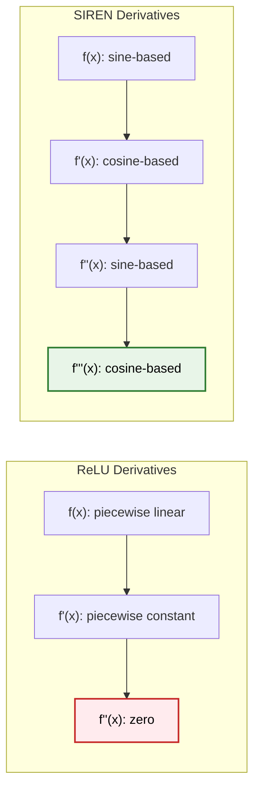
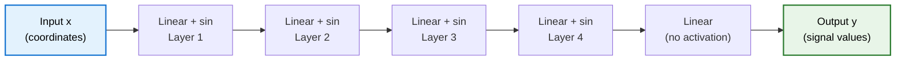
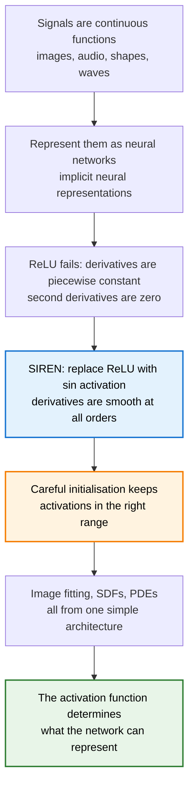

> **TL;DR**: ReLU networks can't represent fine detail in continuous signals because their derivatives are piecewise constant and their second derivatives are zero. SIREN replaces ReLU with sine activations -- the derivative of sine is cosine, the derivative of cosine is sine, smooth all the way down. With a careful initialization scheme, this one change lets a simple MLP faithfully represent images, solve differential equations, and reconstruct 3D shapes from point clouds.

> These paper reviews are written more for me and less for others. LLMs have been used in formatting
{: .prompt-tip }

---

## What If a Function *Was* the Data?

### Implicit Neural Representations

Here is a question that sounds strange until it doesn't: what if instead of storing an image as a grid of pixels, you stored it as a *function*?

An image is a mapping from coordinates to colour values. Every pixel at position $(x, y)$ has an RGB value $(r, g, b)$. That's a function $f: \mathbb{R}^2 \rightarrow \mathbb{R}^3$. If you had a neural network that learned this mapping perfectly, you could throw away the pixel grid entirely. Query the network at any $(x, y)$ -- integer or fractional -- and it hands you the colour. You get a **continuous representation** of the image for free.

This idea is called an **implicit neural representation (INR)**. Instead of storing data on a discrete grid (pixels, voxels, point clouds), you parameterise the signal as a neural network. The network *is* the data.

And it generalises beyond images. Audio is a function from time to amplitude. A 3D shape can be represented as a **signed distance function (SDF)** -- a function from 3D coordinates to the distance to the nearest surface. Video is coordinates plus time to colour. Any signal that maps coordinates to values can be an INR.

The appeal is clear: continuous, compact, differentiable representations. The problem is making it actually work.

For the experiments in this post, I used [Sirenhead](https://www.youtube.com/watch?v=kYnCen1qWD4) as the test image — a creepypasta creature that felt thematically appropriate for a paper called SIREN.

---

## Why ReLU Falls Apart

### The Derivative Argument

If you try to fit an image using a standard MLP with ReLU activations, you get something that looks... okay. From a distance. But zoom in and the fine detail is gone -- textures are smoothed out, edges are soft where they should be sharp.

The reason is mathematical, not just empirical.

ReLU is piecewise linear. Its derivative is piecewise constant -- either 0 or 1. Its second derivative is zero everywhere (except at the origin, where it's undefined). Stack layers of ReLU and you get a piecewise linear function. The *network itself* is piecewise linear. That means:

$$\text{ReLU}(x) = \max(0, x)$$

$$\frac{d}{dx}\text{ReLU}(x) = \begin{cases} 0 & x < 0 \\ 1 & x > 0 \end{cases}$$

$$\frac{d^2}{dx^2}\text{ReLU}(x) = 0 \quad \text{(almost everywhere)}$$

For basic classification, this is fine. But for INRs, it's fatal. If you want your representation to capture gradients, edges, curvature -- the things that make signals look real -- you need derivatives that actually carry information. ReLU's derivatives carry almost none.

**Tanh** is better -- it's smooth, so derivatives exist. But tanh saturates. Activations get pushed into the flat tails, gradients vanish, and the network struggles to represent high-frequency detail.

{: .left w="280" } {: .normal w="280" } {: .right w="280" }
_Spatial gradient: ground truth (left), SIREN (centre), ReLU (right). ReLU's gradient is smeared; SIREN's matches the original edge structure._

**Positional encoding** (the Fourier feature trick from NeRF and Transformers) helps. You map coordinates through sine and cosine functions of varying frequencies *before* feeding them into a ReLU network. This gives the network access to multiple frequency bands. It improves things significantly -- but the core architecture is still ReLU, still piecewise linear, still blind in its higher derivatives.

---

## The Key Insight: Sine All the Way Down

### SIREN's Activation Function

The insight behind **SIREN** (Sinusoidal Representation Networks) is almost embarrassingly simple: replace the activation function with a sine wave.

Each layer in a SIREN computes:

$$\mathbf{h}_i = \sin(\omega_0 \cdot (\mathbf{W}_i \mathbf{h}_{i-1} + \mathbf{b}_i))$$

where $\omega_0$ is a frequency scaling factor, $\mathbf{W}_i$ is the weight matrix, and $\mathbf{b}_i$ is the bias. The final layer is a standard linear layer with no activation.

That's it. An MLP with sine activations. No skip connections, no normalisation layers, no Fourier feature preprocessing. Just sine.

But here is why it matters. The derivative of sine is cosine. The derivative of cosine is sine. Take as many derivatives as you want -- you always get a smooth, well-behaved periodic function:

$$\frac{d}{dx}\sin(x) = \cos(x), \quad \frac{d}{dx}\cos(x) = -\sin(x)$$

The derivative of a SIREN is a SIREN. This property does *not* hold for ReLU, tanh, or any other standard activation function. And for tasks where the loss function involves derivatives -- solving differential equations, fitting signed distance functions, matching image gradients -- this property is everything.



---

## The Architecture

### Simple, But the Initialisation Is Not

A SIREN is a standard fully connected MLP -- typically five layers, with a few hundred hidden units per layer. The only architectural difference from a vanilla MLP is the sine activation.



But sine activations are sensitive. With ReLU, initialisation matters but isn't make-or-break -- He or Xavier initialisation works, and the network trains. With sine, bad initialisation means the network never converges. The periodic nature of sine means that a small perturbation in the input can swing the output wildly. If activations land in the wrong range, gradients oscillate chaotically and training collapses.

### The $\omega_0$ Initialisation Scheme

The paper's initialisation scheme has two parts:

1. **First layer**: Weights are drawn uniformly from $\mathcal{U}(-1/n, \; 1/n)$ where $n$ is the input dimension, then scaled by $\omega_0$. The authors found $\omega_0 = 30$ works well across all their experiments. This ensures that the sine function spans multiple periods over the input range $[-1, 1]$, giving the first layer access to multiple frequencies.

2. **Hidden layers**: Weights are drawn from $\mathcal{U}\left(-\sqrt{6/n} \;,\; \sqrt{6/n}\right)$ where $n$ is the number of input features to that layer. This keeps the input to each sine activation normally distributed with standard deviation of 1. Since only a few weights have magnitude larger than $\pi$, the effective frequency doesn't blow up through the layers.

The result: activations stay in a well-behaved range, gradients flow cleanly, and the network converges fast and robustly with Adam.

This initialisation took significant effort. Plenty of people have tried sine activations before and abandoned them when training didn't work. The contribution here isn't just "use sine" -- it's "use sine *with this specific initialisation*, and it will work."

---

## What SIREN Can Do

### Image Fitting

The simplest demonstration. Take a natural image, treat each pixel as a data point $(x, y) \rightarrow (r, g, b)$. Train the SIREN to map coordinates to pixel values by sampling mini-batches of pixels and minimising L2 loss.

ReLU networks produce blurry approximations -- they capture the broad structure but miss fine textures and sharp edges. Tanh networks produce visible artifacts. Positional encoding plus ReLU does better, but still loses detail in the derivatives.

SIREN captures the image faithfully. But the real test is the derivatives. Compute the gradient (edge map) and Laplacian (second derivative) of the fitted function. For ReLU, the gradient is piecewise constant and the Laplacian is zero. For SIREN, both are smooth and match the ground truth closely. The network wasn't trained on derivatives -- it was trained on pixel values alone -- but because the activation function has well-behaved derivatives, the representation is faithful at every order.

Even more striking: you can train a SIREN using *only* the gradient of the image as supervision. The loss function compares the gradient of the network output to the gradient of the ground truth -- no pixel values are used. When you then query the network for pixel values, the image is reconstructed faithfully (up to a constant offset in brightness, because integration loses the DC component). The same works with the Laplacian. You can supervise on second derivatives alone and still recover the image.

This is impossible with ReLU. A ReLU network has no meaningful second derivative to supervise on.


_SIREN: original (left) vs reconstructed (right). The fine detail — surface texture, edges, the ribcage — is faithfully captured._


_ReLU: same original, same training time. The decoded image is noticeably blurrier — fine detail is smoothed out, edges are soft._

### Solving Poisson's Equation

This brings us to differential equations. **Poisson's equation** relates a function to its Laplacian:

$$\nabla^2 u(\mathbf{x}) = f(\mathbf{x})$$

Given a known source term $f$ and boundary conditions, find $u$. This shows up everywhere in physics -- electrostatics, heat flow, fluid dynamics.

With a SIREN, you parameterise $u$ as the network, and the loss function enforces the PDE constraint: the Laplacian of the network output (computed via automatic differentiation) should equal the known source term. Because the Laplacian of a SIREN is itself smooth and well-defined, the network can satisfy this constraint. ReLU networks cannot -- their Laplacian is zero, so they have no way to represent the relationship the PDE demands.

The image gradient-fitting experiment is actually a special case of this: fitting the gradient or Laplacian of an image is solving a Poisson-like problem where the image is the unknown function.

### Signed Distance Functions for 3D Shapes

A **signed distance function** maps every point in 3D space to its signed distance from the nearest surface -- positive outside, negative inside, zero on the surface. If you have a trained SDF, you can extract the surface as the zero level set.

Given an oriented point cloud (points on the surface plus their normal vectors), you can train a SIREN to represent the SDF by enforcing three constraints simultaneously:

1. **On-surface points**: the SDF value should be zero
2. **On-surface normals**: the gradient of the SDF should align with the known normal vector
3. **Eikonal constraint**: the norm of the spatial gradient should be 1 almost everywhere -- $\lVert \nabla \Phi(\mathbf{x}) \rVert = 1$
4. **Off-surface regularisation**: points far from the surface should have large SDF values (not close to zero)

This is a loss function that involves the function value, its gradient, and the norm of the gradient -- all at once. SIREN handles it naturally. ReLU networks, with their piecewise constant gradients, produce wobbly, artifact-ridden surfaces. The fine geometric detail -- room corners, furniture edges, surface curvature -- is preserved by SIREN and lost by ReLU.

### The Helmholtz Equation

The **Helmholtz equation** governs wave propagation:

$$\nabla^2 u(\mathbf{x}) + k^2 u(\mathbf{x}) = f(\mathbf{x})$$

This relates a wave field $u$ to its own Laplacian. Given boundary measurements and the source term, recover the wave field everywhere. Again, this requires the network's second derivatives to carry meaningful information. SIREN's periodic activations are a natural fit for representing wave-like solutions.

---

## How It Compares

| Method | Derivatives | Fine Detail | PDE-Compatible | Preprocessing |
|---|---|---|---|---|
| **ReLU MLP** | Piecewise constant / zero | Poor | No | None |
| **Tanh MLP** | Smooth but saturating | Moderate | Partial | None |
| **ReLU + Positional Encoding** | Better, still piecewise linear core | Good | Limited | Fourier features |
| **SIREN** | Smooth, periodic, well-defined at all orders | Excellent | Yes | None (just careful init) |

The key differentiator is not just image quality. It's what the derivatives look like. For tasks that only need function values (basic image fitting), positional encoding plus ReLU is competitive. For anything involving gradients or higher-order derivatives -- PDEs, SDFs, physics-informed learning -- SIREN is in a different league.

---

## The Deeper Point

The activation function determines the derivative structure of the entire network. This sounds obvious, but its implications are profound.

With ReLU, your network is a piecewise linear function. Its first derivative is a step function. Its second derivative is a delta function (practically zero). No amount of training, no number of layers, no clever loss function can change this. The architecture *determines* what the derivatives look like, independent of the data.

With sine, derivatives are smooth periodic functions at every order. The network can represent signals and their derivatives simultaneously, because the mathematical structure supports it.

For physics-informed neural networks, for solving PDEs, for any task where the loss depends on derivatives -- the choice of activation function isn't a hyperparameter. It's a foundational design decision. SIREN makes the argument that for continuous signal representation, the activation function should be chosen for its derivative properties first, and everything else second.

---

## Learning Spaces of Implicit Functions

One limitation of the basic SIREN setup: each signal gets its own network. One network per image, one network per shape. There's no generalisation across signals -- it's pure fitting, not learning.

The paper addresses this by training a CNN (a **hypernetwork**) that takes a partially observed image and outputs the *parameters* of a SIREN. The SIREN then represents the complete image. This brings SIRENs back into the standard machine learning framework -- a training set, a test set, generalisation. On CIFAR-10 with heavy masking (only 10-100 pixels visible), the hypernetwork produces SIRENs that reconstruct test images surprisingly well. Not GAN-quality, but it demonstrates that implicit representations can be learned, not just fit.

---

## Summary



**Key Takeaways:**
- **Implicit neural representations** encode signals as continuous functions learned by neural networks -- not discrete grids
- ReLU's piecewise linearity makes its higher derivatives useless, which cripples INRs for any task involving gradients or PDEs
- SIREN uses $\sin(\omega_0 \cdot (\mathbf{Wx} + \mathbf{b}))$ as its activation -- the derivative of a SIREN is a SIREN
- The initialisation scheme is critical: it keeps activations well-distributed so sine doesn't cause chaotic training
- SIREN handles image fitting, Poisson's equation, signed distance functions, and the Helmholtz equation with a single architecture
- The deeper lesson: for physics-informed tasks, the activation function is a foundational choice, not a hyperparameter

---

## My Implementation

A minimal SIREN in PyTorch — the activation class, the initialization scheme, and the model builder:

```python
import torch
import torch.nn as nn
import numpy as np
from typing import List


class Siren(nn.Module):
    def __init__(self, w0=1.0):
        super().__init__()
        self.w0 = w0

    def forward(self, x):
        return torch.sin(self.w0 * x)


def siren_init(layer, w0=1.0, is_first=False):
    """Initialize weights for SIREN layers as described in the paper."""
    dim = layer.in_features
    if is_first:
        bound = 1.0 / dim
    else:
        bound = np.sqrt(6.0 / dim) / w0
    nn.init.uniform_(layer.weight, -bound, bound)
    if layer.bias is not None:
        nn.init.uniform_(layer.bias, -bound, bound)


def siren_model(dimensions: List[int], w0_initial=30.0, w0=1.0):
    """
    Create a SIREN model with the given layer dimensions.

    Args:
        dimensions: List of layer sizes, e.g. [2, 256, 256, 256, 3]
        w0_initial: Frequency for the first layer (default 30.0 per paper)
        w0: Frequency for subsequent layers (default 1.0)
    """
    layers = []
    for i, (dim0, dim1) in enumerate(zip(dimensions[:-1], dimensions[1:])):
        linear = nn.Linear(dim0, dim1)
        if i == 0:
            siren_init(linear, w0=w0_initial, is_first=True)
            layers.append(nn.Sequential(linear, Siren(w0=w0_initial)))
        else:
            siren_init(linear, w0=w0)
            layers.append(nn.Sequential(linear, Siren(w0=w0)))
    return nn.Sequential(*layers)
```

A few things worth noting:
- The `Siren` activation is just `torch.sin(w0 * x)` — three lines. The magic is entirely in the initialization.
- The first layer uses `w0_initial=30` with a tighter uniform bound `(-1/n, 1/n)` — this seeds the network with multiple frequencies.
- Hidden layers use the `sqrt(6/n) / w0` bound — derived from the condition that inputs to each sine stay standard-normally distributed.
- The final layer in a real image-fitting model has no activation — just a linear projection to the output dimension.

To use it for image fitting:

```python
# model: (x, y) coordinates → (r, g, b) pixel values
model = siren_model([2, 256, 256, 256, 3], w0_initial=30.0)

# train with pixel coordinate mini-batches
optimizer = torch.optim.Adam(model.parameters(), lr=1e-4)
loss_fn = nn.MSELoss()
```

Full notebook with the Sirenhead experiments is [in the repo](https://github.com/ceyxasm/ceyxasm.github.io/blob/main/parking/SIREN/Siren_image.ipynb).

---

## Further Reading

- **SIREN Paper**: [Implicit Neural Representations with Periodic Activation Functions (Sitzmann et al., 2020)](https://arxiv.org/abs/2006.09661)
- **Project Page**: [vsitzmann.github.io/siren](https://www.vincentsitzmann.com/siren/)
- **NeRF (related work)**: [Representing Scenes as Neural Radiance Fields (Mildenhall et al., 2020)](https://arxiv.org/abs/2003.08934)
- **Fourier Features**: [Fourier Features Let Networks Learn High Frequency Functions (Tancik et al., 2020)](https://arxiv.org/abs/2006.10739)

---
