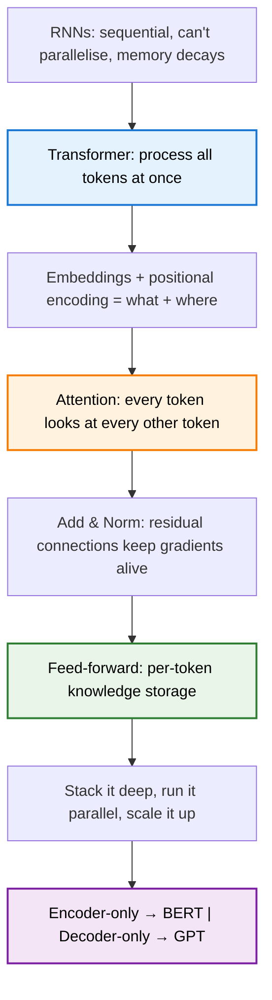

> **TL;DR**: RNNs processed language one word at a time. LSTMs added memory gates but stayed sequential. The Transformer threw all of that out — no recurrence, no convolutions — and replaced it with a single idea: let every word look at every other word, all at once. The 2017 "Attention Is All You Need" paper didn't just propose a new architecture. It ended an era.

> These paper reviews are written more for me and less for others. LLMs have been used in formatting
{: .prompt-tip }

---

## The Problem: Sequence Models Were Holding Us Back

We covered RNNs and LSTMs in an [earlier post](). The short version: RNNs process sequences one token at a time, feeding the hidden state from step $t-1$ into step $t$. It's elegant in theory. In practice, two things kill it.

**First, memory decays.** Even LSTMs, which were specifically designed to fix this, struggle with very long sequences. By the time you're 500 tokens in, the information from the first token has been squeezed through so many gates that it's effectively gone. Generating a coherent story or article? Forget it — literally.

**Second, you can't parallelise.** Step $t$ depends on step $t-1$. Step $t-1$ depends on step $t-2$. You're stuck processing one token at a time, serially. Your GPU has thousands of cores sitting idle while the model plods through the sequence left to right.

This second problem is the quiet killer. In the age of scaling, an architecture that can't parallelise is an architecture that can't grow. And the single biggest lesson of the last decade of deep learning is that **scale alone gives huge qualitative improvements in model performance**.

Vaswani et al. asked a simple question: what if we got rid of recurrence entirely?

---

## The Big Idea: Process Everything at Once

The Transformer's core bet is radical — **no recurrence, no convolutions, just attention**. Every token can directly attend to every other token in the sequence, all in one shot. No more passing information through a chain of hidden states. No more hoping that token 1's information survives the journey to token 500.

Instead, token 500 just *looks at* token 1 directly.

This solves both problems at once. Long-range dependencies? Handled — every token is one step away from every other token. Parallelisation? Handled — all the attention computations for all tokens happen simultaneously.

The price you pay is quadratic complexity in sequence length — the attention pattern is an $N \times N$ matrix, where $N$ is the number of tokens. We'll deal with that problem in a [later post on FlashAttention](). But for now, the tradeoff is worth it.

---

## The Architecture, Piece by Piece

Here's the full picture before we zoom in:

{: w="500" }
_Figure 1 from "Attention Is All You Need" (Vaswani et al., 2017)_

Two halves — an **encoder** that reads and a **decoder** that generates. Let's walk through each component.

---

## Step 1: Tokenisation and Embeddings

The input text gets broken into **tokens** — usually words or subword pieces. Each token is mapped to a high-dimensional vector via a learned embedding matrix. If our embedding dimension is $d_{\text{model}} = 512$, then each token becomes a vector in $\mathbb{R}^{512}$.

This is a lookup table. The word "mole" always gets the same vector, regardless of whether the text is about animals, chemistry, or dermatology. That's fine for now — context will come later.

But there's something important these embeddings encode beyond just word identity: **directions in the embedding space correspond to semantic meaning**. The classic example — take the embedding of "woman", subtract "man", add it to "uncle", and you land near "aunt." One direction in 512-dimensional space encodes gender. Other directions encode other features. The space is rich.

---

## Step 2: Positional Encoding

Here's a problem. The Transformer processes all tokens simultaneously — which means it has no inherent notion of order. The sentence "the cat sat on the mat" and "mat the on sat cat the" would produce identical attention patterns.

RNNs had this for free — position was baked into the sequential processing. Transformers need it injected explicitly.

The solution from the original paper: add a **positional encoding** vector to each token embedding. The encoding uses sine and cosine functions at different frequencies:

$$PE_{(pos, 2i)} = \sin\left(\frac{pos}{10000^{2i/d_{\text{model}}}}\right)$$

$$PE_{(pos, 2i+1)} = \cos\left(\frac{pos}{10000^{2i/d_{\text{model}}}}\right)$$

Where $pos$ is the position in the sequence and $i$ is the dimension index.

Why sines and cosines? Two reasons. First, each dimension gets a wave at a different frequency — so even if two positions have the same amplitude at one dimension, they'll differ at others. The combination is unique. Second, any fixed offset in position can be represented as a linear transformation of the encoding — which means the model can learn to attend to relative positions, not just absolute ones.

The result: each token's embedding now encodes both *what* it is and *where* it sits. And no sequential processing required.

{: w="550" }
_Each row is a position in the sequence, each column is a dimension. Lower dimensions oscillate fast, higher dimensions oscillate slow — the combination is unique for every position._

---

## Step 3: Attention (The High-Level View)

This is where the magic happens — and it's deep enough that it gets [its own post](). Here, I'll give you the intuition.

Consider the word "mole" appearing in three different contexts:
- "American shrew **mole**"
- "one **mole** of carbon dioxide"
- "take a biopsy of the **mole**"

After the embedding step, "mole" has the same vector in all three cases. That's useless. We need the surrounding words to *refine* this embedding — to push it toward the animal meaning, the chemistry meaning, or the medical meaning.

Attention does exactly this. Each token produces three things:
- A **Query** — "what am I looking for?"
- A **Key** — "what do I contain?"
- A **Value** — "what information should I pass along?"

Queries and keys get compared via dot products to produce an attention score — how relevant is each token to each other token. Those scores become weights. The values get mixed according to those weights. The result is a new, context-aware embedding for each token.

The formula, from the paper:

$$\text{Attention}(Q, K, V) = \text{softmax}\left(\frac{QK^T}{\sqrt{d_k}}\right)V$$

The $\sqrt{d_k}$ is there for numerical stability — without it, the dot products get large and softmax saturates. The softmax normalises each row into a probability distribution. The multiplication by $V$ produces a weighted combination of value vectors.

That's one attention head. In practice, you run **multiple heads in parallel** — each with its own Q, K, V matrices — so the model can attend to different types of relationships simultaneously. One head might capture syntactic structure. Another might capture coreference. Another might do something we can't easily interpret.

We'll tear this apart properly in the next post.

---

## Step 4: Add & Norm (Residual Connections)

After every attention layer and every feed-forward layer, the Transformer does two things:

1. **Residual connection**: add the layer's input to its output
2. **Layer normalisation**: normalise the result

$$\text{LayerNorm}(x + \text{Sublayer}(x))$$

This is borrowed from ResNets, and it solves the same problem. Deep networks have trouble propagating gradients through many layers. The residual connection gives the gradient a highway — it can skip layers entirely if needed. Layer norm keeps the scale stable.

Without these, a 96-layer Transformer wouldn't train. With them, gradients flow cleanly from output back to input.

---

## Step 5: The Feed-Forward Network

After attention refines the embeddings based on context, each token passes through a **position-wise feed-forward network** — two linear transformations with a ReLU (or GELU) in between:

$$\text{FFN}(x) = W_2 \cdot \text{ReLU}(W_1 x + b_1) + b_2$$

"Position-wise" means it's applied to each token independently — no cross-token interaction here. That's attention's job. The FFN's job is different: this is where the model stores and retrieves **factual knowledge**. We'll dig into this in [a separate post]() on MLPs and how they encode facts.

In GPT-3, the inner dimension of the FFN is 4× the embedding dimension — so 49,152 neurons. That's a lot of capacity for storing knowledge, and it accounts for about two-thirds of the model's total parameters.

---

## The Decoder Side

Everything above describes the encoder. The decoder is almost identical, with two key differences:

### Masked Self-Attention

During generation, the decoder produces tokens one at a time, left to right. When predicting token $t$, it shouldn't be able to see tokens $t+1, t+2, \ldots$ — that would be cheating.

The fix: **mask** the attention pattern. Before applying softmax, set all positions above the diagonal to $-\infty$. After softmax, those become zero. Each token can only attend to itself and earlier tokens.

### Cross-Attention

The decoder needs to know what the encoder saw. This happens through **cross-attention** — identical to self-attention, except:
- **Keys and Values** come from the encoder's output
- **Queries** come from the decoder

This is how the decoder "reads" the input. In a translation model, the French decoder tokens query against the English encoder representations to figure out which source words matter for generating each target word.

### The Generation Loop

At inference time, the decoder runs autoregressively:

1. Feed in a start token
2. Predict the next token (highest probability from softmax)
3. Append it to the input
4. Repeat until an end token appears

Each step recomputes attention over the full sequence generated so far. This is expensive — and it's exactly the problem that [KV caching]() solves.

---

## Encoder-Only, Decoder-Only, and the Modern Landscape

The original paper used the full encoder-decoder architecture for machine translation. But the real story is what came after:

- **Encoder-only** (BERT): just the encoder, trained with masked language modeling. Great for understanding — classification, NER, similarity.
- **Decoder-only** (GPT): just the decoder, trained autoregressively. Great for generation — and it turns out, with enough scale, great for understanding too.

Most modern LLMs — GPT-4, Claude, Llama — are decoder-only. The encoder-decoder split turned out to be less important than sheer scale and the quality of the attention mechanism itself.

---

## Why This Worked

The Transformer didn't win because attention is theoretically elegant (though it is). It won because of a practical property: **massive parallelisability**.

Every token attends to every other token simultaneously. No sequential dependency. You can matrix-multiply the entire attention computation in one shot on a GPU. Compare that to an LSTM, which has to process token 500 before it can start on token 501.

The result: Transformers scale. You can make them wider (more dimensions), deeper (more layers), and longer (more context), and the hardware can keep up. RNNs hit a wall. Transformers didn't.

That's the real reason attention is all you need.

---

## Summary

**Key Takeaways:**
- The Transformer replaced recurrence with attention — every token attends to every token, in parallel
- Positional encodings inject sequence order via sine/cosine waves — no sequential processing needed
- The architecture is modular: embeddings → attention → add & norm → FFN → add & norm, stacked deep
- Residual connections and layer norm are what make depth possible
- The encoder-decoder split matters less than people think — modern LLMs are mostly decoder-only
- The real victory was parallelisability — Transformers scale where RNNs couldn't

---

## Further Reading

- **The Original Paper**: [Attention Is All You Need (Vaswani et al., 2017)](https://arxiv.org/abs/1706.03762)
- **The Illustrated Transformer**: [Jay Alammar's visual walkthrough](https://jalammar.github.io/illustrated-transformer/)
- **3Blue1Brown's Deep Learning Series**: [Chapter 5 — Transformers](https://www.youtube.com/watch?v=wjZofJX0v4M)

---
