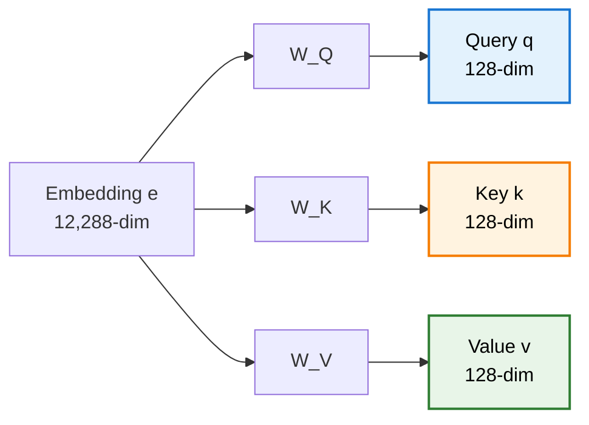
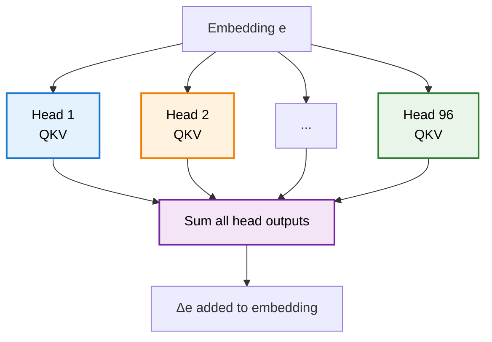
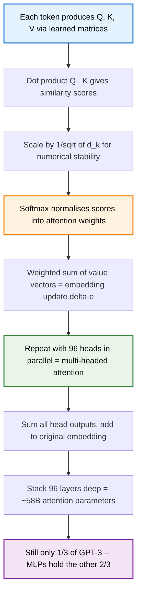

> **TL;DR**: Attention is the mechanism that lets every token look at every other token and decide what matters. It works through three learned matrices -- Query, Key, and Value -- that produce similarity scores, normalize them via softmax, and use them to update embeddings with contextual meaning. GPT-3 runs 96 attention heads per layer across 96 layers, totalling ~58 billion parameters for attention alone. That sounds like a lot. It is only a third of the model.

> These paper reviews are written more for me and less for others. LLMs have been used in formatting
{: .prompt-tip }

---

## Previously, on Transformers

In the [last post](), we walked through the Transformer architecture end to end -- embeddings, positional encodings, attention (at a high level), feed-forward networks, residual connections. We got the shape of the thing. Now we crack open the most important box.

{: w="500" }
_Figure 1 from "Attention Is All You Need" (Vaswani et al., 2017)_

The attention mechanism is where context happens. It is the reason "mole" can mean an animal, a unit of measurement, or a skin lesion depending on the words around it. The initial embedding is just a lookup table -- the same vector for "mole" regardless of context. Attention is what refines that vector into something useful.

Let us tear it apart.

---

## What Does Attention Actually Want to Do?

Consider the phrase: **"a fluffy blue creature roamed the verdant forest."**

After tokenisation and embedding, "creature" is a generic vector in $\mathbb{R}^{12288}$ (using GPT-3's dimensions). It encodes "creature" in the abstract -- something alive, probably an animal, no further detail. But we want it to encode a *fluffy blue* creature. The adjectives need to push the noun's embedding toward a more specific region of the space.

That is the job. Attention figures out *which* words are relevant to *which* other words, and then updates the embeddings accordingly.

---

## The Query-Key-Value Framework

Three matrices. That is the entire machinery.

### Queries: "What Am I Looking For?"

Each token's embedding $e$ gets multiplied by a **query matrix** $W_Q$ to produce a **query vector** $q$:

$$q = W_Q \cdot e$$

The query encodes a question. For a noun like "creature", the query might encode something like "are there adjectives near me?" The query lives in a smaller space -- 128 dimensions in GPT-3, compared to 12,288 for the embedding.

### Keys: "What Do I Have to Offer?"

The same embedding gets multiplied by a **key matrix** $W_K$ to produce a **key vector** $k$:

$$k = W_K \cdot e$$

The key is the answer to someone else's query. For "fluffy", the key might encode "I am an adjective, and I am nearby." Keys live in the same 128-dimensional space as queries.

### Values: "What Information Should I Pass Along?"

A **value matrix** $W_V$ produces the **value vector** $v$:

$$v = W_V \cdot e$$

This is the actual content that gets passed. If "fluffy" attends to "creature", the value vector is *what gets added* to creature's embedding. It is the payload.

Every token in the sequence produces all three. The query-key pairs determine *how much* to attend. The values determine *what* gets communicated.

---

## Dot Products as Similarity Scores

How do you measure whether a key matches a query? **Dot product.**

For each pair of tokens $i$ and $j$, compute $q_i \cdot k_j$. A large positive dot product means the key and query point in similar directions -- they are relevant to each other. A small or negative dot product means they are unrelated.

Do this for *every* pair and you get an $N \times N$ grid of scores, where $N$ is the sequence length. Each entry answers: "how relevant is token $j$ to updating token $i$?"

In our example, the dot product between the query of "creature" and the keys of "fluffy" and "blue" should be large and positive. The dot product between the query of "creature" and the key of "the" should be small or negative. They have nothing to say to each other.

Here is what that $N \times N$ grid looks like in practice — this is a cross-attention map from an English-to-French translation model. Each row is a French output token, each column is an English input token. Brighter = more attention.

{: w="500" }
_The diagonal structure shows the model mostly aligns words in order — but notice "zone économique européenne" attending broadly to "European Economic Area", and "1992" locking cleanly onto "1992"._

---

## Scaling by $\sqrt{d_k}$: A Numerical Necessity

Here is a subtle problem. If the key-query dimension $d_k = 128$, and the entries of $q$ and $k$ are roughly unit variance, the dot product has variance proportional to $d_k$. That means the raw scores can get very large -- large enough to push softmax into saturation, where it assigns nearly all the weight to one token and near-zero to everything else.

The fix is simple: divide by $\sqrt{d_k}$.

$$\text{score}(q_i, k_j) = \frac{q_i \cdot k_j}{\sqrt{d_k}}$$

With $d_k = 128$, that is dividing by $\approx 11.3$. It keeps the variance at a manageable scale so softmax has a meaningful gradient to work with. Without this, training becomes unstable. It is the kind of detail that seems trivial but actually matters.

---

## Softmax: Turning Scores into Weights

The raw scores can be any real number. We need them to be probabilities -- non-negative and summing to 1 per column. **Softmax** does this:

$$\alpha_{ij} = \frac{\exp(\text{score}(q_i, k_j))}{\sum_{m} \exp(\text{score}(q_i, k_m))}$$

After softmax, each column of the attention grid is a probability distribution. The weights tell you: "of all the tokens in the sequence, how much should each one contribute to updating this particular token?"

For autoregressive models like GPT, there is one more step -- **masking**. Token $t$ should not attend to tokens after position $t$ (that would be seeing the future). Before softmax, all entries above the diagonal are set to $-\infty$. After softmax, they become zero. The columns stay normalised, and causality is preserved.

Putting it all together, the full attention formula from the original paper:

$$\text{Attention}(Q, K, V) = \text{softmax}\left(\frac{QK^T}{\sqrt{d_k}}\right)V$$

{: w="500" }

---

## Values and the Embedding Update ($\Delta e$)

The attention weights are computed. Now what?

For each token, you take a weighted sum of all the value vectors, weighted by the attention scores from that token's column. The result is a change vector $\Delta e$ -- something you *add* to the original embedding.

$$\Delta e_i = \sum_j \alpha_{ij} \cdot v_j$$

For "creature", this means adding large proportions of the value vectors from "fluffy" and "blue" (high attention weight) and near-zero proportions from "the" or "roamed" (low weight). The result is a refined embedding that now encodes "fluffy blue creature" instead of just "creature."

This is the core operation. Everything else -- queries, keys, dot products, softmax -- exists to compute the weights $\alpha_{ij}$. The values are the actual information transfer.

---

## Low-Rank Factorisation: Value-Down, Value-Up

In the simplest version, the value matrix would be square -- $12{,}288 \times 12{,}288$ -- mapping from embedding space back to embedding space. That is $\sim$150 million parameters for a single attention head. Way too many.

The solution: **factor the value map into two smaller matrices.**

- **Value-down** ($W_{V\downarrow}$): maps from the 12,288-dimensional embedding space down to 128 dimensions. Same size as the key-query space.
- **Value-up** ($W_{V\uparrow}$): maps from 128 dimensions back up to 12,288.

$$V_{\text{full}} = W_{V\uparrow} \cdot W_{V\downarrow}$$

This is a **low-rank factorisation**. The overall map from embedding space to embedding space is constrained to have rank at most 128. You lose some expressiveness, but you gain a massive parameter reduction -- from $\sim$150 million to $\sim$3.1 million for the value map.

Conceptually, the value-down matrix compresses the embedding into a compact representation of "what this token has to say." The value-up matrix expands that back into a direction in embedding space -- the actual nudge that gets added to another token's embedding. The blueness of "blue", for example, gets compressed to a small vector and then expanded into the specific direction in 12,288-dimensional space that encodes colour.

---

## Multi-Headed Attention: 96 Perspectives at Once

One attention head captures one type of relationship. Maybe adjectives updating nouns. But language has far more structure than that.

- "they crashed the **car**" -- the verb changes the state of the noun
- "**Harry** ... wizard" -- distant context changes the identity of a name
- "the cat sat on the **mat**" -- syntactic structure determines roles

A single head cannot learn all of these simultaneously. The solution: **run many attention heads in parallel**, each with its own $W_Q$, $W_K$, $W_{V\downarrow}$, and $W_{V\uparrow}$ matrices.

GPT-3 uses **96 attention heads per layer.** Each head independently computes its own attention pattern and its own set of value updates. The results are summed:

$$\Delta e_i = \sum_{h=1}^{96} \Delta e_i^{(h)}$$

Each head learns to attend to different things. One might capture syntactic dependencies. Another might handle coreference. Another might do something entirely uninterpretable. The model does not care about clean categories -- it cares about predicting the next token.

{: w="500" }
_Each panel is a different attention head from the same layer -- each one has learned a distinct pattern of which tokens attend to which._

---

## The Output Matrix: Stapling Heads Together

In practice, the value-up matrices from all 96 heads are not kept separate. They are **concatenated into a single large output matrix** $W_O$, associated with the entire multi-headed attention block.

Each head produces a 128-dimensional value vector per token. Concatenate all 96 of those and you get a $96 \times 128 = 12{,}288$-dimensional vector -- exactly the embedding dimension. The output matrix then maps this combined vector back to embedding space.

This is the standard implementation you will see in papers and code. When people refer to the "value matrix" of a given head, they typically mean only the value-down projection. The value-up part lives inside $W_O$.

This is worth knowing because the notation in papers can be confusing if you do not realise the factorisation is split across two different conceptual units.

---

## Cross-Attention vs Self-Attention

Everything we have discussed is **self-attention** -- the tokens attend to each other within the same sequence. This is what GPT uses.

**Cross-attention** is almost identical, with one difference: the keys and values come from one sequence, and the queries come from another. In a translation model, for instance, the French decoder tokens produce queries, while the English encoder tokens produce keys and values. The attention pattern then captures which English words are relevant for generating each French word.

Cross-attention also typically has no masking -- there is no notion of "future" tokens when attending across two different sequences.

For decoder-only models like GPT, cross-attention does not apply. But if you read the original "Attention Is All You Need" paper, the encoder-decoder architecture uses both.

---

## Parameter Counting: How the Numbers Add Up

Let us do the accounting for GPT-3. Embedding dimension $d_{\text{model}} = 12{,}288$. Key-query dimension $d_k = 128$.

**Per attention head:**

| Matrix | Dimensions | Parameters |
|--------|-----------|------------|
| $W_Q$ | $128 \times 12{,}288$ | $\sim 1.57\text{M}$ |
| $W_K$ | $128 \times 12{,}288$ | $\sim 1.57\text{M}$ |
| $W_{V\downarrow}$ | $128 \times 12{,}288$ | $\sim 1.57\text{M}$ |

That is $\sim$4.7M per head for Q, K, and value-down.

**Per layer (96 heads):**

The value-up matrices are stapled into the output matrix $W_O$, which is $12{,}288 \times 12{,}288 = \sim 151\text{M}$ parameters. Combined with all 96 heads' Q, K, and value-down:

$$96 \times 4.7\text{M} + 151\text{M} \approx 600\text{M parameters per attention block}$$

**Full model (96 layers):**

$$96 \times 600\text{M} \approx 57.6\text{B parameters}$$

Call it ~58 billion. For attention alone.

---

## The Other Two-Thirds

Here is the punchline that the title promised. GPT-3 has 175 billion parameters. Attention accounts for about 58 billion -- roughly **one-third**.

Where do the other 117 billion live? In the **multi-layer perceptrons** (MLPs) that sit between attention blocks. Each attention block is followed by a feed-forward network with an inner dimension of $4 \times d_{\text{model}} = 49{,}152$. These MLPs are where the model stores factual knowledge -- the actual "memory" of the network.

Attention figures out *which* tokens are relevant. The MLPs figure out *what to do* with that information. Two-thirds of the model's capacity is devoted to the second part.

We will dig into those MLPs in the next post. For now, just know: attention is all you need to *route* information. It is not all you need to *process* it.

---

## Summary

**Key Takeaways:**
- Attention uses three learned matrices (Q, K, V) to compute which tokens are relevant to which, and what information to transfer
- Dot products between queries and keys produce similarity scores; scaling by $\sqrt{d_k}$ prevents softmax saturation
- The value map is low-rank factorised (value-down, value-up) to keep parameter counts manageable
- Multi-headed attention (96 heads in GPT-3) lets the model learn many types of contextual relationships simultaneously
- The output matrix staples all value-up projections together -- a detail that trips people up when reading papers
- GPT-3 devotes ~58B parameters to attention across 96 layers -- and that is only one-third of the model
- The other two-thirds live in the MLPs, which store and process factual knowledge

---

## Further Reading

- **The Original Paper**: [Attention Is All You Need (Vaswani et al., 2017)](https://arxiv.org/abs/1706.03762)
- **3Blue1Brown's Deep Learning Series**: [Chapter 6 -- Attention in Transformers](https://www.youtube.com/watch?v=eMlx5fFNoYc)
- **The Illustrated Transformer**: [Jay Alammar's visual walkthrough](https://jalammar.github.io/illustrated-transformer/)
- **The Annotated Transformer**: [Harvard NLP's line-by-line implementation](https://nlp.seas.harvard.edu/annotated-transformer/)

---
