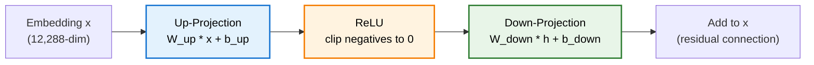
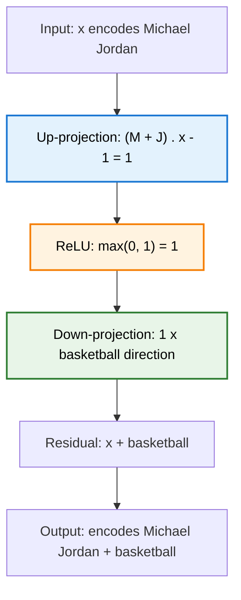
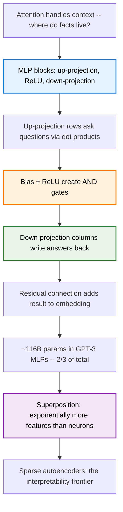

> **TL;DR**: Attention lets tokens talk to each other. But where do the actual facts live -- "Michael Jordan plays basketball," "Paris is in France"? They live in the MLP blocks. Two matrix multiplications with a nonlinearity in between. The up-projection asks questions about the embedding. ReLU acts as an AND gate. The down-projection writes answers back. These blocks hold two-thirds of GPT-3's parameters. And thanks to superposition, they might store exponentially more facts than they have neurons.

> These paper reviews are written more for me and less for others. LLMs have been used in formatting
{: .prompt-tip }

---

## Previously, on Transformers

In the [architecture post](), we walked through the full Transformer -- embeddings, positional encodings, feed-forward networks, residual connections. In the [attention post](), we cracked open the mechanism that lets every token look at every other token.

Attention handles context. It is the reason the model knows that "Jordan" in "Michael Jordan plays the sport of ___" refers to a basketball player and not a country. Attention moves information between positions -- it lets the second token absorb meaning from the first.

But there is a question we skipped. Once the model knows it is looking at Michael Jordan, where does it retrieve the fact that he plays basketball? Where does factual knowledge actually live?

The answer, or at least the best current answer: **the MLP blocks**. Also called feed-forward networks, also called multi-layer perceptrons. The unglamorous other half of each Transformer layer. Two-thirds of all parameters. And the subject of today's post.

---

## The MLP Block: What Is It, Exactly?

Each Transformer layer has two main components: an attention block and an MLP block. Attention lets tokens communicate. The MLP processes each token independently -- no cross-token interaction, everything in parallel.

The computation is almost disappointingly simple:

$$\text{MLP}(x) = W_{\text{down}} \cdot \text{ReLU}(W_{\text{up}} \cdot x + b_{\text{up}}) + b_{\text{down}}$$

Three steps:
1. **Up-projection**: multiply by a big matrix $W_{\text{up}}$, add a bias $b_{\text{up}}$
2. **Nonlinearity**: pass through ReLU (or GELU)
3. **Down-projection**: multiply by another big matrix $W_{\text{down}}$, add a bias $b_{\text{down}}$

The result gets added back to the input via a residual connection. That is the whole thing.

{: w="600" }
_The MLP block laid flat: input embeddings (left) pass through the linear up-projection, ReLU clips the negatives, then the down-projection maps back to embedding space._

The up-projection in GPT-3 maps from 12,288 dimensions to 49,152 -- exactly 4x. That is a design choice, not a law of nature. But clean multiples are friendly for hardware, and 4x has become standard.

---

## A Toy Example: Encoding "Michael Jordan Plays Basketball"

Let us make this concrete. Suppose the model is processing the prompt "Michael Jordan plays the sport of ___" and needs to predict "basketball." Here is how an MLP block could, in principle, store and retrieve that fact.

We need a few assumptions about the embedding space. Suppose there exist three directions:
- A **first-name-Michael** direction $\vec{M}$
- A **last-name-Jordan** direction $\vec{J}$
- A **basketball** direction $\vec{B}$

If a vector $x$ encodes the concept "first name Michael," then $\vec{M} \cdot x = 1$. If it does not, that dot product is zero or negative. Same logic for $\vec{J}$ and $\vec{B}$.

For a vector encoding the full name "Michael Jordan," both $\vec{M} \cdot x = 1$ and $\vec{J} \cdot x = 1$. This assumes an earlier attention block has already moved the first-name information into the second token's vector -- which is exactly the kind of thing attention is built to do.

Now. How does the MLP use this?

---

## Up-Projection: Asking Questions

Think of the up-projection matrix $W_{\text{up}}$ row by row. Each row is a vector -- a direction in embedding space. Multiplying by the matrix means taking a dot product with every row. Each row is asking a question about the input.

Suppose the first row of $W_{\text{up}}$ is $\vec{M} + \vec{J}$ -- the sum of the Michael and Jordan directions. Then the first component of the output is:

$$(\vec{M} + \vec{J}) \cdot x = \vec{M} \cdot x + \vec{J} \cdot x$$

If $x$ encodes the full name Michael Jordan, this equals $1 + 1 = 2$. If it encodes only "Michael" (but not "Jordan"), it equals $1$. If it encodes neither, it is $0$ or negative.

Now add the bias. Set $b_{\text{up}}$ to $-1$ for this component. The result becomes:

$$(\vec{M} + \vec{J}) \cdot x - 1$$

This is $+1$ if and only if both names are present. Otherwise it is $0$ or negative. We have built an **AND gate** out of a dot product and a bias.

But there is a problem. This is still a linear operation. Michael plus Phelps would trigger halfway. Alexis plus Jordan would too. We need a hard cutoff.

---

## ReLU: The Nonlinear Switch

Enter **ReLU** -- the Rectified Linear Unit. The graph is dead simple: negative values become zero, positive values pass through unchanged.

$$\text{ReLU}(z) = \max(0, z)$$

After ReLU, our AND gate becomes clean:
- Michael Jordan: $\text{ReLU}(2 - 1) = \text{ReLU}(1) = 1$
- Michael Phelps: $\text{ReLU}(1 - 1) = \text{ReLU}(0) = 0$
- Alexis Jordan: $\text{ReLU}(1 - 1) = \text{ReLU}(0) = 0$
- Random name: $\text{ReLU}(\leq 0) = 0$

The nonlinearity is what makes the gate work. Without it, partial matches would leak through. With it, you get a binary-like response: this vector either encodes Michael Jordan or it does not.

Most modern models actually use **GELU** instead of ReLU -- same basic shape, just smoother around zero. For building intuition, ReLU is cleaner. The logic is the same.

{: w="550" }
_ReLU hard-clips at zero. GELU and SiLU smooth the transition -- they allow small negative values through, which helps gradient flow during training._

---

## Neurons: Active and Inactive

When people talk about **neurons** in a Transformer, they mean these intermediate values -- the outputs after the up-projection and nonlinearity. In GPT-3, each MLP block has 49,152 neurons.

A **neuron is active** when its value is positive (it survived ReLU). A **neuron is inactive** when its value is zero (ReLU killed it). Each active neuron says: "yes, the input matches the pattern I was looking for."

This is exactly the classic neural network picture -- a layer of dots with lines connecting to the previous layer. The dots are neurons. The lines are weights. The combination of linear transformation followed by a pointwise nonlinearity is the fundamental unit of neural computation. It has been since the 1980s. Transformers did not change this part.

---

## Down-Projection: Writing the Answer

The down-projection matrix $W_{\text{down}}$ maps back from 49,152 dimensions to 12,288. Think of it column by column this time. Each column is a vector in embedding space -- a direction that gets added to the result when the corresponding neuron is active.

Suppose the first column of $W_{\text{down}}$ is the basketball direction $\vec{B}$. When the Michael-Jordan neuron fires (value = 1), the down-projection adds $1 \times \vec{B}$ to the output. When it does not fire (value = 0), nothing gets added.

And it does not have to be just basketball. That column could encode a superposition of many features associated with Michael Jordan -- basketball, Chicago Bulls, six championships, Space Jam. The model can bake whatever associations it wants into that column.

Every other column does the same thing for its corresponding neuron. The full down-projection is just a sum of contributions from all active neurons:

$$W_{\text{down}} \cdot h = \sum_{i} h_i \cdot \text{column}_i$$

Where $h_i$ is the activation of neuron $i$. Inactive neurons contribute nothing. Active neurons add their column to the result.

---

## Putting It All Together

The full picture for our toy example:

1. Vector $x$ encoding "Michael Jordan" flows in
2. Up-projection row computes $(\vec{M} + \vec{J}) \cdot x - 1 = 1$
3. ReLU keeps it: $\text{ReLU}(1) = 1$
4. Down-projection column adds $\vec{B}$ (basketball direction) to the output
5. Residual connection adds this to $x$
6. The vector flowing out now encodes Michael Jordan *and* basketball

This is happening in parallel for every token in the sequence. Each vector goes through its own copy of this computation, independently. At GPT-3 scale, that is 49,152 neurons times however many tokens are in the input, all at once.

---

## The Parameter Count: Two-Thirds of Everything

Let us count. The up-projection matrix $W_{\text{up}}$ has shape $49{,}152 \times 12{,}288$. That is about 604 million parameters. The down-projection $W_{\text{down}}$ has shape $12{,}288 \times 49{,}152$ -- same count, transposed. Together: ~1.2 billion parameters per MLP block.

GPT-3 has 96 layers. Each layer has one MLP block. So the total MLP parameter count is:

$$96 \times 1.2 \text{ billion} \approx 116 \text{ billion parameters}$$

That is roughly **two-thirds of GPT-3's total 175 billion parameters**. The attention blocks, embeddings, and unembeddings make up the other third. The MLP is where most of the model lives. If facts are stored anywhere, this is the prime real estate.

---

## Superposition: More Ideas Than Dimensions

Here is where things get strange -- and beautiful.

Our toy example used one neuron per fact. One row in $W_{\text{up}}$ for Michael Jordan, one column in $W_{\text{down}}$ for basketball. But GPT-3 only has 49,152 neurons per layer. The model clearly knows far more than 49,152 facts. So how does it fit?

The answer might be **superposition**. The idea is simple to state and wild in its implications: if you relax the requirement that feature directions be exactly perpendicular and allow them to be *nearly* perpendicular -- say, between 89 and 91 degrees apart -- you can cram exponentially more directions into the same space.

In two or three dimensions, "nearly perpendicular" gives you almost no extra room. But in high dimensions, the story changes dramatically. This is a consequence of the **Johnson-Lindenstrauss lemma**: the number of nearly-orthogonal vectors you can pack into a space grows exponentially with the number of dimensions.

![High-dimensional geometry: [0,1]² [0,1]³ [0,1]⁸](/assets/img/ran/superposition-geometry.png){: w="580" }
_In 2D a unit square has four corners. In 3D a cube has eight. In 8D the hypercube has 256 corners -- all nearly equidistant from each other. The spiky star on the right shows how directions proliferate as dimensions grow._

### The Python Illustration

Here is the intuition. Take 100-dimensional space. Generate 10,000 random vectors -- 100 times more vectors than dimensions. Measure the angles between all pairs. Even for random vectors, the distribution is already heavily concentrated around 90 degrees (a quirk of high-dimensional geometry). Run an optimization process to nudge them toward perpendicularity, and the distribution compresses into a tight band between 89 and 91 degrees.

10,000 nearly perpendicular vectors in 100 dimensions. At the scale of GPT-3's 12,288-dimensional embedding space, or the 49,152-dimensional neuron space, the number of nearly-independent directions is staggering.

{: w="520" }
_Project 300-dimensional vectors down to a lower-dimensional space at random, and pairwise distances are preserved to within ~25%. The distribution is tight -- nearly all pairs land close to the original distance._

### What This Means for MLPs

If the model uses superposition, then individual features are not represented by single neurons. Instead, a feature like "Michael Jordan" would be encoded as a specific *combination* of neurons -- a direction in the 49,152-dimensional neuron space that does not align with any single axis. The model could store far more features than it has neurons, at the cost of some small interference between them.

This is both exciting and terrifying from an interpretability standpoint. You cannot just look at which neurons light up and say "ah, that is the Michael Jordan neuron." The information is smeared across many neurons in a superposition. The model's true features are hidden.

---

## Sparse Autoencoders: Cracking the Code

If features are superimposed across neurons, how do you find them? This is where **sparse autoencoders** come in -- a tool that interpretability researchers use to decompose neuron activations into a larger set of interpretable features.

The basic idea: train an autoencoder on the neuron activations from an MLP layer, but force the hidden layer to be much wider and much sparser than the input. The autoencoder learns to reconstruct neuron patterns using a small number of active features drawn from a large dictionary. Each feature in that dictionary ideally corresponds to a single, clean concept.

Anthropic has done some of the most detailed work here, and the results are genuinely fascinating. But that is its own post.

---

## Summary

**Key Takeaways:**
- MLP blocks are the factual memory of a Transformer -- two matrix multiplications with a nonlinearity in between
- The up-projection probes the embedding; each row asks "does this vector encode feature X?"
- ReLU acts as a gate: partial matches get clipped to zero, clean matches pass through
- The down-projection writes back: each column is the information to add when a neuron fires
- GPT-3's MLPs hold ~116 billion parameters -- about two-thirds of the entire model
- Superposition allows exponentially more features than neurons, via nearly-perpendicular directions in high-dimensional space
- Sparse autoencoders are the current best tool for extracting interpretable features from superimposed neuron activations

---

## Further Reading

- **Toy Models of Superposition**: [Anthropic's exploration of how models represent more features than they have dimensions](https://transformer-circuits.pub/2022/toy_model/index.html)
- **Scaling Monosemanticity**: [Anthropic's work on extracting interpretable features from Claude using sparse autoencoders](https://transformer-circuits.pub/2024/scaling-monosemanticity/)
- **3Blue1Brown -- How might LLMs store facts?**: [The video this post is based on](https://www.youtube.com/watch?v=9-Jl0dxWQs8)
- **Locating and Editing Factual Associations in GPT**: [Meng et al., 2022](https://arxiv.org/abs/2202.05262)

---
