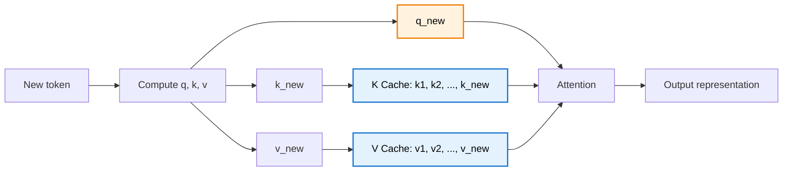
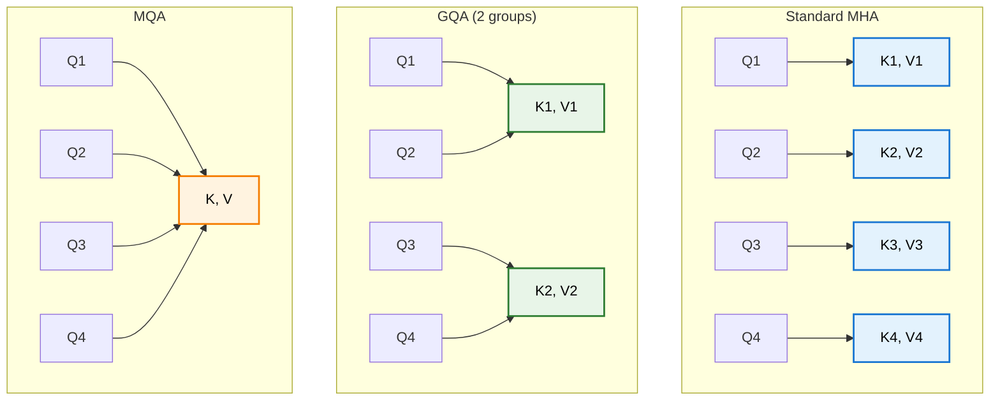
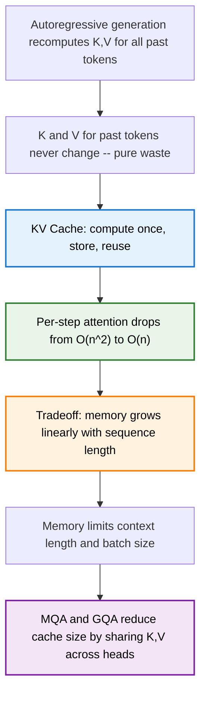

> **TL;DR**: During autoregressive generation, a Transformer recomputes the Key and Value vectors for every previous token at every single step. This is pure waste -- those vectors never change. The KV cache stores them once, reuses them forever, and turns per-step attention from quadratic to linear. The tradeoff? VRAM. Lots of it. Understanding this tradeoff is understanding why your context window has a limit.

> These paper reviews are written more for me and less for others. LLMs have been used in formatting
{: .prompt-tip }

---

## The Setup: How Generation Actually Works

We covered the Transformer architecture in a [previous post](), and tore apart the attention mechanism in [another](). Here's the part that matters for this discussion: at inference time, a decoder-only model generates tokens **one at a time**, autoregressively.

The loop looks like this:

1. Feed in the prompt
2. Predict the next token
3. Append it to the sequence
4. Rerun the entire model on the full sequence
5. Repeat

Step 4 is the problem. Every time we generate a new token, we pass the *entire* sequence through every layer of the model. Every token gets projected into Q, K, and V vectors. Every attention score gets recomputed. Every value vector gets re-weighted and re-summed.

For a sequence of length $n$, that is $O(n^2)$ work per step just for attention -- and it gets worse with every token we add.

---

## The Waste: Same Inputs, Same Outputs, Same Work

Let's be precise about what's happening. At each layer, every token $t_i$ is projected through learned weight matrices to produce:

$$q_i = W_Q \cdot x_i, \quad k_i = W_K \cdot x_i, \quad v_i = W_V \cdot x_i$$

Here is the critical observation: **the model weights $W_Q$, $W_K$, $W_V$ don't change during inference**. And the input representation $x_i$ for a previously processed token doesn't change either -- it's determined by the tokens before it, which are fixed.

So when we're generating the 100th token, we recompute $k_1, k_2, \ldots, k_{99}$ and $v_1, v_2, \ldots, v_{99}$ -- all of which are identical to what we computed at the previous step. We computed $k_1$ at step 1, again at step 2, again at step 3, and so on, 99 times total. Every single computation after the first is wasted.

```mermaid
graph TD
    subgraph "Step 1: Generate token 2"
        S1["Compute K1, V1"] --> S1out["Predict token 2"]
    end
    subgraph "Step 2: Generate token 3"
        S2a["Recompute K1, V1"] --> S2b["Compute K2, V2"]
        S2b --> S2out["Predict token 3"]
    end
    subgraph "Step 3: Generate token 4"
        S3a["Recompute K1, V1"] --> S3b["Recompute K2, V2"]
        S3b --> S3c["Compute K3, V3"]
        S3c --> S3out["Predict token 4"]
    end

    style S2a fill:#ffebee,stroke:#c62828,stroke-width:2px,color:#000
    style S3a fill:#ffebee,stroke:#c62828,stroke-width:2px,color:#000
    style S3b fill:#ffebee,stroke:#c62828,stroke-width:2px,color:#000
```

The red boxes are redundant. Every one of them computes something we already know.

---

## The Fix: Cache Once, Reuse Forever

The KV cache is exactly what it sounds like: **store the K and V vectors after computing them, and never recompute them again**.

At each generation step, instead of projecting the full sequence through $W_Q$, $W_K$, $W_V$, we only project the **new token**. We compute $q_{\text{new}}$, $k_{\text{new}}$, $v_{\text{new}}$ for just that one token. Then we append $k_{\text{new}}$ and $v_{\text{new}}$ to the cache, retrieve all previously cached K and V vectors, and compute attention normally.

{: w="620" }
_Each panel is one generation step. The query (red) is always just one vector. The key and value columns (blue) grow by one entry per step — that's the cache accumulating._

Notice what's missing: we don't cache Q. Why? Because we only ever need the query for the **current** token. The query of token 5 is never used again after step 5 -- it served its purpose in computing that step's attention weights. Keys and values, on the other hand, are needed by every future token's query. That asymmetry is the entire insight.

---

## From Quadratic to Linear: The Complexity Shift

Without KV cache, at generation step $n$, we compute the full $n \times n$ attention matrix. Only the last row matters for predicting the next token, but we compute all $n$ rows anyway. That's $O(n^2)$ per step.

With KV cache, we compute exactly one row of the attention matrix -- the last row. We take $q_{\text{new}}$ and dot it with all $n$ cached keys:

$$\text{attn\_weights} = \text{softmax}\left(\frac{q_{\text{new}} \cdot K_{\text{cached}}^T}{\sqrt{d_k}}\right)$$

That's $O(n)$ per step. We also save on the QKV projections -- instead of projecting $n$ tokens through $W_Q$, $W_K$, $W_V$, we project just one.

Over a full generation of $T$ tokens, the total attention cost drops from $O(T^3)$ (summing $n^2$ for $n = 1$ to $T$) to $O(T^2)$ (summing $n$ for $n = 1$ to $T$). That's one full order of magnitude in the exponent.

---

## A Concrete Walk-Through

Let's trace generation of the sequence "The capital of France is Paris" with and without KV cache. Assume a single attention layer for clarity.

### Without KV Cache

| Step | Input to model | Q,K,V computed for | Attention matrix size |
|------|---------------|--------------------|-----------------------|
| 1 | "The" | 1 token | 1 x 1 |
| 2 | "The capital" | 2 tokens | 2 x 2 |
| 3 | "The capital of" | 3 tokens | 3 x 3 |
| 4 | "The capital of France" | 4 tokens | 4 x 4 |
| 5 | "The capital of France is" | 5 tokens | 5 x 5 |
| 6 | "The capital of France is Paris" | 6 tokens | 6 x 6 |

Total QKV projections: $1 + 2 + 3 + 4 + 5 + 6 = 21$. Total attention elements: $1 + 4 + 9 + 16 + 25 + 36 = 91$.

### With KV Cache

| Step | Input to model | Q,K,V computed for | Attention matrix size | Cache size after |
|------|---------------|--------------------|-----------------------|-----------------|
| 1 | "The" | 1 token | 1 x 1 | 1 |
| 2 | "capital" | 1 token | 1 x 2 | 2 |
| 3 | "of" | 1 token | 1 x 3 | 3 |
| 4 | "France" | 1 token | 1 x 4 | 4 |
| 5 | "is" | 1 token | 1 x 5 | 5 |
| 6 | "Paris" | 1 token | 1 x 6 | 6 |

Total QKV projections: $1 + 1 + 1 + 1 + 1 + 1 = 6$. Total attention elements: $1 + 2 + 3 + 4 + 5 + 6 = 21$.

From 91 attention computations to 21. From 21 QKV projections to 6. And this gap grows *quadratically* with sequence length. At 1000 tokens, the difference is staggering.

---

## The Price: Memory

There is no free lunch. The KV cache trades compute for VRAM. Every key and value vector you cache is memory you can't use for anything else.

Let's do the math. For each layer, each attention head stores a key vector and a value vector for every token in the sequence. Each vector has dimension $d_{\text{head}}$. In FP16, each value takes 2 bytes.

$$\text{KV cache memory} = 2 \times n_{\text{layers}} \times n_{\text{heads}} \times d_{\text{head}} \times n_{\text{tokens}} \times 2 \text{ bytes}$$

The leading factor of 2 is for K and V. Let's plug in realistic numbers for a large model:

| Parameter | Value |
|-----------|-------|
| Layers ($n_{\text{layers}}$) | 80 |
| Attention heads ($n_{\text{heads}}$) | 8 |
| Head dimension ($d_{\text{head}}$) | 128 |
| Context length ($n_{\text{tokens}}$) | 8,192 |
| Precision | FP16 (2 bytes) |

$$\text{Memory} = 2 \times 80 \times 8 \times 128 \times 8192 \times 2 \approx 2.68 \text{ GB}$$

That's 2.68 GB for a **single request** at batch size 1. Bump the batch size to 4 and you're at ~10.7 GB. For batch size 32, you need ~85 GB just for the KV cache -- before you even count model weights, activations, or optimizer states.

This is why context length is not free. Doubling the context window doubles the KV cache memory. It's also why batch size matters so much for serving -- each concurrent request needs its own cache.

---

## Why Your Context Window Has a Limit

The KV cache grows linearly with sequence length. But GPU memory is fixed. At some point, the cache simply doesn't fit.

This creates a hard ceiling on context length. A model might theoretically handle 1 million tokens, but if the KV cache for that many tokens exceeds your GPU's VRAM, you're done. The model architecture isn't the bottleneck -- memory is.

{: w="560" }
_At 32K tokens, KV cache already exceeds the model weights. At 128K, it's nearly 5x the model size. The dashed line is 13 GB — the model itself._

This also explains why **long-context models are expensive to serve**. A 128K context window means 16x more KV cache memory than an 8K window. Serving multiple users simultaneously, each with long contexts, requires enormous memory capacity. The cost isn't in the model weights -- it's in the per-request state.

---

## Shrinking the Cache: MQA and GQA

The KV cache problem has spawned its own subfield of optimisation. Two ideas stand out.

**Multi-Query Attention (MQA)**, introduced by Shazeer in 2019, takes a radical approach: all attention heads share a **single** set of K and V projections. Each head still has its own Q projection, so different heads can attend to different things. But the cached keys and values are shared across all heads. This divides the KV cache size by the number of heads -- a massive reduction.

The cost: slight quality degradation, since heads lose some of their ability to specialise in what information they store.

**Grouped-Query Attention (GQA)**, used in Llama 2 and many newer models, is the compromise. Instead of every head having its own KV (standard) or all heads sharing one KV (MQA), you group heads into clusters. Each group shares a KV pair. With 8 heads and 4 groups, you halve the cache. With 8 heads and 2 groups, you quarter it.

GQA gives you most of MQA's memory savings with almost none of the quality loss. It's the default in most modern architectures.

---

## Implementation Notes

The actual code changes for KV cache are surprisingly small. In the attention module:

1. Pre-allocate cache tensors of shape $(B, n_{\text{heads}}, n_{\text{max\_seq}}, d_{\text{head}})$ for both K and V
2. At each generation step, compute Q, K, V for only the new token
3. Write the new K and V into the cache at the correct position
4. Retrieve the full cached K and V for the attention computation
5. Track how many positions are filled so attention masks work correctly

One subtlety: **positional embeddings**. Without KV cache, every token starts at position 0 because we reprocess the full sequence. With KV cache, the new token needs to know it's at position $n$, not position 0. If you're using absolute positional embeddings, you must track the current sequence length and assign the correct position index. Rotary position embeddings (RoPE) handle this more naturally.

---

## Summary

**Key Takeaways:**
- During autoregressive generation, K and V vectors for past tokens are recomputed at every step -- but they never change
- The KV cache stores these vectors once and reuses them, reducing per-step attention from $O(n^2)$ to $O(n)$
- Only Q needs to be computed for the new token -- K and V come from the cache
- The tradeoff is memory: KV cache scales as $2 \times n_{\text{layers}} \times n_{\text{heads}} \times d_{\text{head}} \times n_{\text{tokens}}$
- This memory cost is why context windows are limited and why serving long-context models is expensive
- Multi-Query Attention and Grouped-Query Attention reduce cache size by sharing K,V across attention heads

---

## Further Reading

- **Multi-Query Attention**: [Fast Transformer Decoding: One Write-Head is All You Need (Shazeer, 2019)](https://arxiv.org/abs/1911.02150)
- **Grouped-Query Attention**: [GQA: Training Generalized Multi-Query Transformer Models from Multi-Head Checkpoints (Ainslie et al., 2023)](https://arxiv.org/abs/2305.13245)
- **Efficient Transformers Survey**: [A Survey on Efficient Inference for Large Language Models (Zhou et al., 2024)](https://arxiv.org/abs/2404.14294)
- **Umar Jamil's Visual Walkthrough**: [KV Cache in LLMs Explained Visually](https://www.youtube.com/watch?v=7OrMFn86PlM)

---
