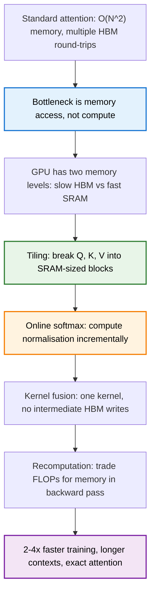

> **TL;DR**: Standard attention is slow not because of the math, but because of memory traffic. The $N \times N$ attention matrix gets written to and read from GPU HBM multiple times, and that data movement dominates wall-clock time. FlashAttention fixes this by tiling the computation into blocks that fit in fast on-chip SRAM, fusing everything into a single kernel, and never materialising the full attention matrix. The result is 2--4x faster training with exact attention -- same math, smarter execution.

> These paper reviews are written more for me and less for others. LLMs have been used in formatting
{: .prompt-tip }

---

## The Bottleneck Nobody Talks About

In the [Transformer architecture post](), we noted that attention has quadratic complexity in sequence length -- that $N \times N$ matrix. In the [attention deep-dive](), we tore apart QKV mechanics, multi-head projections, and softmax normalisation. The natural assumption is that the bottleneck is **compute** -- all those floating-point operations scaling as $O(N^2 d)$.

It is not. On modern GPUs, the bottleneck is **memory access**.

Here is the standard attention algorithm, step by step:

1. Load $Q$ and $K$ from HBM to SRAM, compute $S = QK^T$, write $S$ back to HBM
2. Load $S$ from HBM, compute $P = \text{softmax}(S)$, write $P$ back to HBM
3. Load $P$ and $V$ from HBM, compute $O = PV$, write $O$ back to HBM

Count the round-trips. The $N \times N$ matrices $S$ and $P$ each get written to HBM and read back. That is three full passes over a matrix that, for a sequence length of 4096, contains 16 million entries. The arithmetic itself is fast. The waiting-for-data part is what kills you.

---

## GPU Memory Hierarchy: The Speed Gap

To understand why this matters, you need to know how GPU memory is organised.

{: w="580" }
_Each Streaming Multiprocessor has its own fast L1/SMEM (192 KB). Below that is a shared L2 cache (40 MB). Below that is Global Memory — the HBM (40 GB) that FlashAttention is trying to avoid._

Two levels of memory, wildly different in speed and size:

| Memory | Capacity | Bandwidth | Role |
|--------|----------|-----------|------|
| **HBM** (High Bandwidth Memory) | ~80 GB (A100) | ~2 TB/s | Main GPU memory -- stores model weights, activations, gradients |
| **SRAM** (On-chip cache) | ~20 MB (A100) | ~19 TB/s | Fast scratchpad inside each streaming multiprocessor |

SRAM is roughly **10x faster** than HBM. But it is also roughly **4000x smaller**. The full $N \times N$ attention matrix for any reasonable sequence length does not fit in SRAM. So standard attention has no choice but to materialise it in HBM, pay the bandwidth cost on every access, and move on.

This is the gap FlashAttention exploits.

---

## IO Complexity: Why FLOPS Lie

There is a distinction that matters enormously for GPU programming and is almost never taught in ML courses: **compute complexity** versus **IO complexity**.

**Compute complexity** counts arithmetic operations -- multiplications, additions, exponentials. Standard attention does $O(N^2 d)$ FLOPs. FlashAttention actually does *more* FLOPs (due to recomputation in the backward pass). By the FLOPS metric, FlashAttention is strictly worse.

**IO complexity** counts bytes moved between HBM and SRAM. Standard attention does $O(Nd + N^2)$ HBM accesses -- that $N^2$ term is the attention matrix being read and written multiple times. FlashAttention reduces this to $O(N^2 d^2 / M)$, where $M$ is the SRAM size.

Since $M \gg d^2$ on modern GPUs (SRAM is tens of megabytes, $d$ is typically 64--128 per head, so $d^2$ is at most 16,384), the IO cost drops dramatically. The algorithm does more math but moves far less data. And since attention is memory-bound, less data movement means faster wall-clock time.

> **The lesson**: an algorithm with higher FLOP count can be faster if it has lower IO complexity. FLOPS do not tell the full story. Data movement does.

---

## The Tiling Strategy

The core idea: instead of computing the full $N \times N$ attention matrix, break $Q$, $K$, and $V$ into **blocks** small enough to fit in SRAM. Compute attention one block at a time. Never write the full attention matrix to HBM.

Concretely, divide:
- $Q$ into blocks $Q_1, Q_2, \ldots, Q_{T_r}$ (each of size $B_r \times d$)
- $K$ into blocks $K_1, K_2, \ldots, K_{T_c}$ (each of size $B_c \times d$)
- $V$ into blocks $V_1, V_2, \ldots, V_{T_c}$ (each of size $B_c \times d$)

where $B_r$ and $B_c$ are chosen so that the blocks, plus intermediate results, fit in SRAM.

The algorithm runs two nested loops:
1. **Outer loop** over $K$ and $V$ blocks (index $j$)
2. **Inner loop** over $Q$ blocks (index $i$)

For each pair $(i, j)$:
- Load $Q_i$, $K_j$, $V_j$ into SRAM
- Compute $S_{ij} = Q_i K_j^T$ in SRAM
- Compute local softmax statistics (max and sum) in SRAM
- Update the running output $O_i$ incrementally
- Write only the updated $O_i$ block back to HBM

The full $N \times N$ matrix $S$ is never materialised in HBM. Each $B_r \times B_c$ tile of $S$ lives briefly in SRAM and is consumed immediately.

{: w="680" }
_Left: the memory hierarchy with bandwidth numbers. Centre: the tiling algorithm — blocks of K^T and V are loaded into SRAM, Q loops over them, output goes straight back to HBM. Right: wall-clock time on GPT-2 — the fused kernel eliminates all the intermediate steps._

---

## Online Softmax: The Key Trick

There is a problem with tiling. Softmax requires a global normalisation across the entire row:

$$\text{softmax}(x)_i = \frac{e^{x_i}}{\sum_{j=1}^{N} e^{x_j}}$$

You need the full row of $S$ to compute the denominator. But the whole point of tiling is to *avoid* having the full row. So how do you compute softmax without seeing all the values at once?

The answer is **online softmax** -- computing softmax incrementally, block by block. It works in three steps.

**Step 1: Numerically stable softmax.** Rewrite softmax using the row maximum $m = \max_j(x_j)$:

$$\text{softmax}(x)_i = \frac{e^{x_i - m}}{\sum_{j=1}^{N} e^{x_j - m}}$$

This is mathematically identical but prevents overflow.

**Step 2: Decompose into blocks.** Suppose $x = [x^{(1)}, x^{(2)}]$ is split into two blocks. Compute local statistics for each block:

$$m^{(1)} = \max(x^{(1)}), \quad \ell^{(1)} = \sum_j e^{x_j^{(1)} - m^{(1)}}$$

$$m^{(2)} = \max(x^{(2)}), \quad \ell^{(2)} = \sum_j e^{x_j^{(2)} - m^{(2)}}$$

**Step 3: Merge.** Compute the global max $m = \max(m^{(1)}, m^{(2)})$, then adjust:

$$\ell = e^{m^{(1)} - m} \cdot \ell^{(1)} + e^{m^{(2)} - m} \cdot \ell^{(2)}$$

The correction factors $e^{m^{(k)} - m}$ rescale each block's statistics to the global maximum. This extends to any number of blocks, processed sequentially. At each step, you update the running max and running sum -- no need to store the full row.

This is what makes tiled attention possible. You process one column-block of $K$ at a time, update the running softmax statistics, adjust the output accordingly, and move on.

---

## Kernel Fusion: One Kernel to Rule Them All

Standard PyTorch attention calls multiple GPU kernels sequentially:

```
Kernel 1: S = Q @ K.T          # matmul, write S to HBM
Kernel 2: P = softmax(S)       # elementwise, write P to HBM
Kernel 3: O = P @ V            # matmul, write O to HBM
```

Each kernel launch reads from HBM and writes back to HBM. Three kernels, six HBM accesses for the intermediate matrices.

FlashAttention **fuses** all of this into a single custom CUDA kernel:

```
Single kernel:
    for each block of K, V:
        for each block of Q:
            load Q_i, K_j, V_j into SRAM
            compute S_ij, softmax, multiply by V_j
            update running output O_i
    write final O to HBM
```

One kernel. No intermediate HBM writes. The $N \times N$ attention matrix exists only as transient tiles in SRAM, never touching the slow main memory.

This is kernel fusion -- and it is why FlashAttention requires writing custom CUDA code rather than composing PyTorch operations. PyTorch's operator abstraction is the wrong level for this optimisation. You need to go lower.

---

## The Backward Pass: Recomputation Over Storage

There is a subtlety with the backward pass. Standard attention stores $S$ and $P$ in HBM during the forward pass so they are available for gradient computation. That is $O(N^2)$ memory just for the attention matrix -- and for long sequences, this dominates GPU memory usage.

FlashAttention takes a different approach: **do not store $S$ or $P$ at all**. Instead, store only:
- The output $O$
- The per-row softmax statistics ($m$ and $\ell$)

During the backward pass, **recompute** $S$ and $P$ from $Q$, $K$, and the stored statistics. This trades extra compute for drastically less memory. The recomputation uses the same tiling strategy, so it is also IO-efficient.

The memory savings are substantial. Standard attention needs $O(N^2)$ extra memory for the attention matrix. FlashAttention needs $O(N)$ -- just the softmax statistics.

---

## Wall-Clock Results

The numbers speak clearly:

| Model | Standard Training | FlashAttention | Speedup |
|-------|------------------|----------------|---------|
| GPT-2 Small | Baseline | -- | 1.5--2x |
| GPT-2 Medium | ~21 days | ~7 days | **3x** |
| Long-context models | Often infeasible | Feasible | -- |

Beyond raw speed, FlashAttention enables **longer context lengths**. Standard attention's $O(N^2)$ memory means a GPU runs out of memory before it runs out of compute. By reducing memory from $O(N^2)$ to $O(N)$, FlashAttention lets you train with 4--16x longer sequences on the same hardware. Longer context means better models -- the model can attend to more information during training.

This is not a theoretical improvement. It is the reason modern LLMs can handle 32k, 128k, or even 1M token contexts. FlashAttention (and its successors) made that practical.

---

## FlashAttention-2: Squeezing More Out

Tri Dao followed up with **FlashAttention-2** (2023), which pushed performance further with several engineering improvements:

- **Better work partitioning**: reduced the number of non-matmul FLOPs (which run slower on tensor cores) and improved parallelism across GPU thread blocks
- **Swapped loop order**: the outer loop now iterates over $Q$ blocks and the inner loop over $K$/$V$ blocks, enabling better parallelism across streaming multiprocessors
- **Within-block parallelism**: better distribution of work across warps within each thread block

The result: FlashAttention-2 reaches 50--73% of theoretical peak FLOPS on A100, compared to 25--40% for the original. Roughly a 2x speedup over FlashAttention-1, and up to 9x faster than standard attention in PyTorch.

---

## What This Is -- and What It Is Not

This is worth stating clearly: **FlashAttention is not a new attention mechanism.** It computes exact standard dot-product attention. The same $QK^T$, the same softmax, the same multiplication by $V$. The outputs are identical (up to floating-point precision).

It is a systems-level optimisation. An algorithm redesign that respects the hardware it runs on. The insight is not mathematical -- it is about understanding that on modern GPUs, the cost of moving data dwarfs the cost of computing with it.

This matters for a broader reason. Much of the ML community focuses on algorithmic innovations -- new architectures, new loss functions, new training procedures. FlashAttention is a reminder that **how you implement the algorithm matters as much as the algorithm itself.** A smarter implementation of standard attention beats approximate attention methods that have better theoretical complexity but worse IO patterns.

---

## Summary



**Key Takeaways:**
- Standard attention is **memory-bound**, not compute-bound -- the $N \times N$ matrix bouncing between HBM and SRAM is the bottleneck
- GPU memory has a hierarchy: HBM is large but slow (~2 TB/s), SRAM is small but fast (~19 TB/s)
- **IO complexity** matters more than compute complexity for memory-bound operations -- FLOPS alone are misleading
- FlashAttention **tiles** the computation into SRAM-sized blocks and uses **online softmax** to avoid materialising the full attention matrix
- **Kernel fusion** eliminates intermediate HBM writes by doing everything in a single CUDA kernel
- The backward pass **recomputes** attention instead of storing it, trading compute for $O(N)$ instead of $O(N^2)$ memory
- The result: exact attention, 2--4x faster, with memory savings that enable much longer context lengths

---

## Further Reading

- **FlashAttention Paper**: [FlashAttention: Fast and Memory-Efficient Exact Attention with IO-Awareness (Dao et al., 2022)](https://arxiv.org/abs/2205.14135)
- **FlashAttention-2 Paper**: [FlashAttention-2: Faster Attention with Better Parallelism and Work Partitioning (Dao, 2023)](https://arxiv.org/abs/2307.08691)
- **Tri Dao's PhD Thesis**: [FlashAttention and related work](https://tridao.me/)
- **Online Softmax**: [Online normalizer calculation for softmax (Milakov & Gimelshein, 2018)](https://arxiv.org/abs/1805.02867)

---
