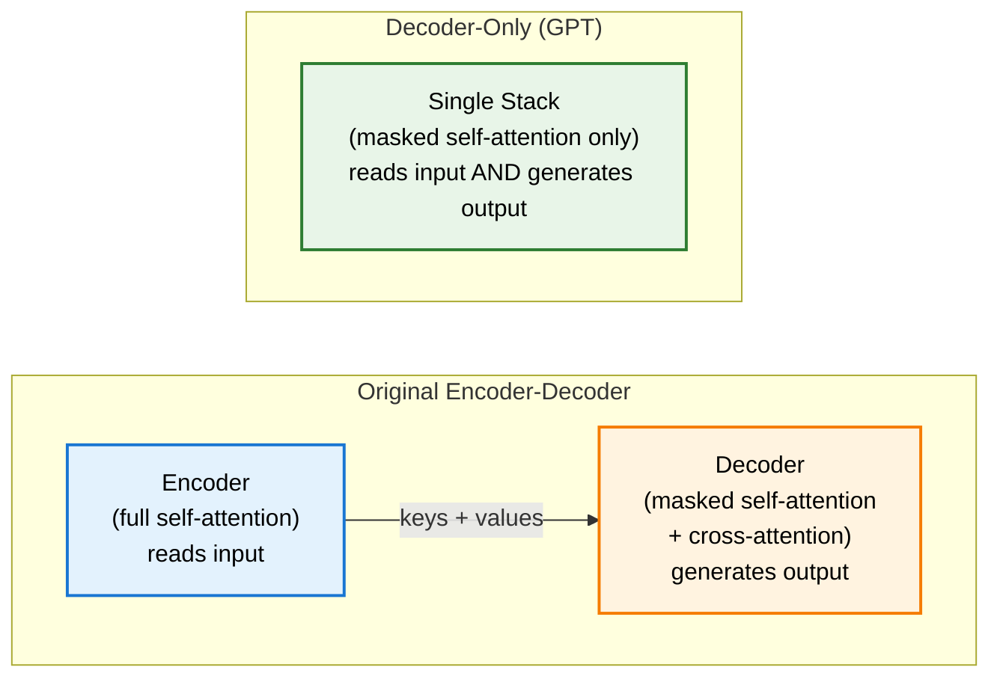
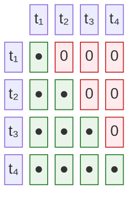
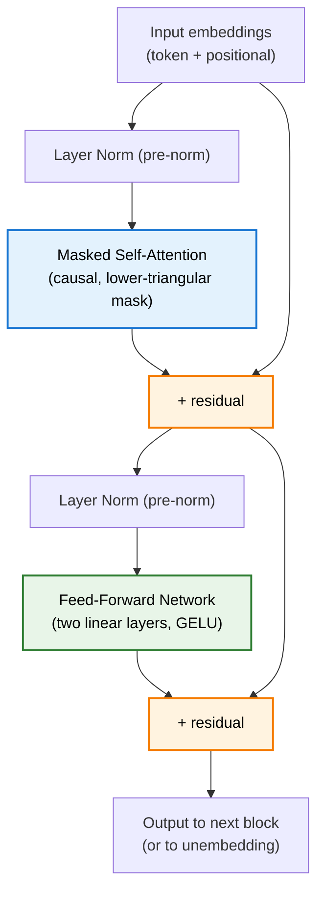
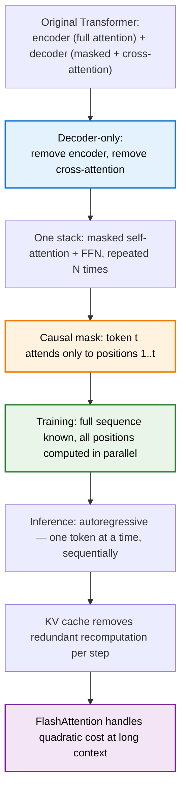

> **TL;DR**: The original Transformer was two halves — an encoder that reads and a decoder that generates. GPT threw away the left half. Decoder-only models use a single stack of masked self-attention layers for both understanding the input and producing the output. No cross-attention. No separate encoder. Just one unit that does everything, autoregressively, one token at a time.

> These paper reviews are written more for me and less for others. LLMs have been used in formatting
{: .prompt-tip }

---

## Previously, on Transformers

In the [architecture post](), we walked through the full encoder-decoder Transformer from "Attention Is All You Need." The encoder reads the input with full, unrestricted self-attention — every token can look at every other token. The decoder generates the output with masked self-attention, then queries the encoder's representations via cross-attention to decide what input context matters for each generated token.

Then GPT came along and removed the encoder entirely.

This post is about why that works, what changes when you do it, and what the generation loop actually looks like. If you have not read the architecture post, the [attention post](), or the [KV cache post](), those provide the mechanics this post builds on.

---

## Encoder vs. Decoder: The Core Distinction

The original Transformer has two structurally distinct halves.

The **encoder** processes the entire input sequence at once. Its self-attention is fully bidirectional — token $t$ can attend to every other token in the sequence, before *and* after it. This is ideal for tasks that require understanding a complete input: translation, where you need to read the whole source sentence before translating; classification; named entity recognition.

The **decoder** is constrained. During generation, it cannot look ahead — it is predicting the next token, so it cannot use future tokens as context without cheating. Its self-attention is **masked**: attention from position $t$ to any position $> t$ is zeroed out. It also has a cross-attention layer that pulls keys and values from the encoder's output, so it can refer back to the input sequence as it generates.

The decoder's cross-attention layer is the architectural bridge between the two halves. Remove the encoder, and there is nothing to bridge to. Cross-attention disappears.

What is left is a stack of masked self-attention layers — and that is the decoder-only Transformer.

---

## What Causal Masking Does

The masking mechanism was introduced in the [attention post](), but it is worth examining more closely here because it is the architectural foundation everything else rests on.

At each layer of a decoder-only Transformer, every token computes queries, keys, and values against every other token. The raw attention scores form an $N \times N$ matrix. Before applying softmax, every entry above the diagonal is set to $-\infty$:

$$\text{score}(i, j) = \begin{cases} \dfrac{q_i \cdot k_j}{\sqrt{d_k}} & \text{if } j \leq i \\ -\infty & \text{if } j > i \end{cases}$$

After softmax, $-\infty$ becomes zero. Token $i$ can only attend to tokens at positions $1$ through $i$. The future is invisible.

Here is what the attention matrix looks like — a lower triangular structure, with the diagonal and everything below it active, and the upper triangle zeroed out:

_Rows are query tokens (what is attending), columns are key tokens (what is being attended to). Green = active, red = masked to zero. Token $t_2$ can attend to $t_1$ and $t_2$, but not $t_3$ or $t_4$._

This constraint is what makes autoregressive generation possible. At training time, the entire target sequence is known — you can run the whole sequence through the model in parallel and compute the loss on all positions simultaneously. The mask enforces the illusion that the model is generating left to right, even though the computation happens all at once. At inference time, the constraint is enforced naturally: the tokens to the right simply do not exist yet.

---

## Why No Encoder Is Needed

When you first hear "remove the encoder," the obvious question is: where does the input go?

In the original encoder-decoder architecture, the encoder processes the prompt with full bidirectional attention, producing rich representations. Those representations are then fed into the decoder via cross-attention. The encoder and decoder are specialised — one reads, one writes.

The decoder-only design collapses this. The input prompt is fed directly into the same masked self-attention stack that generates the output. The prompt tokens form the beginning of the context window. When the model begins generating, it appends new tokens to the end of that context — and those new tokens attend back to the prompt tokens through the same causal self-attention mechanism.

The prompt gets read, but not with full bidirectional attention. Token 500 of the prompt can see tokens 1 through 499. Token 1 can only see itself. This is a real constraint — the encoder's bidirectional attention can build richer representations of each input token because every token sees the full context on both sides.

The decoder-only model trades that richness for simplicity: one architecture, one attention type, no architectural distinction between input and output. In practice, given enough parameters and data, this tradeoff has proven to be worthwhile — models like GPT-3, GPT-4, and most of the LLMs in use today are decoder-only.

---

## How GPT Differs from the Original Transformer

The original "Attention Is All You Need" architecture was designed for machine translation: sequence-to-sequence, encoder-decoder, cross-attention included. GPT is a different animal.

**Structural differences:**

- No encoder. No cross-attention. One stack of transformer blocks, each containing masked self-attention and a feed-forward network.
- A single type of attention throughout: causal self-attention.
- Pre-training objective: next-token prediction on a large text corpus, not translation or any task-specific loss.

**The GPT-3 numbers, for reference:** 96 layers, 96 attention heads per layer, embedding dimension $d_{\text{model}} = 12{,}288$, context window of 2048 tokens, 175 billion total parameters. The parameter breakdown — roughly one-third in attention, two-thirds in the MLPs — was covered in the [attention post]() and the [MLP post]().

**One subtle structural choice:** In the original Transformer, layer normalisation is applied *after* the residual connection (post-norm). GPT-2 and later moved it to *before* the sub-layer (pre-norm). Pre-norm is more stable during training and is now standard in decoder-only models.

---

## The Architecture, Layer by Layer

Here is the full flow through a single transformer block in a decoder-only model:

Repeat this block $N$ times (12 for GPT-1, 96 for GPT-3). After the final block, a linear projection maps the last token's representation to logits over the vocabulary, followed by a softmax to produce a probability distribution.

No encoder. No cross-attention block between the attention and FFN layers. The structure is clean.

---

## Generation, Step by Step

At inference time, the model generates autoregressively. The process:

1. Tokenise the prompt. Embed each token and add positional encodings.
2. Run the full sequence through all transformer blocks. The final block's output for the last token position contains a vector summarising all prior context.
3. Project that vector to vocabulary logits. Apply softmax. Sample or take the argmax — the next token.
4. Append the new token to the sequence.
5. Repeat from step 2, now with sequence length $+1$.

At each step, the model recomputes attention over the entire sequence. This is the expensive part — and it is exactly what the [KV cache]() addresses by storing the keys and values from previous steps and reusing them, so only the new token requires fresh computation.

The quadratic cost of attention — an $N \times N$ matrix for a sequence of length $N$ — also becomes acute at scale. That is the problem [FlashAttention]() addresses: same mathematical result, dramatically lower memory footprint and wall-clock time.

---

## Training vs. Inference: The Parallel/Sequential Asymmetry

This is worth dwelling on because it is counterintuitive. The same model runs very differently at training time and inference time.

**Training**: the full target sequence is known in advance. The causal mask enforces the constraint that token $t$ cannot see beyond position $t$, but the actual computation over all positions happens in parallel — one large batched matrix multiply. You get the loss for every position in a single forward pass. This is efficient. It is why Transformers can be trained at scale.

**Inference**: you do not know the output sequence — that is what you are trying to produce. You have to generate token by token, sequentially. Token 1 determines what token 2 can be. Token 2 determines token 3. There is no way around this sequential dependency; it is intrinsic to the autoregressive task. The KV cache reduces redundant computation per step, but it cannot remove the sequential character of generation.

The practical implication: inference is significantly slower than training relative to model size, and scaling the context window (longer sequences to generate) hits the quadratic attention cost hard.

---

## Why This Architecture Became the Default

It would be reasonable to ask whether removing the encoder is a principled design choice or just a simplification that worked out. The honest answer is probably both.

Decoder-only models have a natural pre-training objective — next-token prediction — that aligns well with generation and scales cleanly with more data and parameters. The original encoder-decoder architecture was designed around translation, a task with explicit source and target sequences. Decoder-only models work equally well on translation, summarisation, reasoning, and every other text task, given enough scale — which made the encoder an expendable specialisation.

There is also an argument from compute efficiency: an encoder-decoder model of a given total parameter count devotes roughly half its capacity to the encoder and half to the decoder. A decoder-only model concentrates all capacity in one stack that handles everything. Whether that is better in practice depends on the task and the scaling regime, but for general-purpose LLMs it has been the winning bet.

BERT-style encoder-only models remain competitive for tasks that require dense representations — classification, embeddings, retrieval — where you want the full bidirectional context that masked language modeling provides. For generation, decoder-only has effectively won.

---

## Summary

**Key Takeaways:**
- Decoder-only models remove the encoder and cross-attention from the original Transformer, leaving a single stack of masked self-attention + FFN blocks
- Causal masking zeros out attention from token $t$ to any position $> t$ — the fundamental constraint that makes autoregressive generation coherent
- The same mask that enforces causality at inference time allows fully parallelised training: the entire sequence is processed at once, with the mask simulating left-to-right generation
- Input prompt tokens and generated output tokens pass through the same architecture — there is no structural distinction between encoding and decoding
- Pre-norm (layer norm before each sub-layer) replaced post-norm in GPT-2 and is now standard
- Inference is inherently sequential; the KV cache and FlashAttention address the resulting performance costs

---

## Further Reading

- **GPT-1 Paper**: [Improving Language Understanding by Generative Pre-Training (Radford et al., 2018)](https://openai.com/index/language-unsupervised/)
- **GPT-3 Paper**: [Language Models are Few-Shot Learners (Brown et al., 2020)](https://arxiv.org/abs/2005.14165)
- **The Illustrated GPT-2**: [Jay Alammar's visual walkthrough of decoder-only generation](https://jalammar.github.io/illustrated-gpt2/)
- **3Blue1Brown's Deep Learning Series**: [Chapter 5 — Transformers](https://www.youtube.com/watch?v=wjZofJX0v4M)

---
