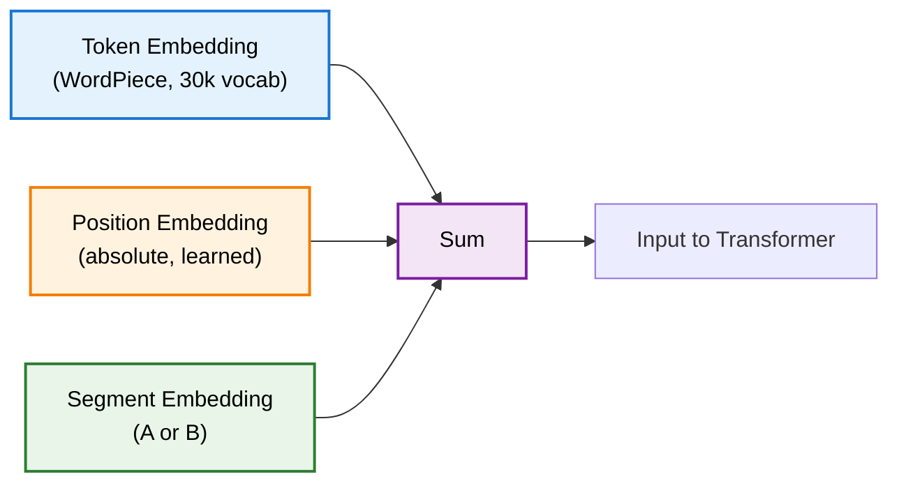
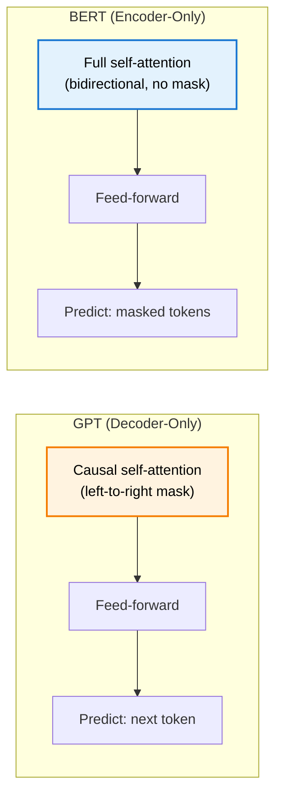
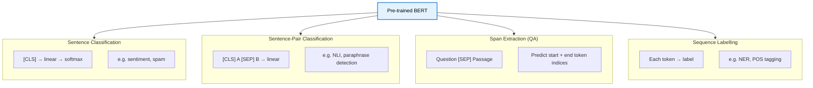
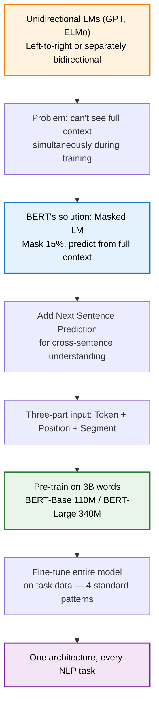

> **TL;DR**: Every language model before BERT read in one direction — either left-to-right or, if "bidirectional," left-to-right and right-to-left separately then stitched together. BERT asked a simple question: what if you just masked out some words and trained the model to predict them, seeing full context from both sides? The answer turned out to demolish the benchmark leaderboards of 2018 and establish a new paradigm: pre-train once, fine-tune everywhere.

> These paper reviews are written more for me and less for others. LLMs have been used in formatting
{: .prompt-tip }

---

## Previously, in This Series

We covered the [Transformer architecture]() and then the [mechanics of attention](). The short version: the Transformer replaced sequential RNN processing with parallel self-attention, letting every token directly attend to every other token in a single layer. The encoder reads and builds contextual representations; the decoder generates autoregressively.

BERT takes only the encoder stack and asks: what can we do with a model that is purely a reader?

---

## The Problem: Language Models Only Look One Way

Before BERT, the dominant pre-training approach was the **language model** — train a model to predict the next token given the previous ones. GPT-1 did exactly this: a 12-layer Transformer decoder, trained left-to-right, achieving state-of-the-art on classification by tacking a linear head on top of the final token's representation.

ELMo tried to address the directional limitation with bidirectional LSTMs. It trained a left-to-right model and a right-to-left model, then concatenated their hidden states to form contextual embeddings. But "bidirectional" here is a bit generous — each direction still only sees half the context when producing its representation. The word "bank" in "he sat on the **bank**" gets a left-context representation and a right-context representation, and you glue them together. The model never actually sees the full sentence simultaneously.

There were two reasons the field stayed unidirectional for so long:

1. **Historical anchoring.** Language models were originally used as probability estimators in translation and speech pipelines. A valid probability distribution requires the left-to-right chain: $P(w_1, w_2, \ldots, w_n) = \prod_t P(w_t \mid w_1, \ldots, w_{t-1})$. The field had internalised this constraint even when it no longer applied.

2. **The cheating problem.** If you train a bidirectional encoder to predict the word at position $t$, and that word is already in the input, the model can just look at it directly. There is nothing to learn. A unidirectional model avoids this by always predicting the next *unseen* word.

BERT's contribution is essentially a clean solution to the second problem.

---

## The Core Idea: Mask It Out

Instead of predicting the next unseen word, predict a hidden word — hidden because you replaced it with a `[MASK]` token.

Given the sentence:

> "The man went to the `[MASK]` to buy a gallon of milk."

The model now has genuine work to do. It must attend to "man", "went", "buy", "gallon", and "milk" — from both sides — to infer that the masked word is likely "store". A left-to-right model would never see "buy" and "milk" when generating a representation for that position.

This is **Masked Language Modelling (MLM)**, and it is the pre-training objective that unlocks bidirectionality.

The masking rate is 15%. This was chosen empirically and has since held up in ablation studies — too high and you strip too much context; too low and pre-training becomes unnecessarily expensive per epoch. The tradeoff against standard language modelling is that you only get predictions for 15% of the tokens per forward pass versus 100% for a left-to-right model. The bidirectional representations more than compensate for this.

### The Pre-train / Fine-tune Mismatch

There is a subtle problem. The `[MASK]` token appears during pre-training but never during fine-tuning — real sentences do not have mask tokens. This creates a distribution mismatch between what the model was trained on and what it sees downstream.

BERT's fix: of the 15% of positions selected for masking, apply the following substitution scheme randomly —

- **80%** of the time: replace with `[MASK]`
- **10%** of the time: replace with a random token
- **10%** of the time: leave the original token unchanged

The model is never told which case it is in. This forces it to maintain a useful representation of every token at every position, because any token might be the one being evaluated. The result: even when no masking is applied at fine-tuning time, the model has learned to build good contextual representations regardless.

---

## The Second Pre-training Task: Next Sentence Prediction

MLM teaches the model to understand words in context. But many downstream tasks — question answering in particular — require understanding the *relationship between two sentences*. Does sentence B follow naturally from sentence A? Does a passage answer a given question?

BERT adds a second pre-training objective: **Next Sentence Prediction (NSP)**. The model receives two sentences, A and B, and must classify whether B is the actual continuation of A or a random sentence from the corpus.

The training data is constructed as:
- **50%** of the time: B is the genuine next sentence from the same document
- **50%** of the time: B is drawn randomly from a different document

A special `[CLS]` token — prepended to every input — learns to represent the aggregate sentence-pair signal. Its output at the final layer feeds into the binary NSP classifier.

Both pre-training objectives run simultaneously, on the same inputs, with the losses summed.

---

## Input Representation

BERT packs a sentence pair into a single flat sequence, structured as:

```
[CLS] Sentence A tokens [SEP] Sentence B tokens [SEP]
```

Each token's input embedding is the **sum of three components**:



**Token embeddings** are WordPiece embeddings — a subword tokenisation scheme with a 30,000-token vocabulary. Rare words get split into common subword pieces, preventing the out-of-vocabulary problem.

**Position embeddings** are learned absolute position encodings — unlike the sinusoidal functions in the original Transformer, BERT learns these from scratch. There is one embedding per position, up to a maximum sequence length of 512.

**Segment embeddings** encode which sentence a token belongs to. Sentence A tokens get segment embedding $E_A$; sentence B tokens get $E_B$. This generalises: for tasks without two sentences (e.g., sentiment classification), every token just uses $E_A$. For richer structured inputs — query, title, document — you can extend the scheme with more segment types.

---

## Architecture: Just the Encoder

BERT is a stack of Transformer encoder layers. From the [transformer architecture post](): each encoder layer runs self-attention over the full input sequence (no causal mask — every token attends to every other token), followed by a position-wise feed-forward network, residual connections, and layer normalisation.

Two model sizes were released:

| Model | Layers | Hidden dim | Attention heads | Parameters |
|-------|--------|-----------|-----------------|------------|
| BERT-Base | 12 | 768 | 12 | ~110M |
| BERT-Large | 24 | 1024 | 16 | ~340M |

Pre-training used approximately 3 billion words — English Wikipedia plus BooksCorpus. Both model sizes were trained with large batch sizes over around 40 epochs. At the time, these were among the largest models trained; subsequent work has exceeded them by 30× or more without finding a quality ceiling.

---

## BERT vs. GPT: Two Halves of the Transformer

The distinction is worth making explicit, because the architectures are more similar than they first appear.



The core architectural difference: GPT applies a **causal mask** in self-attention, setting all above-diagonal entries to $-\infty$ before softmax. This enforces left-to-right processing — token $t$ cannot attend to tokens $t+1, t+2, \ldots$. BERT applies **no mask at all**. Every token attends to every other token.

This makes BERT powerful for understanding tasks and weak for generation. Without a causal structure, BERT cannot generate text token-by-token in a coherent way — the attention over future positions is undefined during inference because there are no future tokens yet. What it can do is produce rich bidirectional representations that are useful for classification, extraction, and labelling — because every token's representation has seen the full context.

---

## Fine-Tuning: One Architecture, Four Task Types

The pre-training / fine-tuning paradigm is where BERT's design pays off. After pre-training, you have a 12- or 24-layer encoder that knows language. Fine-tuning adapts it to a specific task by:

1. Adding a small task-specific output layer
2. Fine-tuning **the entire model** on labelled task data — not just the output layer

The second point is important. GPT-1 took the last token's representation and added a classification head, with only the head trained from scratch. BERT updates all 110M (or 340M) parameters during fine-tuning, with the small task-specific head as a tiny addition. The implication: even for tasks with only a few thousand labelled examples, fine-tuning BERT-Large works without overfitting, because the vast majority of parameters are grounded by pre-training. This is not something you can do with a randomly initialised 340M-parameter model.

The four standard fine-tuning patterns:



For **sentence classification** (sentiment, spam), the `[CLS]` token's final representation feeds into a linear classifier. The entire pre-training machinery — layers, attention, FFN — has already done the hard work of building a meaningful sentence-level vector.

For **sentence-pair tasks** (natural language inference, paraphrase detection), both sentences are packed into the standard `[CLS] A [SEP] B [SEP]` format and the `[CLS]` output classifies the relationship.

For **span extraction** (question answering), the question and passage are packed together. Two new weight vectors — a start vector $S$ and an end vector $E$ — compute dot products with each token's final representation. Softmax over the sequence gives the most likely start and end positions of the answer span. New parameters added: $2 \times d_{\text{hidden}}$ — a few thousand parameters on top of 340 million pre-trained ones.

For **sequence labelling** (NER, POS tagging), each token's final representation independently predicts a label. The bidirectional context means every token's representation already encodes the surrounding context; you are essentially just reading off labels from pre-computed features.

The BERT SQuAD fine-tune takes about 30 minutes on the hardware available at the time. Three decades of NLP custom architecture design, replaced by "add two vectors and run gradient descent for half an hour."

---

## Why Bigger Pre-trained Models Don't Overfit

A counterintuitive empirical result from the paper: scaling from BERT-Base to BERT-Large improves fine-tuning performance even on datasets with only a few thousand examples. For a randomly initialised model, adding parameters with limited data is a recipe for overfitting. For a pre-trained model, the opposite seems to hold — larger pre-trained models generalise better with less fine-tuning data.

The hypothesis is that fine-tuning is really just feature selection. The pre-trained model has already learned millions of latent linguistic features. Fine-tuning selects which of those features are relevant for the target task and amplifies them slightly. Once the selection has been made, a smaller model exists that could represent only those features — and that smaller model can be obtained through distillation, where the fine-tuned large model labels a large set of unlabelled examples and a smaller model trains to match its outputs.

---

## Ablations and What They Show

Two ablation results are worth knowing.

**Removing NSP hurts, especially on QA.** The next sentence prediction task adds meaningful cross-sentence understanding that MLM alone does not provide. On SQuAD, where the model must relate a question to a passage, removing NSP measurably degrades performance.

**MLM converges slower than left-to-right LM but gets further.** In the first epoch, a left-to-right language model converges faster — it predicts 100% of tokens versus BERT's 15%. But very quickly the bidirectional advantage takes over, and the final quality of the MLM-pre-trained model is substantially better. Slower start, higher ceiling.

---

## What Came After

BERT's publication triggered a wave of follow-on work. The salient results:

**RoBERTa** (UW and Facebook, 2019) showed that BERT was significantly undertrained. Training longer, on more data, with dynamic masking (regenerating the mask each time a sentence is seen) yielded further gains. The finding was not flattering to the original paper's training budget — the model had more capacity than the training run exploited.

**ALBERT** introduced factorised embeddings and cross-layer parameter sharing — all 12 layers share the same parameters. This cuts parameters dramatically while maintaining quality. Important nuance: ALBERT is "lite" in parameters, not in compute. Inference runs 12 layers with shared weights; you still pay the full computation cost. Parameters and FLOPs are not the same thing.

**XLNet** addressed the masking approach itself. MLM creates a pre-train / fine-tune mismatch because `[MASK]` tokens never appear in fine-tuning. XLNet uses permutation language modelling — sample a random permutation of the token order, then predict each token autoregressively conditioned on the others in the permuted order. The autoregressive factorisation is preserved (valid probability distribution) while bidirectional context is achieved in expectation across permutations.

**T5** ran a massive ablation study over pre-training choices. The conclusion, somewhat bleak: almost nothing mattered except model size and training data volume and quality. Different masking schemes, different span lengths, different objectives — all swamped by raw scale.

**ELECTRA** replaced the generative MLM task with a discriminative one. A small generator fills in masked tokens; a discriminator predicts, for every token, whether it is real or generator-produced. Because the discriminator predicts on all tokens (not 15%), sample efficiency is better than MLM at equal compute.

---

## Summary



**Key Takeaways:**
- Unidirectional LMs (GPT, ELMo) cannot genuinely see both sides of a word simultaneously — BERT fixes this by masking input tokens and predicting them from full bidirectional context
- The 80/10/10 masking strategy (mask / random / unchanged) prevents pre-train / fine-tune mismatch without sacrificing bidirectionality
- NSP adds sentence-pair understanding that MLM alone does not provide; the `[CLS]` token is its output representation
- Input embeddings are the sum of token, position, and segment components — enabling the model to handle multi-sentence inputs naturally
- Fine-tuning updates the entire pre-trained model, not just a head — which is why larger pre-trained models generalise better, not worse, on small fine-tuning sets
- Four fine-tuning patterns cover almost every NLP task; task-specific parameters added are trivially small relative to the pre-trained backbone
- Post-BERT ablations confirmed the hard lesson: scale and data quality dominate every other pre-training design decision

---

## Further Reading

- **The Original Paper**: [BERT: Pre-training of Deep Bidirectional Transformers for Language Understanding (Devlin et al., 2019)](https://arxiv.org/abs/1810.04805)
- **The Illustrated BERT**: [Jay Alammar's visual walkthrough](https://jalammar.github.io/illustrated-bert/)
- **RoBERTa**: [A Robustly Optimized BERT Pretraining Approach (Liu et al., 2019)](https://arxiv.org/abs/1907.11692)
- **ELECTRA**: [Pre-training Text Encoders as Discriminators Rather Than Generators (Clark et al., 2020)](https://arxiv.org/abs/2003.10555)
- **Stanford CS224N Lecture**: [BERT and Other Pre-trained Language Models (Winter 2020)](https://web.stanford.edu/class/cs224n/)

---
