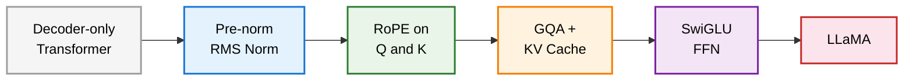
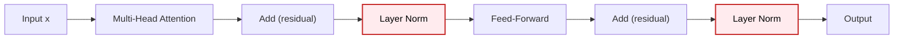
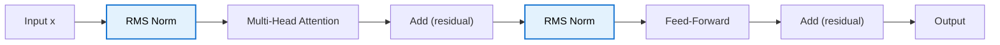
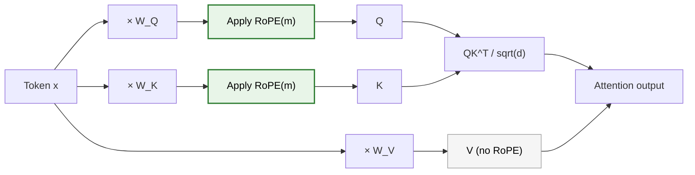
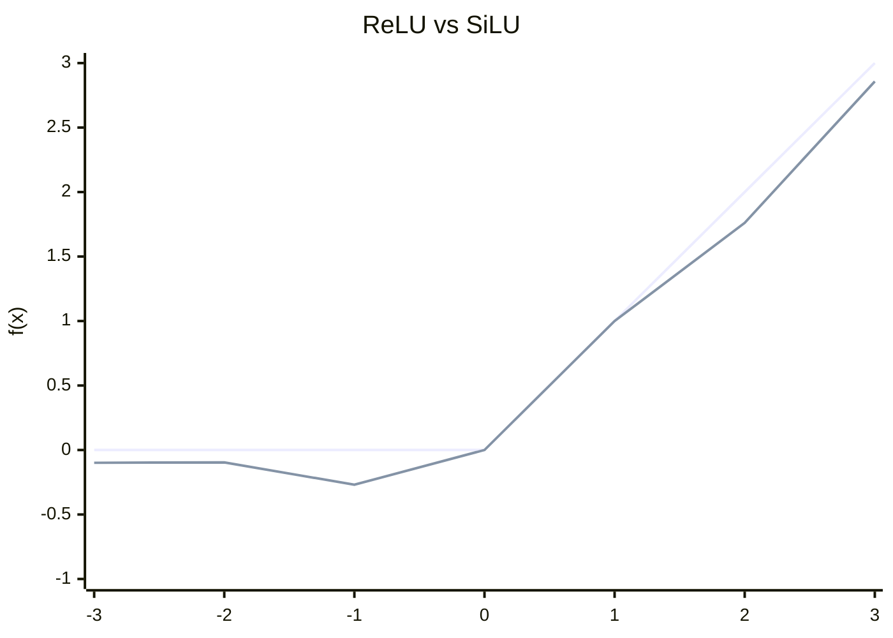
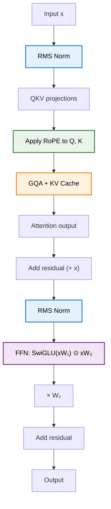

> **TL;DR**: LLaMA is not a new architecture — it is a GPT-style decoder-only Transformer with five deliberate changes: pre-normalization, RMS Norm instead of Layer Norm, Rotary Positional Embeddings on Q and K, Grouped Query Attention for KV cache efficiency, and SwiGLU in the feed-forward block. None of these are radical. Each one was motivated by either efficiency, better training dynamics, or empirically measured gains. Together they add up to a model that trains faster, serves cheaper, and generalises better than a vanilla Transformer of the same size.

> These paper reviews are written more for me and less for others. LLMs have been used in formatting
{: .prompt-tip }

---

## The Starting Point

If you have been following this series, you already know the pieces. We covered the [Transformer architecture](), tore apart the [attention mechanism](), looked at [what MLP blocks actually do](), covered the [KV cache and GQA in depth](), and established why [decoder-only models]() are the dominant paradigm for language modelling.

LLaMA fits into that picture as a refinement, not a reinvention. Meta released LLaMA 1 in February 2023 with four sizes — 6.7B, 13B, 32B, and 65B parameters — each trained on 1 to 1.4 trillion tokens. LLaMA 2 followed, roughly doubling context length and training tokens while keeping parameter counts similar; the 34B and 70B variants added Grouped Query Attention. The architecture is a decoder-only Transformer with five surgical modifications.

Let's go through each change.

---

## Change 1: Pre-Normalization

The original Transformer applies normalization **after** each sub-block — after multi-head attention, and after the feed-forward layer. This is the "Add & Norm" step that wraps every sublayer. LLaMA moves normalization to **before** each sub-block instead.

**Original Transformer (Post-Norm)**

**LLaMA (Pre-Norm)**

Why does the order matter? In post-norm, the raw residual stream — which can carry large-magnitude gradients early in training — is added before normalisation. This can cause instability in deep networks, particularly at the start of training when weights are still being initialised. Pre-norm ensures the input to each sub-block is always normalised, giving a cleaner gradient signal throughout training. In practice, pre-norm models tend to train more stably and require less careful learning rate tuning.

---

## Change 2: RMS Norm Instead of Layer Norm

The original Transformer uses Layer Normalization. For an input vector $x$ of dimension $d$, Layer Norm computes:

$$\text{LayerNorm}(x) = \gamma \cdot \frac{x - \mu}{\sqrt{\sigma^2 + \varepsilon}} + \beta$$

where $\mu$ is the mean across features, $\sigma^2$ is the variance, and $\gamma$, $\beta$ are learnable scale and shift parameters.

LLaMA uses **Root Mean Square Normalization** (RMS Norm). The paper behind it (Zhang & Sennrich, 2019) ran ablation studies on Layer Norm to figure out where the actual benefit comes from. The finding: re-centering — subtracting the mean — contributes almost nothing. The gain is almost entirely from re-scaling, i.e., normalising the magnitude of the vector. If the mean subtraction is doing nothing useful, you can just drop it:

$$\text{RMSNorm}(x) = \gamma \cdot \frac{x}{\text{RMS}(x)}, \quad \text{RMS}(x) = \sqrt{\frac{1}{d}\sum_{i=1}^{d} x_i^2}$$

No $\mu$, no $\beta$. Two fewer statistics to compute, and one fewer learnable parameter per normalised dimension. This reduces computational overhead and simplifies the operation, without measurable quality degradation.

The savings are modest per layer but compound across 32–80 layers. It is the kind of change that looks minor on paper and adds up meaningfully in a model that runs inference millions of times per day.

---

## Change 3: Rotary Positional Embeddings (RoPE)

This is the change that requires the most unpacking.

The vanilla Transformer uses **absolute sinusoidal positional encodings**: a fixed vector computed once and added to each token's embedding before the first layer. Every token gets a unique position vector, and that position information is baked in at the start, then carried forward through all subsequent computations.

The problem: absolute encodings treat each token's position in isolation. They do not directly encode the *relationship* between two positions — the fact that token 5 is 3 steps away from token 8. Attention, however, cares fundamentally about pairwise relationships. When a query at position $m$ attends to a key at position $n$, what matters is $m - n$, not the absolute values.

**Relative positional encodings** address this by making the attention score between positions $m$ and $n$ a function of the content vectors and their relative distance $m - n$. RoPE, proposed by Su et al., achieves this via a clean geometric construction.

### How RoPE Works

The question RoPE asks: can we define a function $f$ such that the inner product $\langle f(q, m), f(k, n) \rangle$ depends only on $q$, $k$, and $m - n$?

Yes. The construction works by rotating a vector in the complex plane. For a 2-dimensional case, rotating a query vector $q$ at position $m$ by angle $m\theta$ and rotating a key vector $k$ at position $n$ by angle $n\theta$, their inner product becomes:

$$\langle f(q, m), f(k, n) \rangle = \text{Re}\left[ q \cdot k^* \cdot e^{i(m-n)\theta} \right]$$

The result depends on $m - n$ through $e^{i(m-n)\theta}$ — exactly what we wanted.

For real-valued vectors of dimension $d$ (e.g., $d = 128$ per head in LLaMA), the rotation is applied independently to each consecutive pair of dimensions $(x_{2i}, x_{2i+1})$, each with its own frequency $\theta_i$:

$$\theta_i = 10000^{-2i/d}$$

This gives a spectrum of frequencies — low-frequency rotations for early dimension pairs, high-frequency for later ones — analogous to the sinusoidal spectrum in the original Transformer's absolute encodings.

In matrix form, the rotation for position $m$ is a block-diagonal matrix $R_m$:

$$R_m = \begin{pmatrix}
\cos m\theta_1 & -\sin m\theta_1 & & & \\
\sin m\theta_1 & \cos m\theta_1 & & & \\
& & \cos m\theta_2 & -\sin m\theta_2 & \\
& & \sin m\theta_2 & \cos m\theta_2 & \\
& & & & \ddots
\end{pmatrix}$$

But materialising this sparse matrix is wasteful. In practice, the rotation is applied via an element-wise multiply using precomputed $\cos$ and $\sin$ values.

### Where It Is Applied

RoPE is applied **inside** the attention heads, **after** the QKV projections — not at the embedding stage. Specifically, it is applied to Q and K but **not** to V. Why not V? Because V vectors are never directly compared against each other to produce attention scores — they are only mixed by the attention weights to produce the output. Positional information only needs to be encoded in the score computation ($QK^T$), not in the aggregation step.

### Long-Term Decay

A useful property that emerges from the RoPE construction: as the distance $\vert m - n \vert$ between two positions grows, the upper bound on their inner product decreases. Tokens that are far apart attend to each other less strongly by default. This is a natural inductive bias for language — nearby tokens are usually more relevant than distant ones — and it is built into the positional encoding geometry rather than learned.

Nothing in RoPE is learned. The $\theta_i$ values are fixed constants, computed once. Like the absolute sinusoidal encodings, RoPE is stateless — but unlike them, it encodes relative rather than absolute position, making it better suited to the attention mechanism and more naturally length-generalising.

---

## Change 4: Grouped Query Attention and the KV Cache

GQA and the KV cache were covered in depth in the [KV cache post]() — this section is a brief recap and a note on why they matter specifically for LLaMA's serving profile.

Standard Multi-Head Attention has $H$ query heads, each with its own K and V projection. During autoregressive inference with a KV cache, every head stores its K and V vectors for each token in the sequence. For LLaMA 65B with 64 heads and a 4096-token context:

$$\text{KV cache} = 2 \times n_\text{layers} \times H \times d_\text{head} \times n_\text{tokens} \times 2\ \text{bytes}$$

That becomes several gigabytes per request — before you add model weights or batch multiple requests.

**Multi-Query Attention** (MQA) takes a sharp approach: all heads share a single K and V projection, dividing KV cache memory by $H$. The quality drop is small but measurable.

**Grouped Query Attention** (GQA) interpolates. Heads are partitioned into $G$ groups; within each group, all heads share one K/V pair. With $H = 8$ and $G = 2$, you get 4x the cache reduction of MHA with minimal quality loss versus MQA.

{: w="560" }
_Multi-Head is slow (one KV pair per head). Multi-Query is fast but aggressive (one shared KV). Grouped Query is the balanced middle — one KV pair per group of heads._

LLaMA 1 and the smaller LLaMA 2 variants use standard MHA with a KV cache. The LLaMA 2 34B and 70B adopt GQA. The motivation is the memory bandwidth bottleneck that becomes acute at large scale: modern GPUs are roughly 10x faster at arithmetic than at moving data, so reducing the KV cache footprint moves the per-step computation back toward the compute-bound regime rather than stalling on memory reads.

One detail worth noting: RoPE interacts cleanly with the KV cache. With absolute positional encodings, the full sequence must be reprocessed together because each token's position vector is added at the embedding stage. With RoPE, position is applied inside the attention heads after projection, so each new token can have its position applied in isolation — exactly what the KV cache assumes when it only computes Q, K, V for the new token and appends to the cache.

---

## Change 5: SwiGLU in the Feed-Forward Block

The feed-forward network in the original Transformer is a two-layer MLP with ReLU:

$$\text{FFN}(x) = \max(0,\ xW_1 + b_1) W_2 + b_2$$

LLaMA replaces this with **SwiGLU** (Swish-Gated Linear Unit), proposed by Noam Shazeer — who also co-authored the original Transformer paper and the MQA paper, apparently incapable of writing fewer than three influential papers per decade:

$$\text{FFN}_\text{SwiGLU}(x) = \big(\text{Swish}(xW_1) \odot (xW_3)\big) W_2$$

where $\text{Swish}(x) = x \cdot \sigma(x)$ (also called SiLU — Sigmoid Linear Unit), and $\odot$ is element-wise multiplication.

This introduces a **gating mechanism**: the term $xW_3$ acts as a gate that modulates the activated output of $xW_1$. The gate is not explicitly trained to be a gate — it is just another linear projection — but the product structure allows the network to suppress or amplify features selectively.

Note the three weight matrices: $W_1$, $W_2$, $W_3$. The vanilla FFN uses two. To keep total parameter count comparable, LLaMA reduces the hidden dimension of the FFN block proportionally when using SwiGLU.

### SiLU vs ReLU

The key difference: ReLU hard-clamps every negative input to zero. SiLU has a small negative tail — values around $x \approx -1.28$ reach a minimum of about $-0.28$ before recovering — and does not saturate sharply at zero. This means gradients flow for slightly negative activations rather than dying. The transition around zero is smooth rather than kinked.

Empirically, SwiGLU produces lower perplexity than ReLU and GELU variants across a range of benchmarks. Why exactly? Shazeer's paper is refreshingly candid on this point:

> "We offer no explanation as to why these architectures seem to work; we attribute their success, as all else, to divine benevolence."

The typical approach in LLM research at this scale is ablation: change one component, hold everything else fixed, measure perplexity on a held-out set. If it goes down, you keep it. The mathematical reason may be elusive, but the measurement is not.

---

## Putting It Together

Here is the full LLaMA block, from input to output:

Each change is local, composable, and orthogonal to the others. RoPE only touches the QK projections. RMS Norm only changes the normalisation op. SwiGLU only changes the FFN activation. GQA only changes how many KV heads exist. Pre-norm only changes where the norm is applied. None of them interact in ways that require joint tuning — which is partly why the LLaMA design spread so quickly as a template for subsequent open-weight models.

---

## Summary

| Component | Vanilla Transformer | LLaMA |
|---|---|---|
| Architecture | Encoder–Decoder | Decoder-only |
| Normalisation position | Post-sublayer | Pre-sublayer |
| Normalisation type | Layer Norm (mean + variance) | RMS Norm (variance only) |
| Positional encoding | Absolute sinusoidal (embedding stage) | RoPE on Q, K (inside attention) |
| Attention | Multi-Head Attention | GQA + KV Cache |
| FFN activation | ReLU | SwiGLU (3 weight matrices) |

The overarching theme: reduce unnecessary computation (RMS Norm, GQA), encode structure more precisely (RoPE, pre-norm), and improve empirical performance where theory gives no clean answer (SwiGLU). It is a model built by people who had trained many Transformers and knew exactly where to press.

---

## Further Reading

- **LLaMA 1**: [LLaMA: Open and Efficient Foundation Language Models (Touvron et al., 2023)](https://arxiv.org/abs/2302.13971)
- **LLaMA 2**: [Llama 2: Open Foundation and Fine-Tuned Chat Models (Touvron et al., 2023)](https://arxiv.org/abs/2307.09288)
- **RoPE**: [RoFormer: Enhanced Transformer with Rotary Position Embedding (Su et al., 2021)](https://arxiv.org/abs/2104.09864)
- **RMS Norm**: [Root Mean Square Layer Normalization (Zhang & Sennrich, 2019)](https://arxiv.org/abs/1910.07467)
- **SwiGLU**: [GLU Variants Improve Transformer (Shazeer, 2020)](https://arxiv.org/abs/2002.05202)
- **GQA**: [GQA: Training Generalized Multi-Query Transformer Models from Multi-Head Checkpoints (Ainslie et al., 2023)](https://arxiv.org/abs/2305.13245)

---
