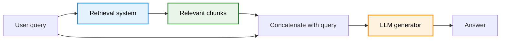
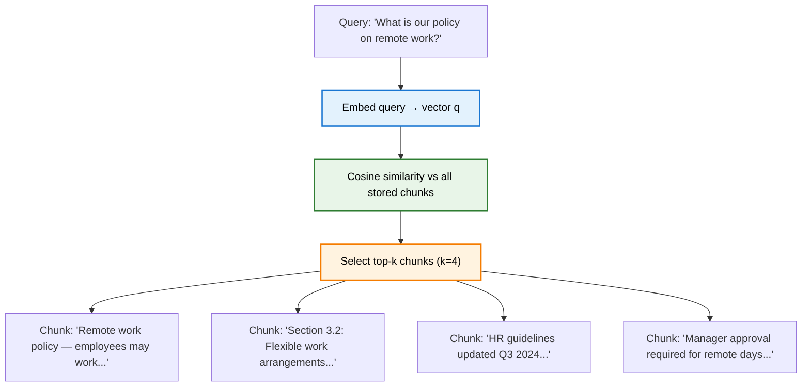
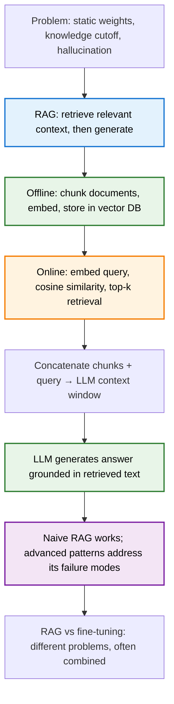

> **TL;DR**: A language model knows only what it memorised during training — no private documents, no events after the cutoff, and no reliable restraint about making things up. Retrieval-Augmented Generation fixes this by turning the model into an open-book exam taker: retrieve relevant passages first, then generate an answer grounded in what was actually found. Two components — a retrieval system and a generator — working in sequence. The model does not need to know everything; it just needs to look it up.

> These paper reviews are written more for me and less for others. LLMs have been used in formatting
{: .prompt-tip }

---

## The Problem with Memorised Knowledge

In the [MLP post](), we traced exactly where facts live in a Transformer — in the feed-forward blocks, encoded as directions in high-dimensional neuron activation space. Michael Jordan plays basketball. Paris is in France. The capital of Australia is Canberra, not Sydney. All of it baked into the weights during training, compressed and superimposed across billions of parameters.

That works remarkably well for general knowledge. It works less well for three things:

1. **Knowledge after the training cutoff.** The model was trained on a snapshot of the internet. Whatever happened after that snapshot does not exist to the model.
2. **Private or proprietary data.** Your company's internal documents, your customer database, your legal contracts — none of this was in the training corpus. The model simply does not know it.
3. **Facts that were memorised incorrectly.** Hallucination is not random noise; it is the model confidently retrieving an answer that happens to be wrong, because something similar appeared in training data in a misleading context. The model has no mechanism to distinguish "I know this" from "I think this sounds right."

You can try to patch these gaps by re-training the model on new data, but that is expensive and slow. You can fine-tune on your private documents, but fine-tuning teaches a model to reproduce a style and distribution — it does not reliably teach it to accurately recite specific facts (and it adds no ability to cite sources or admit uncertainty). For factual grounding, neither approach is quite right.

The alternative: do not make the model memorise everything. Make it look things up.

---

## What RAG Actually Is

**Retrieval-Augmented Generation** — RAG — is an architectural pattern, not a model architecture in the sense of a new attention mechanism or a new positional encoding scheme. It sits one level above the model.

The core idea is simple: before asking the model to answer a question, retrieve relevant documents and include them in the prompt. The model then generates an answer grounded in what it was just shown, rather than relying solely on what it memorised.



Two systems in sequence: **retrieve**, then **generate**. Neither is new on its own. Information retrieval has existed for decades. Language model generation has been the focus of this entire post series. The insight of RAG is that combining them produces something better than either alone — a model that can reason over information it was never trained on.

---

## Step One: Ingestion

Before anything can be retrieved, your documents need to be processed and stored in a way that supports fast semantic search. This is the offline step — it happens before any user query arrives.

### Chunking

Documents are too long to embed whole and too heterogeneous to treat uniformly. A legal contract has a different structure than a news article; a PDF with tables behaves differently than a markdown README. Before embedding, documents get split into **chunks**.

The naive approach is **fixed-size chunking**: cut every document into pieces of, say, 500 tokens, with some overlap to avoid losing meaning at boundaries. It works for prototyping. It is not good enough for production.

A better approach is **semantic chunking**: use an embedding model to detect where the meaning of the text shifts, and break on those natural boundaries. The chunks reflect actual topic transitions rather than arbitrary token counts.

For structured documents — PDFs with section headers, Markdown files, legal documents with numbered clauses — **document-aware chunking** respects the existing structure. A section boundary is a better split point than an arbitrary 500-token limit.

One more pattern worth knowing: **hierarchical chunking** (sometimes called small-to-big retrieval). Store both a small, precise chunk and a larger parent chunk that contains it. When retrieval finds the small chunk, the system passes the larger parent to the model. The small chunk enables precise matching; the parent provides the surrounding context the model needs to answer correctly. This turns out to be one of the more effective techniques in practice.

### Embedding

Once chunked, each piece of text is converted into a **vector embedding** — a fixed-size numerical representation of its meaning. When a user query arrives, it gets embedded in the same space, and retrieval becomes a geometry problem: find the chunks closest to the query.

The [BERT post]() covered how bidirectional encoder models produce these dense contextual representations. Dedicated embedding models — built specifically for semantic similarity rather than generation — are what RAG systems typically use. OpenAI's `text-embedding-3-large`, VoyageAI's `Voyage-3`, and open-source models like `BGE-Large` or `E5-Mistral` are common choices. Performance varies significantly by domain: a model excellent on general web text may underperform on specialised legal or scientific corpora.

---

## Step Two: Vector Databases

Embeddings need to live somewhere, and that somewhere needs to support fast approximate nearest-neighbour search at scale. This is what vector databases are built for.

The major players — Pinecone, Weaviate, Qdrant, Milvus, ChromaDB — differ in their tradeoffs between query latency, scalability, and operational complexity. For most practical purposes, the choice matters less than people think. What matters more is whether the database supports **metadata filtering**: the ability to restrict retrieval to documents from a certain date range, a certain source, or a certain category before the semantic search runs.

**Hybrid search** — combining vector similarity with keyword search (BM25 or similar) — often outperforms pure vector search. Exact term matches matter for proper nouns, product names, and technical identifiers that may not have clean semantic representations.

---

## Step Three: Retrieval

The retrieval step has two components: finding the most relevant chunks for a given query, and deciding how many to return.

### Cosine Similarity

The standard similarity measure for dense embeddings is **cosine similarity**:

$$\text{sim}(q, d) = \frac{q \cdot d}{\lVert q \rVert \, \lVert d \rVert}$$

This measures the angle between two vectors in embedding space rather than their Euclidean distance. Because embedding models are trained to place semantically similar text near each other in directional terms — not necessarily magnitude terms — cosine similarity is more robust than raw dot product when vectors have different norms.

A query vector $q$ and a document chunk vector $d$ are both in the same high-dimensional space produced by the embedding model. Cosine similarity near 1 means the texts are about the same thing. Near 0 means they are unrelated. Negative values rarely occur in practice for text, since most encoders produce non-negative or bounded representations.

### Top-K Retrieval

Retrieve the $k$ chunks with highest similarity to the query. $k$ is a design choice. Too small, and you may miss relevant context. Too large, and you fill the prompt with noise — and there is good evidence that models lose the signal when buried in irrelevant text. A common default is $k = 3$–$5$; production systems tune this per use case.



---

## Step Four: Generation

The retrieved chunks get concatenated with the user query and passed to the language model as context. A typical prompt structure looks like:

```
You are a helpful assistant. Use the following documents to answer the question.
If the answer is not in the documents, say so.

[Document 1]
<chunk text>

[Document 2]
<chunk text>

[Document 3]
<chunk text>

Question: <user query>
Answer:
```

The model's job is to synthesise the provided context into a coherent answer. The instructions explicitly tell it to rely on the retrieved text — not its memorised knowledge — and to flag when the answer is not present. This is what "grounded generation" means in practice.

The model described in the [LLaMA architecture post]() — a decoder-only Transformer with a context window that can hold tens of thousands of tokens — is exactly the kind of model that makes this practical. The retrieved chunks simply go into the context window alongside the query.

---

## Naive RAG vs. Advanced RAG Patterns

What was described above is **naive RAG** — also called simple RAG. One query, one retrieval pass, one generation. It is the hello-world of the approach, and it is a reasonable starting point. It is also not sufficient for many real-world requirements.

Here are the patterns that address the gaps:

**RAG with memory.** Simple RAG treats each query independently. Add a memory layer and the system can track conversation history — earlier turns inform retrieval and generation for later ones. Essential for any multi-turn application.

**Branched RAG.** Some questions cannot be answered with a single retrieval pass. "How does our Q3 revenue compare to Q2, and what drove the change?" requires at least two retrievals. Branched RAG uses the LLM to decompose the question into sub-questions, runs parallel retrieval for each, and synthesises the results. More expensive; necessary for compositional questions.

**HyDE (Hypothetical Document Embeddings).** A subtle mismatch exists between query embeddings and document embeddings: "what causes inflation?" looks different as a vector than a paragraph explaining inflation, even though they are about the same thing. HyDE fixes this by first prompting the LLM to generate a *hypothetical* answer to the query — before retrieval — then embedding that hypothetical answer and using it as the search vector. A hypothetical answer looks much more like an actual document. Retrieval quality improves.

**Adaptive RAG.** Not every query needs retrieval. "What is 2 + 2?" does not require a vector database lookup. A routing layer — a lightweight classifier or a cheap LLM call — decides whether retrieval is needed at all, and if so, whether simple or multi-step retrieval is appropriate. This reduces latency and cost for queries that can be answered from the model's memorised knowledge.

**Corrective RAG (CRAG).** What if the retrieved documents are irrelevant or low quality? CRAG adds an evaluation step after retrieval. If retrieved chunks score below a confidence threshold, the system either reformulates the query and retries, or falls back to a web search. It is a quality gate on the retrieval output.

**Self-RAG.** Takes self-correction further. The model is trained or prompted to generate explicit reflection tokens as it writes — "is retrieval needed here?", "is this passage relevant?", "is this claim supported by the retrieved context?" The model critiques its own reasoning in real time. Useful for high-stakes applications where transparency about confidence matters.

**Agentic RAG.** Instead of a fixed retrieve-then-generate pipeline, an LLM orchestrator decides what to do next: retrieve more, call an API, run code, switch data sources, or determine that it has enough context to answer. It loops until the answer meets a quality criterion. For complex multi-step queries, this is the direction the field is moving.

**Graph RAG.** Standard RAG treats the knowledge base as a flat collection of chunks. Graph RAG builds a knowledge graph — explicitly mapping entities and their relationships — and uses that structure during retrieval. When a question requires connecting multiple pieces of information across documents ("how does this regulation affect these three vendor contracts?"), graph-based retrieval outperforms pure vector similarity because it understands relationships, not just proximity.

---

## RAG vs. Fine-Tuning

The two are often compared as alternatives. They solve different problems.

**Fine-tuning** adjusts the model's weights on a new dataset. It teaches the model a style, a domain vocabulary, or a task format. It does not reliably teach specific facts — models fine-tuned on a proprietary document corpus will still hallucinate details from that corpus, because fine-tuning optimises for output distribution rather than factual faithfulness. It also does not provide attribution (the model cannot point to which document supported a claim) and does not handle data that changes after fine-tuning.

**RAG** does not change the model at all. It changes what the model sees. The knowledge is external — in the vector database — so it can be updated without retraining. Retrieved chunks can be surfaced as citations. The model can explicitly say "this is not in the documents I retrieved."

The tradeoffs:

| | RAG | Fine-tuning |
|---|---|---|
| Dynamic / updatable knowledge | Yes | No |
| Source attribution | Natural | Difficult |
| Private data (no training exposure) | Yes | No |
| Adapting tone / format / style | Limited | Strong |
| Handling domain-specific vocabulary | Limited | Strong |
| Hallucination risk | Lower (when retrieval works) | Unchanged or higher |

In practice, production systems often combine both: fine-tune for domain vocabulary and output format, use RAG for factual grounding over live data. They are not mutually exclusive — they address different layers of the same problem.

---

## The Context Window Argument

A common objection: with LLMs supporting context windows of 128k or 1M tokens, why not just stuff the entire knowledge base into the prompt?

Three reasons this does not hold up at scale:

1. **Cost.** Processing a million-token context on every query is expensive. Retrieval reduces the tokens in the prompt to the $k$ most relevant chunks — orders of magnitude cheaper.
2. **Latency.** Time-to-first-token scales with context length. A well-built RAG pipeline is faster than a brute-force context-stuffing approach.
3. **Accuracy.** Models perform worse when given irrelevant context. "Lost in the middle" is a documented failure mode: when relevant information is buried in a long context full of noise, the model frequently misses it. RAG surfaces precisely the right information, which improves accuracy.

Retrieval is not a workaround for a short context window — it is a principled approach to surfacing relevant information regardless of how large the window gets.

---

## Summary



**Key Takeaways:**
- A language model's weights are a static snapshot — RAG gives it access to external, updatable knowledge at inference time
- The pipeline has three phases: ingest (chunk + embed + store), retrieve (embed query + cosine similarity + top-k), generate (retrieved context + query → LLM)
- Chunking strategy matters — fixed-size is a baseline; semantic, document-aware, and hierarchical chunking improve retrieval quality
- Cosine similarity is the standard measure: $\text{sim}(q, d) = \frac{q \cdot d}{\lVert q \rVert \lVert d \rVert}$, with top-$k$ chunks selected per query
- Naive RAG works for simple queries; branched, corrective, adaptive, self-, agentic, and graph RAG patterns address its failure modes
- RAG and fine-tuning solve different problems — RAG for factual grounding and attribution, fine-tuning for style and domain adaptation
- Large context windows do not make RAG obsolete — retrieval wins on cost, latency, and accuracy when the knowledge base is large

---

## Further Reading

- **Original RAG Paper**: [Retrieval-Augmented Generation for Knowledge-Intensive NLP Tasks (Lewis et al., 2020)](https://arxiv.org/abs/2005.11401)
- **Self-RAG**: [Self-RAG: Learning to Retrieve, Generate, and Critique through Self-Reflection (Asai et al., 2023)](https://arxiv.org/abs/2310.11511)
- **Corrective RAG**: [Corrective Retrieval Augmented Generation (Yan et al., 2024)](https://arxiv.org/abs/2401.15884)
- **HyDE**: [Precise Zero-Shot Dense Retrieval without Relevance Labels (Gao et al., 2022)](https://arxiv.org/abs/2212.10496)
- **Graph RAG**: [From Local to Global: A Graph RAG Approach to Query-Focused Summarization (Edge et al., 2024)](https://arxiv.org/abs/2404.16130)
- **Lost in the Middle**: [Lost in the Middle: How Language Models Use Long Contexts (Liu et al., 2023)](https://arxiv.org/abs/2307.03172)

---
