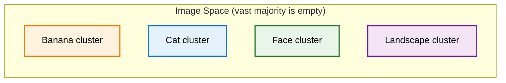
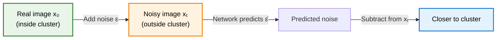
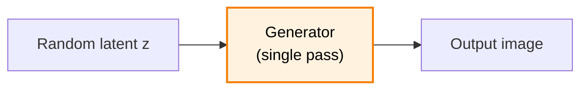
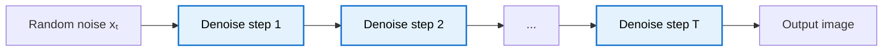

> **TL;DR**: A diffusion model learns a vector field over image space -- for every point in a million-dimensional void, it predicts the direction toward the nearest cluster of plausible images. Training requires no labels: add noise to a real image, ask the network to predict what you added. Generation is gradient ascent on an implicit probability landscape, one cautious step at a time. The result is a generative model that sidesteps GANs' instability and mode collapse by offloading creativity to pure randomness and letting the network handle logic.

> These paper reviews are written more for me and less for others. LLMs have been used in formatting
{: .prompt-tip }

---

## Images as Points in a Very Large Space

Consider a $1000 \times 1000$ pixel image. Each pixel takes a value between 0 and 255. That image is a point in a one-million-dimensional space -- one axis per pixel, each bounded between 0 and 255. A hypercube with a million sides.

Every possible arrangement of pixel values lives somewhere in this space. The cat on your desk, the Mona Lisa, a million pixels of random static -- they are all just coordinates.

To a computer, these are indistinguishable. Each is a vector in $\mathbb{R}^{10^6}$. What makes some of them "good" and most of them garbage is structure -- patterns that our visual system has opinions about. An image generator needs to learn what that structure is.

---

## The Structure of Image Space

Plot enough real images as points in this space and two things become apparent.

**Most of the space is empty.** The vast majority of pixel combinations look like noise. Good images follow highly specific rules -- nearby pixels tend to have similar values, edges form coherent boundaries, colours obey lighting physics. Almost no random vector satisfies these constraints. The ratio of "plausible images" to "all possible images" is astronomically small -- far smaller than the 2D diagrams we draw can suggest.

**Similar images cluster together.** All banana images live near each other. All cat images live near each other. The banana cluster and the cat cluster are far apart relative to the within-cluster distances. This is the same idea behind [embedding spaces in Transformers]() -- semantically related objects end up geometrically close.

The generator's job: start from somewhere random in this mostly-empty void, and find your way to one of these tiny pockets where real images live.

---

## The Vector Field View

Here is the key insight. A diffusion model learns a **vector field** over image space. At every point -- every possible arrangement of pixels -- the model associates a direction: the direction that moves you toward the nearest cluster of good images.

If you are floating in the empty void between the cat cluster and the landscape cluster, the model tells you which way to walk. If you are closer to the cats, it points you toward the cats. If you are closer to landscapes, it points you there instead.

Concretely, the model takes in a million-dimensional vector (your current image) and outputs another million-dimensional vector (the direction to move). Every pixel gets an instruction: make this one a bit brighter, make that one a bit darker. The output has exactly the same shape as the input.

{: w="500" }
_Each arrow points toward the nearest cluster of plausible images. The model learns this field over the entire space._

This is worth pausing on, because it is a fundamental difference from classification.

---

## Output Same Size as Input

An image classifier takes a $1000 \times 1000$ image and produces a tiny output -- a class label, maybe a vector of 1000 probabilities. You compress a million dimensions down to a handful.

A diffusion model does the opposite. Input: a million-dimensional vector. Output: a million-dimensional vector. The network has to produce a per-pixel instruction. It is not summarising the image into a category -- it is transforming the image, point by point, into a slightly better version of itself.

This is why diffusion models typically use a **U-Net** architecture instead of the classification backbones you might be used to. The U-Net takes spatial input and produces spatial output of the same resolution, using skip connections to preserve fine-grained detail.

---

## Training: Self-Supervised Direction Prediction

The training procedure is almost suspiciously simple. No labels required.

1. **Pick a real image** $x_0$ from your dataset -- a dog, a sunset, whatever. This image sits inside one of the good clusters in image space.
2. **Add random noise.** Sample $\epsilon$ from a Gaussian distribution and add it to $x_0$, producing a noisy version $x_t$. Geometrically, this is a random backtrack -- you have taken a step away from the cluster into the void.
3. **Ask the network to predict the noise.** The network sees $x_t$ and tries to predict $\epsilon$ -- the direction that brought you from inside the cluster to outside.

$$\mathcal{L} = \mathbb{E}_{x_0, \epsilon, t}\left[\lVert \epsilon - \epsilon_\theta(x_t, t) \rVert^2\right]$$

That is the entire loss function. Mean squared error between actual noise and predicted noise.

The trick: if the model can predict which direction took you away from the cluster, it can also tell you the direction back. Subtract the predicted noise from the noisy image, and you move closer to the cluster of good images.

By varying the amount of noise (controlled by a timestep parameter $t$) and the direction (a fresh Gaussian sample each time), you train the model to navigate back to the cluster from many different locations and distances. Do this across your entire dataset -- dogs, cats, faces, landscapes -- and the model learns the full vector field. It learns how to get to *some* cluster of good images from *any* point in image space.

No human annotation. No class labels. The supervised signal is generated automatically by adding noise you already know. If you can sample from a Gaussian, you can train a diffusion model.

---

## Why Iterative Refinement Is Necessary

If the model knows the direction toward good images, why not just take one big step and be done with it?

Because the model is shortsighted.

What the diffusion model actually approximates is the **local gradient** of the probability landscape -- the direction of steepest ascent at your current position. This is not the same as the global direction toward the nearest cluster. The probability landscape of real images is bumpy and complex, with ridges, valleys, and local optima everywhere.

Think of a blindfolded person trying to climb a hill they have never visited. They cannot see the summit. All they can do is feel the ground under their feet, find the direction of steepest ascent locally, and take a small step. Then repeat. If the hill has a single clean peak, this works beautifully. If the terrain is rugged, a single large step could send you off a cliff.

Diffusion models face the same problem. The direction the model gives you at step 1 might be slightly wrong by step 50. You need to keep querying the model as you move, letting it update its recommendation based on where you actually are -- not where you were 50 steps ago.

This is why typical diffusion models use $T = 1000$ denoising steps. Each step is small. Each step gets fresh guidance. The path converges.

{: w="580" }
_Yes, the images are anime. It's a diffusion blog — what did you expect? Each stepping stone is one denoising step. The path curves because local gradients follow the terrain, not a straight line to the summit._

---

## How the Model Decides What to Generate

This is the question that makes diffusion models feel mysterious when presented as "noise in, image out." If noise contains no information, how does the model "decide" to generate a cat instead of a house?

The answer is geometry. The initial noise sample is a random point in image space. It happens to be closer to one cluster than to another -- not because of any encoded meaning, but by pure chance. The model's vector field points toward the nearest cluster. So a noise sample that lands closer to the cat region of image space gets shepherded toward cats. A different sample, landing closer to the landscape region, becomes a landscape.

There is no catness hidden in the noise. The noise is just a starting position, and the starting position determines which basin of attraction you fall into.

---

## Why Paths Are Curved

If you watch a diffusion model generate an image step by step, the trajectory through image space is not a straight line. It curves.

This follows directly from the local-gradient nature of the process. At each step, the model reports the direction of steepest ascent *at your current location*. Early on, when you are far from any cluster, the gradient might point in a roughly correct global direction. But as you get closer, the local terrain changes. The gradient bends to follow ridges, skirt valleys, and navigate the fine structure of the probability landscape.

The straight-line path from your starting point to the nearest cluster peak would require global knowledge -- knowing the full layout of image space. The model does not have that. It has a learned approximation of local gradients. So it follows the terrain, and the terrain is not flat.

This is also why early steps tend to determine coarse structure (two cats, pink background) while later steps refine details (fur texture, whisker placement). The large-scale gradient gets the broad direction right early. The small-scale gradient handles the fine structure near the end.

---

## Comparison with GANs

If you have been following the generative modelling arc through the [GAN post](), the contrast with diffusion models is instructive.

**Single pass vs. iterative refinement.** A GAN generator gets one forward pass. Latent vector in, image out. The generator has to learn the entire mapping in a single shot. A diffusion model gets $T$ passes -- typically 1000 -- to refine the image. Early passes handle composition. Late passes handle texture. This is a fundamentally more forgiving setup.

**Mode collapse vs. diversity.** GANs are notorious for mode collapse -- the generator discovers a handful of outputs that fool the discriminator and keeps recycling them. Diffusion models do not suffer from this. The random noise injected at each step ensures diversity. The creativity comes from the randomness; the model only needs to handle the logical structure. This separation of concerns -- randomness for variety, network for coherence -- is elegant.

**Training stability.** GANs require a delicate balancing act between the generator and discriminator. Too strong a discriminator and the generator collapses. Too weak and the generator produces garbage. Diffusion models train with a simple MSE loss on noise prediction. No adversarial dynamics. No minimax games. The training is stable, predictable, and scales cleanly.

**Speed.** This is where GANs win. One forward pass versus a thousand. Diffusion models are slow at inference. Techniques like DDIM (skipping steps) and latent consistency models (distilling the process into fewer steps) have narrowed the gap, but the fundamental tradeoff remains: iterative refinement buys quality and diversity at the cost of speed.

**GAN**

**Diffusion**

---

## Summary

**Key Takeaways:**
- An image is a point in high-dimensional space. Most of that space is empty -- plausible images occupy tiny, tightly-clustered pockets
- A diffusion model learns a vector field that maps every point in image space to the direction of the nearest good-image cluster
- Training is self-supervised: noise is the random backtrack, and the model learns to predict the way back. No labels required
- The output has the same dimensionality as the input -- a per-pixel direction vector, not a class label
- Generation is iterative because the model only sees local gradients, not global directions. You need many small steps, not one big leap
- What the model generates is determined by which cluster the initial noise is closest to -- pure geometric chance
- Compared to GANs, diffusion models trade inference speed for training stability, sample diversity, and the elimination of mode collapse

For the full mathematical treatment -- the forward process, ELBO derivation, and how the loss simplifies to predicting noise -- see [1000 Steps Back: The Math Behind DDPM]().

---

## Further Reading

- **Denoising Diffusion Probabilistic Models**: [Ho et al., 2020](https://arxiv.org/abs/2006.11239)
- **Score-Based Generative Modeling through SDEs**: [Song et al., 2021](https://arxiv.org/abs/2011.13456)
- **The Breakthrough Behind Modern AI Image Generators**: [Diffusion Models Part 1 -- Artem Kirsanov](https://www.youtube.com/watch?v=H3jGVjmJIJE)
- **Understanding Diffusion Models: A Unified Perspective**: [Luo, 2022](https://arxiv.org/abs/2208.11970)
- **High-Resolution Image Synthesis with Latent Diffusion Models**: [Rombach et al., 2022](https://arxiv.org/abs/2112.10752)
- **My ComfyUI workflows**: [A collection of workflows for running diffusion models locally](https://github.com/ceyxasm/ComfyUI-workflows)

{: w="500" }
_Generated using my ComfyUI workflows. The model has never read Frank Herbert, but it gets the vibe._

---
