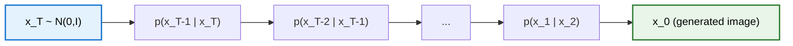
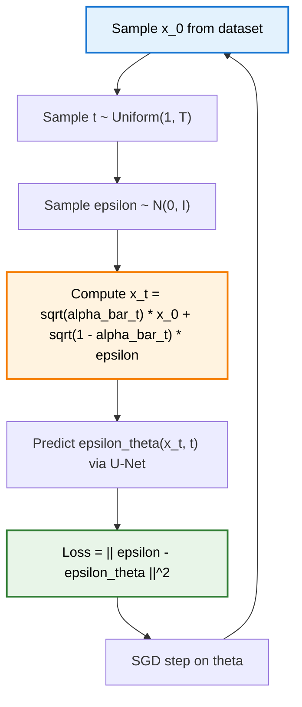

> **TL;DR**: Denoising Diffusion Probabilistic Models generate images by learning to reverse a noise-adding Markov chain. The forward process gradually destroys an image over $T$ steps until only Gaussian noise remains. A neural network then learns the reverse -- predicting the noise at each step so it can be subtracted away. The training objective, derived from a variational bound on log-likelihood, simplifies to an almost embarrassingly simple MSE loss between the true noise and the predicted noise. The result: sample quality that matches or beats GANs on CIFAR-10 and LSUN, with none of the training instability.

> These paper reviews are written more for me and less for others. LLMs have been used in formatting
{: .prompt-tip }

---

## Previously, on Diffusion

In the [diffusion intuition post](), we built geometric intuition for why adding noise and then removing it is a reasonable strategy for generation. We talked about the forward process as a walk toward the centre of a high-dimensional Gaussian, and the reverse process as learning to walk back. That was the story without equations. Now we write down the equations.

---

## The Forward Process: Turning Images into Static

The forward process is a Markov chain. Given a data sample $x_0 \sim q(x_0)$, we produce a sequence of increasingly noisy latents $x_1, x_2, \ldots, x_T$ by adding Gaussian noise at each step:

$$q(x_t \vert x_{t-1}) = \mathcal{N}\left(x_t;\ \sqrt{1 - \beta_t}\, x_{t-1},\ \beta_t \mathbf{I}\right)$$

where $\beta_1, \beta_2, \ldots, \beta_T$ is a **variance schedule** -- a sequence of small positive constants that controls how much noise is injected at each step. The original DDPM paper uses a linear schedule from $\beta_1 = 10^{-4}$ to $\beta_T = 0.02$ over $T = 1000$ steps.

The joint forward process factorises neatly because of the Markov property:

$$q(x_1, \ldots, x_T \vert x_0) = \prod_{t=1}^{T} q(x_t \vert x_{t-1})$$

### Notation: $\alpha_t$ and $\bar{\alpha}_t$

Define:

$$\alpha_t = 1 - \beta_t, \qquad \bar{\alpha}_t = \prod_{s=1}^{t} \alpha_s$$

Since each $\beta_t$ is small, each $\alpha_t$ is close to 1 -- but $\bar{\alpha}_t$ is a cumulative product, so it decays toward zero as $t$ grows.

### Closed-Form Sampling: $q(x_t \vert x_0)$

Here is the key property that makes training efficient. We do not need to run the chain step by step. By recursively substituting the transition formula and using the fact that the sum of independent Gaussians is Gaussian, we get:

$$q(x_t \vert x_0) = \mathcal{N}\left(x_t;\ \sqrt{\bar{\alpha}_t}\, x_0,\ (1 - \bar{\alpha}_t)\mathbf{I}\right)$$

Using the **reparameterisation trick**, we can sample $x_t$ directly:

$$x_t = \sqrt{\bar{\alpha}_t}\, x_0 + \sqrt{1 - \bar{\alpha}_t}\, \epsilon, \qquad \epsilon \sim \mathcal{N}(0, \mathbf{I})$$

This is a single matrix multiply and addition -- no Markov chain simulation needed. Any timestep $t$ is directly accessible from $x_0$, which is what makes stochastic gradient descent over random timesteps possible.

### Deriving the Closed Form

The derivation is a telescoping substitution. Start with $x_t = \sqrt{\alpha_t}\, x_{t-1} + \sqrt{\beta_t}\, \epsilon_t$ and expand $x_{t-1}$ using the same formula:

$$x_t = \sqrt{\alpha_t}\left(\sqrt{\alpha_{t-1}}\, x_{t-2} + \sqrt{1 - \alpha_{t-1}}\, \epsilon_{t-1}\right) + \sqrt{1 - \alpha_t}\, \epsilon_t$$

The two noise terms $\sqrt{\alpha_t(1 - \alpha_{t-1})}\, \epsilon_{t-1}$ and $\sqrt{1 - \alpha_t}\, \epsilon_t$ are independent Gaussians, so they combine into a single Gaussian with variance $\alpha_t(1 - \alpha_{t-1}) + (1 - \alpha_t) = 1 - \alpha_t \alpha_{t-1}$. Repeating this recursion $t$ times yields $\sqrt{\bar{\alpha}_t}\, x_0$ plus a noise term with variance $1 - \bar{\alpha}_t$.

---

## Why the Forward Process Converges to $\mathcal{N}(0, \mathbf{I})$

Consider what happens as $t \to T$. The mean of $q(x_t \vert x_0)$ is $\sqrt{\bar{\alpha}_t}\, x_0$. Since $\bar{\alpha}_t$ is a product of values less than 1, it decays exponentially -- for large $T$, $\bar{\alpha}_T \approx 0$, so the mean vanishes. The variance is $(1 - \bar{\alpha}_t)\mathbf{I}$, which approaches $\mathbf{I}$.

In other words, the signal coefficient $\sqrt{\bar{\alpha}_t}$ crushes the data to zero while the noise coefficient $\sqrt{1 - \bar{\alpha}_t}$ inflates to unit scale. By $T = 1000$, the original image is gone. All that remains is isotropic Gaussian noise.

The relationship between the scaling and noise variance coefficients -- $\sqrt{\alpha_t}$ and $\sqrt{1 - \alpha_t}$ -- is not arbitrary. It is precisely what ensures the limiting variance is $\mathbf{I}$ rather than some other scale.

---

## The Reverse Process: Learning to Denoise

The reverse process starts from $x_T \sim \mathcal{N}(0, \mathbf{I})$ and runs backward:

$$p_\theta(x_{0:T}) = p(x_T) \prod_{t=1}^{T} p_\theta(x_{t-1} \vert x_t)$$

Each reverse transition is modelled as a learned Gaussian:

$$p_\theta(x_{t-1} \vert x_t) = \mathcal{N}\left(x_{t-1};\ \mu_\theta(x_t, t),\ \sigma_t^2 \mathbf{I}\right)$$

The neural network must learn $\mu_\theta$ -- the mean of the denoising distribution. The variance $\sigma_t^2$ is fixed (more on that shortly).

### Predicting Noise vs. Predicting $x_0$

There are two equivalent ways to parameterise $\mu_\theta$:

1. **Predict $x_0$ directly**: have the network output $\hat{x}_0 = f_\theta(x_t, t)$, then plug it into the posterior mean formula (derived below).
2. **Predict noise $\epsilon$**: have the network output $\hat{\epsilon} = \epsilon_\theta(x_t, t)$, then recover $\hat{x}_0$ via the reparameterisation formula and plug that into the posterior mean.

The authors found that predicting noise works better empirically. This is the standard parameterisation.

### The U-Net Backbone

The network $\epsilon_\theta(x_t, t)$ is a U-Net -- an encoder-decoder architecture with skip connections. The input is the noisy image $x_t$, and the output is the predicted noise $\hat{\epsilon}$, same spatial dimensions as the input.

**Timestep conditioning** is crucial. The same network handles all $T$ timesteps, so it needs to know *which* timestep it is denoising. The timestep $t$ is encoded via sinusoidal position embeddings (borrowed from Transformers) and injected into the network, typically through addition or FiLM-style modulation at each residual block.

### Fixing the Variance

The authors set $\sigma_t^2 = \beta_t$ (or equivalently $\sigma_t^2 = \tilde{\beta}_t$, the posterior variance derived below). They find both choices give similar results. Fixing the variance means the network only needs to learn the mean -- one output instead of two. This simplifies training considerably.

---

## ELBO Derivation

We want to maximise the log-likelihood $\log p_\theta(x_0)$. Since this is intractable, we derive a lower bound.

Start by marginalising over the latent chain:

$$\log p_\theta(x_0) = \log \int p_\theta(x_{0:T})\, dx_{1:T}$$

Introduce the forward process $q(x_{1:T} \vert x_0)$ via importance sampling:

$$\log p_\theta(x_0) = \log \int q(x_{1:T} \vert x_0) \frac{p_\theta(x_{0:T})}{q(x_{1:T} \vert x_0)}\, dx_{1:T} = \log\, \mathbb{E}_{q}\left[\frac{p_\theta(x_{0:T})}{q(x_{1:T} \vert x_0)}\right]$$

Apply Jensen's inequality ($\log$ is concave):

$$\log p_\theta(x_0) \geq \mathbb{E}_{q}\left[\log \frac{p_\theta(x_{0:T})}{q(x_{1:T} \vert x_0)}\right] = \text{ELBO}$$

### Decomposing the ELBO

Factor $p_\theta$ and $q$ using the Markov property, then rearrange. The key step is applying Bayes' theorem to the forward conditionals:

$$q(x_t \vert x_{t-1}, x_0) = \frac{q(x_{t-1} \vert x_t, x_0)\, q(x_t \vert x_0)}{q(x_{t-1} \vert x_0)}$$

After telescoping cancellations, the ELBO decomposes into three types of terms:

$$\text{ELBO} = \underbrace{\mathbb{E}_q\left[\log p_\theta(x_0 \vert x_1)\right]}_{\text{reconstruction}} - \underbrace{D_{\text{KL}}\left(q(x_T \vert x_0)\ \Vert\ p(x_T)\right)}_{\text{prior matching}} - \underbrace{\sum_{t=2}^{T} \mathbb{E}_q\left[D_{\text{KL}}\left(q(x_{t-1} \vert x_t, x_0)\ \Vert\ p_\theta(x_{t-1} \vert x_t)\right)\right]}_{\text{denoising matching}}$$

- **Reconstruction term**: how well the model reconstructs $x_0$ from $x_1$. Analogous to the reconstruction loss in a VAE.
- **Prior matching term**: how close $q(x_T \vert x_0)$ is to $\mathcal{N}(0, \mathbf{I})$. This is parameter-free -- the forward process is designed to make this small, so we do not optimise it.
- **Denoising matching terms**: the sum that does the heavy lifting. Each term asks the learned reverse transition $p_\theta(x_{t-1} \vert x_t)$ to match the *true* posterior $q(x_{t-1} \vert x_t, x_0)$.

---

## The Posterior $q(x_{t-1} \vert x_t, x_0)$

This is the tractable reverse conditional -- the distribution we *would* use if we knew the original image. It is the target for each denoising KL term.

Apply Bayes' theorem:

$$q(x_{t-1} \vert x_t, x_0) = \frac{q(x_t \vert x_{t-1}, x_0)\, q(x_{t-1} \vert x_0)}{q(x_t \vert x_0)}$$

Each factor on the right is a known Gaussian (from the forward process). Writing them out in exponential form and completing the square in $x_{t-1}$:

### Posterior Variance

$$\tilde{\beta}_t = \frac{1 - \bar{\alpha}_{t-1}}{1 - \bar{\alpha}_t} \cdot \beta_t$$

### Posterior Mean

$$\tilde{\mu}_t(x_t, x_0) = \frac{\sqrt{\bar{\alpha}_{t-1}}\, \beta_t}{1 - \bar{\alpha}_t}\, x_0 + \frac{\sqrt{\alpha_t}\, (1 - \bar{\alpha}_{t-1})}{1 - \bar{\alpha}_t}\, x_t$$

So the posterior mean is a weighted combination of the original image $x_0$ and the current noisy image $x_t$. The weights shift over time -- at large $t$ (lots of noise), $x_t$ dominates; at small $t$ (near the clean image), $x_0$ dominates.

The full posterior is:

$$q(x_{t-1} \vert x_t, x_0) = \mathcal{N}\left(x_{t-1};\ \tilde{\mu}_t(x_t, x_0),\ \tilde{\beta}_t \mathbf{I}\right)$$

---

## KL Between Gaussians with Matched Variance

Both $q(x_{t-1} \vert x_t, x_0)$ and $p_\theta(x_{t-1} \vert x_t)$ are Gaussians. The authors fix the variance of $p_\theta$ to match $\tilde{\beta}_t$, so the two distributions differ only in their means. The KL divergence between two Gaussians with the same variance $\sigma^2$ simplifies to:

$$D_{\text{KL}}\left(\mathcal{N}(\tilde{\mu}_t, \sigma^2 \mathbf{I})\ \Vert\ \mathcal{N}(\mu_\theta, \sigma^2 \mathbf{I})\right) = \frac{1}{2\sigma^2} \left\Vert \tilde{\mu}_t - \mu_\theta \right\Vert^2$$

The KL reduces to a scaled MSE on the means. Minimising the ELBO denoising terms is equivalent to making the predicted mean $\mu_\theta(x_t, t)$ match the posterior mean $\tilde{\mu}_t(x_t, x_0)$.

---

## From Predicting $x_0$ to Predicting $\epsilon$

The posterior mean $\tilde{\mu}_t$ depends on $x_0$, which the network does not have at inference time. We need to express $\mu_\theta$ in a form the network can produce.

### Option 1: Predict $x_0$

Parameterise $\mu_\theta$ the same way as $\tilde{\mu}_t$, but replace $x_0$ with a network prediction $\hat{x}_\theta(x_t, t)$:

$$\mu_\theta(x_t, t) = \frac{\sqrt{\bar{\alpha}_{t-1}}\, \beta_t}{1 - \bar{\alpha}_t}\, \hat{x}_\theta(x_t, t) + \frac{\sqrt{\alpha_t}\, (1 - \bar{\alpha}_{t-1})}{1 - \bar{\alpha}_t}\, x_t$$

The loss becomes proportional to $\Vert x_0 - \hat{x}_\theta(x_t, t) \Vert^2$. This works but is not what the authors recommend.

### Option 2: Predict $\epsilon$ (the winning parameterisation)

From the reparameterisation formula, solve for $x_0$:

$$x_0 = \frac{1}{\sqrt{\bar{\alpha}_t}}\left(x_t - \sqrt{1 - \bar{\alpha}_t}\, \epsilon\right)$$

Substitute into the posterior mean:

$$\tilde{\mu}_t = \frac{1}{\sqrt{\alpha_t}}\left(x_t - \frac{\beta_t}{\sqrt{1 - \bar{\alpha}_t}}\, \epsilon\right)$$

Now parameterise $\mu_\theta$ by replacing $\epsilon$ with a network prediction $\epsilon_\theta(x_t, t)$:

$$\mu_\theta(x_t, t) = \frac{1}{\sqrt{\alpha_t}}\left(x_t - \frac{\beta_t}{\sqrt{1 - \bar{\alpha}_t}}\, \epsilon_\theta(x_t, t)\right)$$

Plugging into the MSE-on-means loss, the $x_t$ terms cancel, and we get:

$$L_t = \frac{\beta_t^2}{2\sigma_t^2 \alpha_t (1 - \bar{\alpha}_t)} \left\Vert \epsilon - \epsilon_\theta(x_t, t) \right\Vert^2$$

The loss is now an MSE between the *actual* noise $\epsilon$ that was sampled during the forward process and the noise *predicted* by the network.

---

## The Simplified Loss

The scaling coefficient $\frac{\beta_t^2}{2\sigma_t^2 \alpha_t (1 - \bar{\alpha}_t)}$ varies with $t$ and weights different timesteps differently. The authors found that **dropping this coefficient entirely** and using a uniform weight across timesteps works better in practice:

$$L_{\text{simple}} = \mathbb{E}_{t, x_0, \epsilon}\left[\left\Vert \epsilon - \epsilon_\theta\left(\sqrt{\bar{\alpha}_t}\, x_0 + \sqrt{1 - \bar{\alpha}_t}\, \epsilon,\ t\right) \right\Vert^2\right]$$

That is it. The entire training objective is: sample an image, sample a timestep, sample noise, predict that noise from the noisy image, take the MSE. No adversarial training, no mode collapse, no careful learning rate balancing between two networks. Just regression.

---

## Training Algorithm

In pseudocode:

1. Sample $x_0 \sim q(x_0)$ from the training set
2. Sample $t \sim \text{Uniform}\{1, \ldots, T\}$
3. Sample $\epsilon \sim \mathcal{N}(0, \mathbf{I})$
4. Compute $x_t = \sqrt{\bar{\alpha}_t}\, x_0 + \sqrt{1 - \bar{\alpha}_t}\, \epsilon$
5. Compute loss $L = \Vert \epsilon - \epsilon_\theta(x_t, t) \Vert^2$
6. Take a gradient step on $\theta$
7. Repeat until convergence

The closed-form $q(x_t \vert x_0)$ is what makes step 4 a single operation rather than a $t$-step simulation. The $\bar{\alpha}_t$ values are precomputed from the variance schedule.

---

## Sampling Algorithm

Once trained, generation proceeds by running the learned reverse chain:

1. Sample $x_T \sim \mathcal{N}(0, \mathbf{I})$
2. For $t = T, T-1, \ldots, 1$:
   - Compute $\mu_\theta(x_t, t) = \frac{1}{\sqrt{\alpha_t}}\left(x_t - \frac{\beta_t}{\sqrt{1 - \bar{\alpha}_t}}\, \epsilon_\theta(x_t, t)\right)$
   - If $t > 1$: sample $z \sim \mathcal{N}(0, \mathbf{I})$ and set $x_{t-1} = \mu_\theta(x_t, t) + \sigma_t z$
   - If $t = 1$: set $x_0 = \mu_\theta(x_1, 1)$ (no noise added at the final step)
3. Return $x_0$

The stochastic noise $z$ at each step introduces variation -- different runs from the same $x_T$ can produce different images. At the final step, we return the mean directly to get a clean output.

This requires 1000 forward passes through the U-Net. It is slow. We will address that at the end.

---

## Results

The authors evaluate on three benchmarks:

| Dataset | FID $\downarrow$ | Inception Score $\uparrow$ |
|---------|------|-----------------|
| CIFAR-10 | **3.17** | **9.46** |
| LSUN Bedroom 256x256 | 4.90 | -- |
| CelebA-HQ 256x256 | -- | -- |

On CIFAR-10, the FID of 3.17 was state-of-the-art among likelihood-based models and competitive with the best GANs at the time. The Inception Score of 9.46 was similarly strong.

**FID (Frechet Inception Distance)** measures the distance between the distribution of real and generated images in the feature space of an Inception-v3 network -- lower is better. **Inception Score** measures both quality (sharp, recognisable objects) and diversity (spread across classes) -- higher is better.

The quality on LSUN (churches, bedrooms) was comparable to Progressive GANs, and the CelebA-HQ 256x256 samples showed sharp, realistic faces. The model also supports progressive generation -- you can visualise the denoising trajectory from pure noise to final image -- and latent-space interpolation by interpolating in the noisy latent space rather than pixel space.

A notable finding: the negative log-likelihood was not particularly competitive. DDPMs optimise a variational bound, not exact likelihood, and the bound is loose. But the sample quality -- the thing humans actually care about -- was excellent.

{: w="600" }
_Same prompt, different noise samples, different outputs. It's a diffusion blog — the anime was inevitable. Notice the diversity: each run follows a different path through image space, landing at a different point in the same cluster._

---

## A Note on DDIM

The main drawback of DDPM is sampling speed. Generating a single image requires 1000 sequential U-Net evaluations. Song et al. (2020) addressed this with **DDIM (Denoising Diffusion Implicit Models)**, which generalises the framework by defining a *non-Markovian* forward process that yields the same marginals $q(x_t \vert x_0)$ as DDPM.

The key insight: the DDIM forward process introduces an additional parameter $\sigma_t$ that controls stochasticity. When $\sigma_t$ matches the DDPM schedule, you recover standard DDPM. When $\sigma_t = 0$, the reverse process becomes **deterministic** -- given the same $x_T$, you always get the same $x_0$. More importantly, because the loss function is identical to DDPM's, a model trained with the DDPM objective can be sampled using DDIM *without retraining*.

The practical payoff is **skip-step inference**. Instead of denoising through all 1000 timesteps, DDIM can skip -- jumping from $t = 999$ to $t = 781$ to $t = 581$ and so on, using as few as 50 steps. Each step uses the same U-Net, the same predicted noise, but leaps over intermediate timesteps. The quality degrades gracefully, and 50-step DDIM often produces images comparable to 1000-step DDPM at a 20x speedup.

---

## Summary

**Key Takeaways:**
- The forward process is a fixed Markov chain adding Gaussian noise; the closed-form $q(x_t \vert x_0)$ makes training efficient
- The reverse process uses a U-Net to predict noise $\epsilon$ at each timestep, conditioned on $t$ via sinusoidal embeddings
- The ELBO decomposes into terms that require matching the learned reverse to the tractable posterior $q(x_{t-1} \vert x_t, x_0)$
- The posterior is derived via Bayes' theorem and completing the square -- its mean is a weighted average of $x_0$ and $x_t$
- Fixing the reverse variance reduces KL to MSE on means; reparameterising converts mean-prediction to noise-prediction
- The simplified loss drops the timestep-dependent scaling and just uses $\Vert \epsilon - \epsilon_\theta \Vert^2$ -- and it works better
- DDIM reuses the same trained model but enables deterministic, skip-step sampling for a 20x speedup

---

## Further Reading

- **The DDPM Paper**: [Denoising Diffusion Probabilistic Models (Ho, Jain, Abbeel, 2020)](https://arxiv.org/abs/2006.11239)
- **The DDIM Paper**: [Denoising Diffusion Implicit Models (Song, Meng, Ermon, 2020)](https://arxiv.org/abs/2010.02502)
- **The Original Diffusion Paper**: [Deep Unsupervised Learning using Nonequilibrium Thermodynamics (Sohl-Dickstein et al., 2015)](https://arxiv.org/abs/1503.03585)
- **Lilian Weng's Blog**: [What are Diffusion Models?](https://lilianweng.github.io/posts/2021-07-11-diffusion-models/)
- **The Annotated Diffusion Model**: [Hugging Face walkthrough](https://huggingface.co/blog/annotated-diffusion)

---
