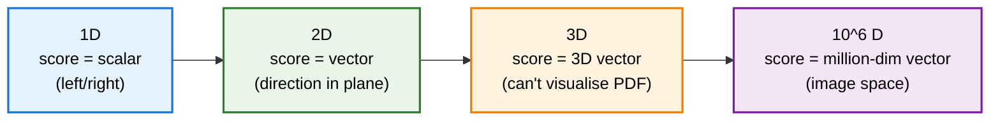

> **TL;DR**: Diffusion models work because of two things most explanations skip -- the score function (gradient of the log-PDF) and Langevin dynamics (an algorithm that turns that gradient into samples). If you know the score, you can sample from any distribution. The diffusion model's job is to estimate the score. The noise you add during generation is not a nuisance -- it is raw material, a source of creativity, and a mechanism for escaping local optima. This post covers the full chain: from probability distributions to sampling, from score functions to Langevin updates, from 1D toy examples to million-dimensional image space.

> These paper reviews are written more for me and less for others. LLMs have been used in formatting
{: .prompt-tip }

> This is one of the more under-the-radar explanations of how diffusion models actually work. Most popular treatments focus on the forward and reverse noise process -- add noise, learn to remove it, done. That is the *how*. This post goes deeper, to the score function and Langevin dynamics that make the whole thing tick. If you want to understand *why* diffusion works -- why denoising is a valid generative procedure, why noise is added during sampling, why the same recipe works for dice rolls and million-pixel images -- this is the post.
{: .prompt-info }

---

## Probability Distributions as the Fundamental Object

Before we talk about generating images, we need to talk about what we are generating *from*.

A **probability distribution** is a machine that, when you press its button, gives you a random observation -- a sample. You cannot predict any individual sample, but you can say meaningful things about how samples behave over many trials. A fair die gives each face roughly one-sixth of the time. That long-run behaviour is captured by its **probability mass function** (PMF).

Distributions can be **discrete** (a die roll -- only certain values, nothing in between) or **continuous** (any real number in some range), in which case they are described by a **probability density function** (PDF) instead of a PMF.

Most people are comfortable with one-dimensional distributions. A single coin toss. A single die roll. But distributions can be multi-dimensional. A two-dimensional distribution produces samples described by *two* numbers. The density function describes the likelihood of encountering each *pair* of numbers instead of single numbers.

And images? An image of size $1000 \times 1000$ pixels is a sample from a distribution over one million dimensions. Each dimension is a pixel value between 0 and 255. There exists (conceptually) a PDF over this space that assigns higher likelihood to images resembling real-world scenes and near-zero likelihood to random static.

---

## Sampling as a Computational Problem

Knowing a distribution's PDF does not tell you how to *sample* from it. These are different problems.

We know the exact PMF of a fair die. Each face has probability $\frac{1}{6}$. But that tells us nothing about how to generate samples computationally. The algorithms that do this -- Mersenne Twister, xoroshiro -- sound more like supervillain names than sampling methods.

There is a useful trick, though: if you can sample from one distribution, you can sometimes use that to sample from another. For dice rolls, one approach is to sample from a continuous uniform distribution on $[0, 1]$ and apply thresholds:

- If the sample is below $\frac{1}{6}$, output 1
- If between $\frac{1}{6}$ and $\frac{2}{6}$, output 2
- And so on

This works because the two distributions are structurally similar. But there is a distribution so powerful that knowing how to sample from it lets you sample from *almost anything else*: the **normal distribution**. To see how, we need two more ingredients -- the score function and Langevin dynamics.

---

## The Score Function

Suppose we have a distribution with PDF $p(x)$. The **score function** is defined as:

$$s(x) = \nabla_x \log p(x)$$

It is the gradient of the *log* of the PDF. For a one-dimensional distribution, this is just the derivative $\frac{d}{dx} \log p(x)$. It tells you: from your current location $x$, which direction should you move to most quickly increase the log-likelihood?

### Why the Log?

You could use the raw gradient $\nabla_x p(x)$ instead. But consider what happens far from the peaks of a distribution. Out in the tails, $p(x)$ is tiny -- and so is its gradient. A sample starting in a low-density region would barely move, taking an enormous number of steps to reach the peaks where the actual samples live.

The log fixes this. By the chain rule:

$$\frac{d}{dx} \log p(x) = \frac{p'(x)}{p(x)}$$

The division by $p(x)$ acts as a natural scaling factor. Where $p(x)$ is small, the divisor is small, which *amplifies* the gradient. The score function has large magnitude precisely in the regions where you need to move the most -- the low-density wastelands far from the peaks.

---

## Langevin Dynamics

Now the algorithm. Given the score function $s(x) = \nabla_x \log p(x)$ and the ability to sample from a normal distribution, **Langevin dynamics** generates samples from $p(x)$ through a simple iterative process:

$$x_{t+1} = x_t + \epsilon \, s(x_t) + \sqrt{2\epsilon} \, z_t, \quad z_t \sim \mathcal{N}(0, I)$$

Three components per step:

1. **Start** at your current location $x_t$
2. **Move** in the direction of the score function $s(x_t)$ -- gradient ascent on the log-PDF
3. **Add noise** -- a sample from the normal distribution, scaled by $\sqrt{2\epsilon}$

That is it. Repeat this update many times. As the number of steps grows, $x_t$ converges to a sample from $p(x)$.

The gradient step pulls you toward high-density regions. The noise ensures you do not collapse onto the peaks. Together, they produce proper samples with the right variability.

---

## Worked Example: Sampling from a Two-Peak Distribution

Consider a distribution $p_{\text{2peaks}}$ with two modes -- one large peak and one smaller peak. We do not know the exact functional form, only its shape and the score function $s_{\text{2peaks}}(x)$.

The procedure:

1. Draw $x_0 \sim \mathcal{N}(0, 1)$ -- a random starting point
2. For $t = 0, 1, \ldots, 999$: apply the Langevin update using $s_{\text{2peaks}}$
3. The final $x_{1000}$ is a sample from $p_{\text{2peaks}}$

Draw many such samples (each starting from a fresh Gaussian draw, each running 1000 updates), and the histogram matches the shape of the PDF. Not perfectly -- Langevin sampling only converges to the true distribution in the limit of infinite steps. But 1000 steps captures the essence: samples cluster around the two peaks with the correct relative frequencies.

Without the noise term, you would only ever land exactly on one of the two peaks. Those are not samples from $p_{\text{2peaks}}$ -- real samples have variability around the peaks. The noise is what gives you that variability.

---

## Worked Example: Generating Dice Rolls via Langevin

This one is slightly absurd, which is the point. We will use Langevin sampling -- the same procedure we will later use for million-dimensional images -- to simulate rolling a die.

**Strategy**: first, use Langevin to sample from a continuous uniform distribution on $[0, 1]$. Then threshold the result to get a die face.

The score function for the uniform distribution is interesting: it is **zero everywhere** inside $[0, 1]$. The density is flat, so there is no direction that increases it. The only non-trivial part is handling boundaries -- if a sample drifts below 0 or above 1, the score function pushes it back.

This means the Langevin updates inside $[0, 1]$ consist purely of adding Gaussian noise. It seems implausible that repeatedly adding noise to a number would produce uniform samples. But draw 10,000 of them, and the histogram is indistinguishable from a true uniform distribution.

Threshold those samples into six bins, and you get a fair die. Each face appears roughly $\frac{1}{6}$ of the time.

The significance is not efficiency -- NumPy's `random.uniform` is obviously faster. The significance is *generality*. The exact same recipe -- score function plus Gaussian noise, iterated -- works for this trivial distribution and for the incomprehensibly complex distribution over natural images.

{: w="520" }
_Left: a die. Right: a million-faceted object representing the distribution over natural images. Langevin sampling does not care which one you hand it._

---

## From 1D to a Million Dimensions

In one dimension, the score function is a scalar -- go left or go right, and by how much. The sample space is a number line. The PDF is a curve above it.

In two dimensions, the sample space is a plane. The score function is a 2D vector at every point -- a direction and magnitude. The PDF becomes a surface. The Langevin update adds a 2D gradient step and 2D Gaussian noise.

In three dimensions, we run out of axes to visualise the PDF. We can plot samples and colour-code them by likelihood -- red for high, blue for low -- but the landscape itself lives in 4D.

For images, the sample space has one million dimensions. The score function is a direction in million-dimensional space. The PDF is a function from $\mathbb{R}^{10^6}$ to $\mathbb{R}$. We cannot visualise any of this. But the 2D and 3D settings give the right intuition -- just pretend there are a million axes instead of two or three.

---

## The Empty Regions Problem

Here is a problem that does not show up in toy examples. Most of image space is empty.

Real images occupy tiny clusters scattered through million-dimensional space. The vast stretches between clusters contain no plausible images whatsoever. In these regions, the PDF is zero -- and the gradient is zero too. If your Langevin sample starts in one of these empty patches, the score function gives you nothing. Your updates consist purely of the Gaussian noise term, and stumbling into a cluster of good images by random noise alone is about as likely as a monkey typing Shakespeare.

This is one of the key engineering problems that diffusion models solve. By adding noise to training images at various scales, they effectively populate the empty regions with "fake" samples -- smeared-out versions of real images. This makes the score function non-zero everywhere in image space while still pointing toward where the true samples live. The multi-scale noise schedule is not just a training trick; it is what makes Langevin sampling feasible in high dimensions.

---

## The Diffusion Model Output IS the Score Function

Here is the punchline. A diffusion model is trained to predict the noise that was added to a clean image. But predicting the noise added to an image is mathematically equivalent to estimating the score function -- the gradient of the log-PDF of the image distribution.

This equivalence is not obvious. The original authors (under the framework of **score matching**) had to prove it rigorously. But the intuition is natural:

- The score function points from low-density regions toward high-density regions in image space
- A noisy image sits in a lower-density region than the clean image it came from
- The direction from the noisy image toward the clean image is the noise that was added
- So predicting the noise $\approx$ estimating the score

$$\text{predicted noise} \propto -s(x) = -\nabla_x \log p(x)$$

The diffusion model's output is exactly the $s(x)$ term that Langevin sampling needs. When you run the reverse process -- starting from pure noise and iteratively denoising -- you are performing Langevin dynamics. Each step combines the model's score estimate with fresh Gaussian noise.

---

## Why Noise Is Raw Material, Not Just Something to Remove

The standard narrative frames noise as the enemy: diffusion adds noise, the model removes it, image appears. But this misses something fundamental. The noise added *during sampling* is not a leftover from training -- it is an active, essential ingredient.

### The Red Panda Experiment

Take a diffusion model generating a red panda. Run the first 500 steps normally (score step + noise). Then, for the remaining 500 steps, remove the noise term and follow only the score function.

The result: the image starts as a crisp red panda at the midpoint, then *degrades* into a blurry mess. The model, left to its own devices without noise, destroys detail rather than adding it. High-frequency features -- textures, fur patterns, sharp edges -- come from the noise, not from the model.

### Local Optima

The probability landscape of images is not a smooth terrain with a few clean peaks. It is bumpy and messy, riddled with small hills everywhere. Following the gradient alone, you get trapped in local optima -- configurations that are locally better than their neighbours but globally mediocre. A blurry prototype of a red panda might sit in such a local optimum.

Noise breaks you out. Random perturbations can knock you off a small hill and into the basin of a taller one. Without noise, the model is shortsighted -- it only sees the immediate neighbourhood and has no mechanism for discovering better regions.

### The Two-Artist Metaphor

Think of it as a two-person art team:

- The **noise term** is the creative half -- painting random patterns on the canvas with reckless abandon
- The **diffusion model** is the methodical half -- stepping in to say, "if I just clean up this smudge, remove that jumble, we get something like an edge, a texture, a shape"

Neither can work alone. The model is trained to *remove* noise, not to *add* detail. It lacks the creative capacity to introduce features. The noise lacks the intelligence to produce anything structured. Together, they are more than the sum of their parts.

{: w="600" }
_The creative one throws paint. The methodical one knows what a face looks like. It's a diffusion blog — the anime was inevitable._

### Noise for Diversity

Without noise, you get mode collapse. The model converges on the same prototypical output every time -- the single highest-density point. With noise, each sample takes a different stochastic path through image space, landing on different members of the distribution. This is why diffusion models produce diverse outputs where GANs often do not. GANs must balance creativity and logic within a single network -- conflicting objectives that lead to training instability and mode collapse. Diffusion models offload creativity to pure randomness, letting the network focus entirely on the logical component.

---

## The Philosophical Parallel: Langevin at Test Time, Gradient Descent at Train Time

There is a striking symmetry hiding in plain sight.

**Gradient descent** (training):
$$\theta_{t+1} = \theta_t - \eta \, \nabla_\theta \mathcal{L}(\theta_t) + \text{noise from mini-batch}$$

**Langevin dynamics** (sampling):
$$x_{t+1} = x_t + \epsilon \, \nabla_x \log p(x_t) + \sqrt{2\epsilon} \, z_t$$

Both are iterative. Both follow noisy gradients. Both use small steps repeated many times. Both rely on stochasticity to escape local optima.

In gradient descent, we update the *parameters* of a network to minimise a loss. The randomness comes from mini-batch sampling. In Langevin dynamics, we update the *pixels* of an image to maximise log-likelihood. The randomness comes from explicit Gaussian noise.

Diffusion models use both: gradient descent at train time to learn the score function, and Langevin dynamics at test time to sample from the learned distribution. They are deep networks that rely on iterative stochastic gradient-based optimisation in both phases.

This points to something deeper. To solve a hard optimisation problem, it seems you only need two things: the gradient of whatever you are trying to optimise (computed locally, from where you currently stand), and some noise (to escape ruts when you get stuck). The rest is just repetition -- keep stepping, keep adding noise, and the difficulty of the problem determines how many steps you need.

Gradient descent has an unbroken line of influence through every neural network ever trained. Langevin dynamics may turn out to be its twin -- the same principle, applied at inference time instead of training time.

---

## Summary

**Key Takeaways:**
- A probability distribution is a machine that produces random samples; its PDF describes the likelihood landscape
- Knowing the PDF does not tell you how to sample -- sampling is its own computational problem
- The **score function** $\nabla_x \log p(x)$ is the gradient of the log-PDF; the logarithm amplifies the signal in low-density regions
- **Langevin dynamics** generates samples from any distribution using only the score function and Gaussian noise
- The same procedure works for one-dimensional toy distributions and million-dimensional image distributions
- Diffusion models estimate the score function by learning to predict noise -- predicting noise $\approx$ estimating the score
- Noise during sampling is not a nuisance; it provides raw material for detail, pulls samples out of local optima, and ensures diversity
- Langevin sampling at test time is structurally identical to gradient descent at train time -- iterative, stochastic, gradient-based

---

## Further Reading

- **[Finding Signal in the Static]()**: the forward and reverse noise process, and why denoising works as a generative strategy
- **[1000 Steps Back]()**: the denoising diffusion probabilistic model in detail -- training objective, noise schedule, and the ELBO
- **Generative Modeling by Estimating Gradients of the Data Distribution**: Song & Ermon, 2019 -- the score matching paper that connects noise prediction to score estimation
- **DepthAI -- More Than Image Generators**: the video this post draws from, framing diffusion through the lens of Langevin dynamics and probability
- **Denoising Diffusion Probabilistic Models**: Ho et al., 2020 -- the paper that made diffusion models practical

---
