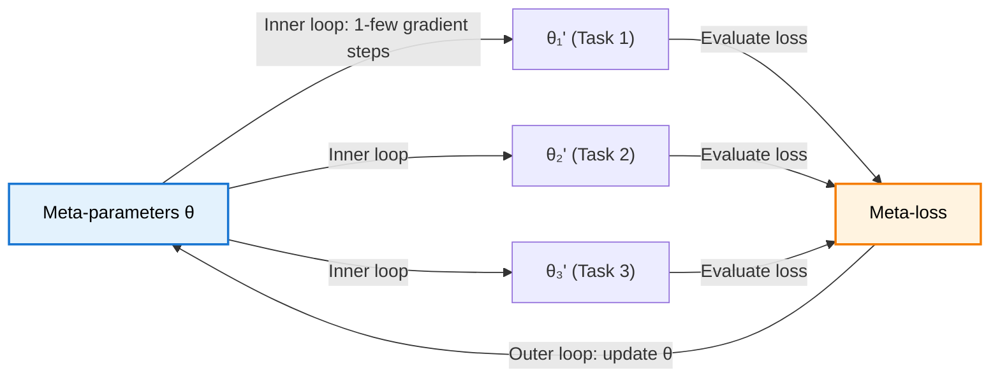

> **TL;DR**: Standard deep learning needs thousands of examples per class. Humans need one or two. Few-shot learning closes that gap through meta-learning -- learning how to learn. MAML finds an initialisation that can adapt to any new task in a handful of gradient steps, by optimising not for performance on any single task but for *adaptability* across all tasks. Prototypical Networks take a different route: learn an embedding space where each class is represented by the mean of its support embeddings, then classify by nearest prototype. Two philosophies -- optimisation-based and metric-based -- for the same fundamental problem.

> These paper reviews are written more for me and less for others. LLMs have been used in formatting
{: .prompt-tip }

---

## The Problem: Deep Learning Is Data-Hungry

Modern deep learning follows a familiar script. Take an overparameterised model, throw a massive dataset at it, train for weeks, beat benchmarks. ImageNet has 1.2 million images. Language models train on trillions of tokens. This works -- but it is fundamentally different from how humans learn.

A child sees two or three dogs and can recognise dogs forever. A deep network trained on three dog images will memorise them and fail on everything else. The issue is overfitting -- with few examples, the model latches onto noise instead of learning generalisable features.

Few-shot learning asks: can we build models that learn new concepts from just a few examples? Not by training from scratch on those examples, but by leveraging prior experience across many tasks to learn *how to learn* efficiently.

---

## The Few-Shot Setup: N-way K-shot

Few-shot learning has its own vocabulary. Here is what you need:

- **Support set**: the few labelled examples you are given for a new task. Think of this as a tiny training set -- maybe 1-5 examples per class.
- **Query set**: the unlabelled examples you need to classify. This is the test set for that task.
- **N-way**: the number of classes in each task. A 5-way task means you distinguish between 5 classes.
- **K-shot**: the number of support examples per class. 1-shot means one example per class. 5-shot means five.

So a "5-way 1-shot" problem gives you 5 classes, 1 example each, and asks you to classify new queries into one of those 5 classes. This is genuinely hard -- you have 5 data points total.

The model does not train on one task. It trains on *hundreds* of such tasks, each sampled from a distribution. The hope: after seeing enough 5-way 1-shot problems during training, the model develops a general strategy for solving them -- even for classes it has never encountered.

---

## Multitask Learning: The Prelude

Before diving into MAML, it helps to understand what it improves upon.

In standard multitask learning, you train a single model on several tasks simultaneously. The shared layers learn general features -- edges, textures, shapes -- while task-specific heads learn what each task needs. This works because low-level features transfer across tasks. Training a dog classifier alongside a car classifier forces the model to learn *image features*, not just *dog features*.

The typical approach to obtaining a multitask initialisation is straightforward: average the parameters across task-specific models, or pre-train on a large combined dataset. Then fine-tune on your target task.

The problem? **Nothing in the optimisation objective accounts for fine-tuning.** You are hoping that the averaged parameters happen to be close to the optimal parameters for any given task. On a smooth loss landscape, this might work. On the jagged, high-dimensional landscapes of real neural networks, the average of several good parameter vectors can land you somewhere terrible.

MAML fixes this by directly optimising for adaptability.

---

## MAML: Optimise for Fast Adaptation

Model-Agnostic Meta-Learning (Finn et al., 2017) has one key insight: **do not optimise for performance on any single task. Optimise for the ability to quickly adapt to any task.**

The goal is to find an initialisation $\theta$ such that a few gradient descent steps on any task $\mathcal{T}\_i$ produce parameters $\theta\_i'$ that perform well on that task.

### The Inner Loop: Task-Specific Adaptation

Given a task $\mathcal{T}\_i$ with its own data and loss function $\mathcal{L}\_{\mathcal{T}\_i}$, the inner loop performs standard gradient descent starting from $\theta$:

$$\theta_i' = \theta - \alpha \nabla_\theta \mathcal{L}_{\mathcal{T}_i}(f_\theta)$$

This is just fine-tuning. One (or a few) gradient steps, learning rate $\alpha$, on the task-specific loss. Nothing exotic. The output $\theta\_i'$ is the adapted parameter vector for task $i$.

### The Outer Loop: The Meta-Update

Here is where MAML becomes interesting. The meta-objective optimises $\theta$ not based on how $f\_\theta$ performs directly, but based on how $f\_{\theta\_i'}$ performs *after* adaptation:

$$\min_\theta \sum_{\mathcal{T}_i \sim p(\mathcal{T})} \mathcal{L}_{\mathcal{T}_i}(f_{\theta_i'})$$

Read that carefully. We evaluate the loss using the *updated* parameters $\theta\_i'$, but we optimise with respect to the *original* parameters $\theta$. The meta-gradient flows through the inner loop update step.

{: w="580" }
_The MAML objective expanded. The right-hand side makes explicit that $\theta\_i'$ is just $\theta$ minus a gradient step -- the optimisation "peeks one step ahead."_

The meta-update then becomes:

$$\theta \leftarrow \theta - \beta \nabla_\theta \sum_{\mathcal{T}_i \sim p(\mathcal{T})} \mathcal{L}_{\mathcal{T}_i}(f_{\theta_i'})$$

{: w="480" }
_The solid arrow is the meta-learning update. The dashed arrows show task-specific adaptation -- from the shared initialisation $\theta$, a few gradient steps reach each task's optimum $\theta\_i^*$._

### Why This Is Not Just Averaging Parameters

This distinction matters. If you directly optimise $\mathcal{L}\_{\mathcal{T}\_i}(f\_\theta)$ -- without the inner loop update -- you are finding a $\theta$ that performs reasonably on all tasks simultaneously. That is multitask learning. You get an average model.

MAML does something subtly different. By including the gradient step inside the objective, it finds a $\theta$ that *after one update step* lands near the optimum for each task. The loss landscape around $\theta$ matters. MAML seeks regions where the gradient direction for each task leads downhill quickly -- even if $\theta$ itself sits on a ridge.

Think of it geometrically. You want to stand at a point in parameter space where, no matter which direction a task pulls you, one step in that direction reaches a valley. That point might not be a valley itself. It might have mediocre performance on every individual task. But it has the property that adaptation is easy from there.

{: w="580" }
_The loss landscape that MAML navigates. The contour lines show the terrain; the paths show how different task gradients carve routes through parameter space toward their respective optima._

### Model-Agnostic and No Extra Parameters

The name says it: MAML is model-agnostic. It works with any model that learns via gradient descent -- CNNs, RNNs, fully connected networks, policy networks. No architectural changes. No extra parameters. You just change the training procedure.

This is a big deal. Other meta-learning methods like RL$^2$ introduce additional parameters for the meta-learner. MAML uses the same model, the same parameters -- just a smarter way of initialising them.

### A Note on Second-Order Gradients

The meta-gradient $\nabla\_\theta \mathcal{L}\_{\mathcal{T}\_i}(f\_{\theta\_i'})$ involves differentiating through the inner loop update. Since $\theta\_i' = \theta - \alpha \nabla\_\theta \mathcal{L}\_{\mathcal{T}\_i}(f\_\theta)$, computing the full meta-gradient requires second-order derivatives -- a Hessian-vector product. This is computationally expensive. In practice, first-order approximations (FOMAML) that ignore the second-order terms work almost as well, at a fraction of the cost.

### Results: Sinusoids and RL Agents

**Sinusoid regression.** The paper fits sinusoidal curves from a few data points. With $K = 10$ support points, a pre-trained baseline barely tracks the ground truth even after 10 gradient steps. MAML nearly perfectly fits the curve after a single gradient step. The meta-initialisation gives the model such a strong prior on "sinusoid-like functions" that one update is enough to pin down amplitude and phase.

**Reinforcement learning.** MAML was applied to simulated locomotion tasks -- a half-cheetah that needs to run forward or backward, an ant that needs to reach different goal positions. At zero gradient steps (the raw meta-initialisation), the agents move randomly. After *one* gradient step on the new task, the cheetah runs in the correct direction and the ant navigates toward the goal. One step from random to purposeful -- that is the power of a good initialisation.

---

## Prototypical Networks: Classify by Prototype

Prototypical Networks (Snell et al., 2017) take a completely different approach. Instead of optimising an initialisation for fast gradient-based adaptation, they learn an embedding space where classification reduces to nearest-neighbour lookup.

### The Key Insight

The idea comes from K-means clustering. In K-means, each cluster is represented by its centroid -- the mean of all points assigned to it. Prototypical Networks apply the same logic to few-shot classification: **each class is represented by the mean embedding of its support examples**.

If the embedding space is good -- if semantically similar inputs map to nearby points -- then this mean embedding (the "prototype") captures the essence of the class. A new query point is classified by finding the nearest prototype.

### Computing Prototypes

Given an embedding function $f\_\phi$ (a neural network), compute the prototype $c\_k$ for class $k$ as the mean of the embedded support points:

$$c_k = \frac{1}{\vert S_k \vert} \sum_{x_i \in S_k} f_\phi(x_i)$$

where $S\_k$ is the set of support examples for class $k$.

In a 5-way 5-shot setup, you have 5 classes with 5 examples each. Each example gets embedded, and within each class, the 5 embeddings are averaged to produce one prototype vector. You end up with 5 prototypes in embedding space.

### Classification: Negative Distance + Softmax

For a query point $x\_q$, compute its embedding $f\_\phi(x\_q)$ and measure the Euclidean distance to each prototype:

$$d(f_\phi(x_q), c_k) = \lVert f_\phi(x_q) - c_k \rVert^2$$

Distances are large for dissimilar points, but we need probabilities -- where higher means more likely. So negate the distances and pass through a softmax:

$$p(y = k \mid x_q) = \frac{\exp(-d(f_\phi(x_q), c_k))}{\sum_{k'} \exp(-d(f_\phi(x_q), c_{k'}))}$$

The minus sign turns distances into similarities. The softmax turns similarities into a probability distribution. The class with the highest probability wins.

### The Loss Function

Training minimises the negative log-probability of the correct class:

$$\mathcal{L} = -\log p(y = k \mid x_q)$$

Expanding the log-softmax:

$$\mathcal{L} = d(f_\phi(x_q), c_k) + \log \sum_{k'} \exp(-d(f_\phi(x_q), c_{k'}))$$

The first term pushes the query embedding closer to its true prototype. The second term (the log-sum-exp) pushes it away from all prototypes -- but since the true class appears in the sum too, the net effect is: *get closer to your prototype, farther from the others*.

### Why It Works

The elegance of Prototypical Networks is in what they force the embedding to learn. The network must map inputs to a space where:
- Same-class examples cluster tightly (so their mean is representative)
- Different-class clusters are well-separated (so nearest-prototype classification works)

This is not explicitly encoded as a contrastive loss. It falls out naturally from the softmax-over-negative-distances objective. The training signal shapes the embedding geometry exactly as needed.

### Strengths and Limitations

**Strengths:**
- Dead simple to implement -- a forward pass, a mean, a distance computation, a softmax
- Efficient at test time -- no gradient steps needed, just embedding + nearest prototype
- Noise-resistant -- since prototypes are means, a single mislabelled support example barely shifts the centroid

**Limitations:**
- Prototypes are just means. If the class distribution in embedding space is multimodal (e.g., "vehicles" including both cars and boats), a single mean does not capture the structure
- Unlike MAML, Prototypical Networks cannot perform test-time adaptation. Fine-tuning on the support set at test time can actually *hurt* performance -- the embeddings were trained assuming prototypes are computed from raw forward passes, not from fine-tuned features

---

## Two Philosophies: Optimisation vs. Metric

MAML and Prototypical Networks represent two fundamental approaches to few-shot learning:

**MAML (optimisation-based)**: learn an initialisation. At test time, take gradient steps on the support set to adapt the full model. The model changes for each new task. Flexibility is high, but you pay for it with gradient computation at inference time.

**Prototypical Networks (metric-based)**: learn an embedding space. At test time, embed the support set, compute means, classify by distance. The model does not change. Inference is fast, but you are limited to what the fixed embedding can express.

| | MAML | Prototypical Networks |
|---|---|---|
| **Philosophy** | Find the right starting point | Find the right space |
| **Test-time adaptation** | Yes (gradient steps) | No (forward pass only) |
| **Extra parameters** | None | None |
| **Inference cost** | Higher (requires backprop) | Lower (just forward pass + distance) |
| **Flexibility** | Adapts any differentiable model | Tied to the embedding network |
| **Failure mode** | Second-order gradients are expensive | Mean prototypes miss multimodal classes |

{: w="620" }
_Two paths to the same goal. MAML navigates the loss landscape with gradient steps. Prototypical Networks group points around prototypes in a learned latent space._

Both are model-agnostic in spirit -- MAML literally, Prototypical Networks in the sense that any architecture can serve as the embedding function. Both achieve strong results on standard few-shot benchmarks like Omniglot and miniImageNet. The choice between them often comes down to whether you can afford gradient steps at test time.

---

## Key Takeaways

- Standard deep learning needs massive datasets because it learns each task from scratch. Few-shot learning reframes the problem: learn *across* tasks so that new tasks require minimal data
- The N-way K-shot setup formalises few-shot learning -- N classes, K examples each, classify query points using only the support set
- **MAML** optimises for an initialisation that adapts quickly. The meta-objective evaluates performance *after* inner-loop gradient steps, not before -- this is what separates it from naive multitask learning
- The inner/outer loop structure means MAML finds parameter regions where the loss landscape is friendly for all tasks, not just a region that is decent on average
- **Prototypical Networks** learn an embedding where class prototypes (mean embeddings) enable nearest-neighbour classification. No gradient steps at test time -- just embed, average, and compare distances
- The two approaches represent a broader split in meta-learning: optimisation-based methods (adapt the model) versus metric-based methods (adapt the representation)

---

## Further Reading

- **Model-Agnostic Meta-Learning for Fast Adaptation of Deep Networks**: [Finn et al., 2017](https://arxiv.org/abs/1703.03400)
- **Prototypical Networks for Few-Shot Learning**: [Snell et al., 2017](https://arxiv.org/abs/1703.05175)
- **Chelsea Finn's BAIR Blog Post on MAML**: [Learning to Learn](https://bair.berkeley.edu/blog/2017/07/18/learning-to-learn/)
- **On First-Order Meta-Learning Algorithms (FOMAML, Reptile)**: [Nichol et al., 2018](https://arxiv.org/abs/1803.02999)
- **Matching Networks for One Shot Learning**: [Vinyals et al., 2016](https://arxiv.org/abs/1606.04080)
- **A Closer Look at Few-Shot Classification**: [Chen et al., 2019](https://arxiv.org/abs/1904.04232)

---
