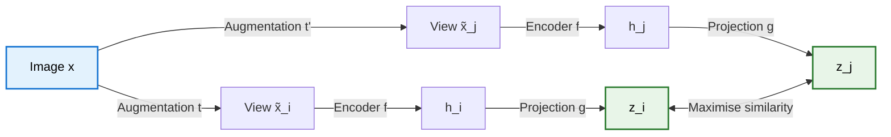
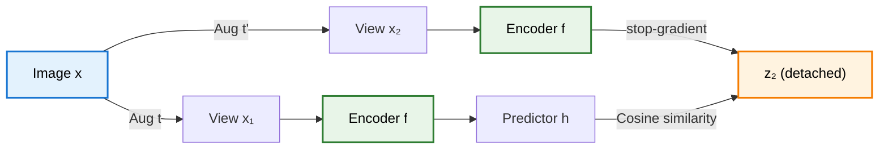

> **TL;DR**: Supervised learning needs labels. Labels are expensive. Self-supervised learning sidesteps this by learning visual representations from unlabeled data. SimCLR does it with contrastive learning -- augment an image two ways, pull the augmented views together in embedding space, push everything else apart. It works brilliantly but needs massive batch sizes to provide enough negatives. BYOL removes negatives entirely using an online-target architecture with momentum updates, and somehow does not collapse. SimSiam goes further -- no negatives, no momentum encoder, just a Siamese network with stop-gradient. Each step in this progression removes a component that was thought essential, revealing that the Siamese architecture itself is the core inductive bias driving self-supervised visual learning.

> These paper reviews are written more for me and less for others. LLMs have been used in formatting
{: .prompt-tip }

---

## The Problem: Labels Are Expensive

Modern deep learning follows a familiar pattern. Collect a massive labelled dataset, train a large model, beat benchmarks. ImageNet has 1.2 million hand-labelled images. This works -- but it does not scale. Labelling is slow, expensive, and error-prone. Worse, it limits us to the data we can afford to annotate.

Meanwhile, the internet is drowning in unlabelled images. Billions of photos, videos, satellite imagery -- all sitting there, useless to supervised learning because nobody has drawn bounding boxes around them. The question is simple: **can we learn useful visual features without any labels at all?**

The answer is self-supervised learning. The idea: construct a supervised signal from the data itself. Define a pretext task that requires no human annotation, train a model on it, then transfer the learned representations to downstream tasks. If the pretext task is well-designed, the representations it forces the model to learn will be broadly useful.

Contrastive learning is one such approach, and it has produced some of the strongest results in self-supervised visual representation learning. The story begins with SimCLR.

---

## SimCLR: A Simple Framework for Contrastive Learning

SimCLR (Chen et al., 2020) strips contrastive learning down to its essentials. No specialised architectures. No memory banks. Just data augmentation, an encoder, a projection head, and a contrastive loss. The simplicity is the point -- and the results are remarkable.

### The Core Idea

Take an image $x$. Apply two different random augmentations to produce two views $\tilde{x}\_i$ and $\tilde{x}\_j$. These are the **positive pair** -- two distorted versions of the same image that should have similar representations. Every other augmented image in the batch forms a **negative pair** with each view.

The training objective: pull positive pairs together in embedding space, push negative pairs apart.

### Data Augmentation: The Secret Weapon

SimCLR argues that the choice of augmentation matters more than the architecture. The authors run a full grid search over all pairwise compositions of augmentations -- crop, resize, colour distortion, Gaussian blur, rotation, cutout -- and find that **random cropping combined with colour distortion** dominates everything else.

Why cropping? It forces the model to learn both global-to-local context (a crop of a dog's face should match the full dog) and adjacent-view context (two non-overlapping crops of the same image should still be recognised as related). This is a powerful learning signal.

Why colour distortion on top of that? Because without it, the model takes a shortcut. Different crops of the same image tend to have nearly identical colour histograms across RGB channels. A lazy network learns to map those histograms rather than extracting semantic features -- shapes, textures, object structure. Colour jittering destroys the histogram shortcut and forces the network to learn the real thing. It is like taking away a student's calculator so they actually learn the math.

The strength of augmentation matters too. Stronger colour distortion consistently improves results -- unlike supervised learning, where aggressive augmentation eventually hurts. The unsupervised objective benefits from harder invariance constraints.

### Encoder and Projection Head

The encoder $f$ is a standard ResNet-50. Nothing exotic. It produces a representation $h\_i = f(\tilde{x}\_i)$.

Here is the interesting part. SimCLR does **not** apply the contrastive loss directly to $h$. Instead, a small two-layer MLP projection head $g$ maps $h$ to a lower-dimensional embedding $z\_i = g(h\_i)$, and the loss is computed on $z$.

Why? Because the contrastive loss discards information. The projection head $g$ acts as an information bottleneck -- it absorbs the damage. The representation $h$ before the projection head retains far more information about the input, as shown by t-SNE visualisations where $h$ exhibits much cleaner class separation than $z$. After training, the projection head is thrown away. Only $f$ and its representations $h$ are kept for downstream tasks.

The authors verify this by using both $h$ and $z$ to predict which augmentations were applied to the input. The $h$ representation is significantly better, confirming that it preserves information that the contrastive loss would otherwise destroy.

### The NT-Xent Loss

SimCLR uses the **Normalised Temperature-scaled Cross-Entropy (NT-Xent)** loss. For a positive pair $(i, j)$ in a batch of $N$ images (yielding $2N$ augmented views):

$$\ell_{i,j} = -\log \frac{\exp(\text{sim}(z_i, z_j) / \tau)}{\sum_{k=1}^{2N} \mathbf{1}_{[k \neq i]} \exp(\text{sim}(z_i, z_k) / \tau)}$$

where $\text{sim}(z\_i, z\_j) = z\_i^\top z\_j / (\lVert z\_i \rVert \lVert z\_j \rVert)$ is the cosine similarity and $\tau$ is a temperature parameter.

The numerator measures the similarity between the positive pair. The denominator normalises over all other views in the batch -- including the $2(N-1)$ negative pairs. The loss pushes the positive pair's similarity up relative to all negatives.

The temperature $\tau$ controls the sharpness of the distribution. Lower $\tau$ makes the loss more sensitive to hard negatives (images that are dissimilar but have high similarity scores). The authors find $\tau = 0.5$ works well.

### Why Large Batches Matter

Here is the catch. The negatives in NT-Xent come from the batch. A batch of $N = 256$ gives $2 \times 255 = 510$ negatives per positive pair. A batch of $N = 8192$ gives over 16,000 negatives. More negatives means a richer signal -- the model sees a wider variety of "things this image is not" and learns more discriminative representations.

SimCLR's performance scales almost linearly with batch size. Going from 256 to 8192 yields substantial accuracy gains. This is a fundamental limitation: you need large batches, which means many GPUs, which means significant compute. Not everyone has Google-scale infrastructure.

### Scaling Up

Three additional findings round out SimCLR:

- **Wider networks help more in unsupervised learning.** Increasing the ResNet-50 width multiplier from 1x to 4x gives larger accuracy gains under contrastive pre-training than under supervised training. Unsupervised learning benefits more from scale.
- **Longer training helps.** Training for 1000 epochs instead of 100 continues to improve accuracy, unlike supervised learning which saturates earlier.
- **Global batch normalisation matters.** With data parallelism across GPUs, local batch normalisation can introduce shortcuts. Global batch norm across the entire batch prevents this.

### Results

On ImageNet linear evaluation (freeze the encoder, train a linear classifier on top), SimCLR with a ResNet-50 (4x width) matches the accuracy of a supervised ResNet-50. On semi-supervised and transfer learning benchmarks, SimCLR pre-trained models outperform supervised baselines, especially with limited labelled data. The gap widens with less supervision -- exactly where self-supervised learning should shine.

---

## BYOL: Bootstrap Your Own Latent

SimCLR works. But the reliance on negatives is a problem. Large batches are expensive. Memory banks are clunky. And there is a subtler issue: by random chance, two images in a batch might contain the same object, and the loss would push them apart -- a false negative. BYOL (Grill et al., 2020) asks: can we ditch negative pairs entirely?

The answer, against all intuition, is yes.

### The Collapse Problem

Why do contrastive methods need negatives? Without them, the loss only has the "pull positive pairs together" signal. The trivial solution: map every input to the same constant vector. Similarity is maximised. Loss is zero. Representations are useless. This is **representation collapse**, and it is the central challenge of negative-free self-supervised learning.

### A Crazy Experiment

The authors start with a thought experiment turned real experiment. Take two copies of a network. Freeze one (randomly initialised). Train the other to predict the frozen network's representations. This avoids collapse -- the frozen network provides a non-trivial target. But the target is garbage, so the representations should be garbage too.

Surprisingly, the trained (online) network achieves 18.8% top-1 accuracy on ImageNet linear evaluation. The frozen (target) network gets 1.4%. The online network learned *something* useful from a random target. This finding is the core motivation for BYOL: even a poor target can bootstrap a better representation.

### The Architecture

BYOL builds on this observation with two networks:

- **Online network** ($\theta$): encoder $f\_\theta$, projector $g\_\theta$, and an additional **predictor** $q\_\theta$. This is the network being trained.
- **Target network** ($\xi$): encoder $f\_\xi$ and projector $g\_\xi$. Same architecture as the online network but **no predictor** and **no gradient updates**.

The target parameters $\xi$ are an **exponential moving average (EMA)** of the online parameters $\theta$:

$$\xi \leftarrow \tau \xi + (1 - \tau) \theta$$

with $\tau = 0.99$ (or higher). The target network is a slow-moving, smoothed version of the online network.

{: w="600" }
_The online network has the predictor $q\_\theta$ — the target network does not. The target's weights are an exponential moving average of the online's. This asymmetry is what prevents collapse._

### The Loss

No contrastive loss. Just **mean squared error** between the L2-normalised prediction of the online network and the L2-normalised projection of the target network:

$$\mathcal{L}_\theta = \left\lVert \bar{q}_\theta(z_\theta) - \bar{z}'_\xi \right\rVert^2$$

where the bar denotes L2 normalisation. The loss is symmetrised by swapping which view goes through which network and summing the two terms.

Gradients flow only through the online network. The target network receives no gradients -- it updates only through the EMA. This is a **stop-gradient** operation on the target side, and it turns out to be crucial.

### Why Doesn't It Collapse?

This is the mystery. There are no negatives to prevent collapse. The online and target networks have the same architecture. The EMA means they eventually converge to similar parameters. Why does the whole thing not collapse to a constant?

The authors do not have a formal proof. But they identify the key components through ablation:

**The predictor $q\_\theta$ is essential.** Removing it causes collapse. The asymmetry between the online network (which has the predictor) and the target network (which does not) is what prevents the trivial solution. The predictor maps from the online projection space to the target projection space, and this asymmetry breaks the symmetry that would allow collapse.

**The EMA provides stability.** Setting $\tau = 1$ (never update the target) gives the random-target experiment -- works but poorly. Setting $\tau = 0$ (target is an exact copy of the online network) causes collapse. The sweet spot is $\tau \approx 0.99$: the target changes slowly, providing a stable but gradually improving signal.

Interestingly, later work showed that the EMA is not strictly necessary -- you can make the target an exact copy of the online network ($\tau = 0$) *if* the predictor is updated more aggressively (higher learning rate or more update steps). The EMA provides training stability, but the predictor is the real collapse-prevention mechanism.

The authors hypothesise that the target network's main role is to keep the predictor near-optimal throughout training. A stable target means the predictor can track it. A wildly changing target would make the predictor lag behind, destabilising training.

### Results and Robustness

BYOL achieves 74.3% top-1 accuracy on ImageNet linear evaluation with a standard ResNet-50, outperforming SimCLR and matching or exceeding other self-supervised baselines.

But the real wins are in robustness:

- **Batch size sensitivity.** Reducing batch size from 4096 to 256 drops BYOL's accuracy by only 0.6%. SimCLR drops by 3.4%. Without negatives, BYOL does not need large batches.
- **Augmentation sensitivity.** Removing colour distortion and using cropping only drops BYOL by about 13 percentage points. SimCLR drops by about 28. BYOL is incentivised to retain *all* information captured by the target, not just the information needed to distinguish positives from negatives. Even if augmented views share the same colour histogram, BYOL retains additional features because the target representation contains them.

{: w="520" }

---

## SimSiam: Simple Siamese Representation Learning

BYOL removed negatives. But it introduced a momentum encoder -- the EMA-updated target network. SimSiam (Chen & He, 2021) asks: do we even need that?

### The Architecture

SimSiam is almost aggressively simple. Two copies of the same encoder (a true Siamese network -- identical weights, not EMA). One side has a predictor MLP $h$. The other side has a **stop-gradient**.

Given two augmented views $x\_1$ and $x\_2$ of the same image:

$$\mathcal{L} = -\frac{1}{2}\left[\text{sim}(h(f(x_1)),\ \text{stopgrad}(f(x_2))) + \text{sim}(h(f(x_2)),\ \text{stopgrad}(f(x_1)))\right]$$

where $\text{sim}$ is the negative cosine similarity, $f$ is the encoder (with projector), and $h$ is the predictor.

That is the entire method. No negatives. No momentum encoder. No memory bank. No clustering. Just a Siamese network, a predictor on one side, and stop-gradient on the other.

The loss is symmetrised: compute it once with the predictor on the $x\_1$ side and stop-gradient on the $x\_2$ side, then swap.

### Why Stop-Gradient Is All You Need

The authors run a critical ablation: remove the stop-gradient. The model immediately collapses -- the output converges to a constant vector, and the loss drops to its minimum value trivially. The stop-gradient is not optional. It is the mechanism that prevents collapse.

But *why* does stop-gradient prevent collapse? The authors provide an elegant hypothesis based on an analogy to **Expectation-Maximisation (EM)**.

### The EM Interpretation

Consider the following alternating optimisation problem. Define:

$$\mathcal{L}(\theta, \eta) = \mathbb{E}\left[\lVert f_\theta(x_1) - \eta_{x_2} \rVert^2\right]$$

where $\theta$ are the network parameters and $\eta$ is a set of target vectors (one per image). This decomposes into two sub-problems:

1. **E-step**: fix $\theta$, solve for the optimal $\eta$. The solution is $\eta\_{x\_2} = \mathbb{E}[f\_\theta(x\_2)]$ -- the mean representation across augmentations.
2. **M-step**: fix $\eta$, update $\theta$ by gradient descent on $\mathcal{L}$.

This is exactly the structure of k-means: compute centroids from assignments, then reassign points to centroids. The stop-gradient implements this alternation -- when we compute the loss, the target side is treated as a fixed value (the "E-step" output), and only the predictor side receives gradients (the "M-step"). The predictor $h$ approximates the E-step by learning to predict the expected representation.

SimSiam implements this EM-like alternation *within a single forward-backward pass*, which is why it works with standard SGD and does not require the explicit two-phase structure of actual EM.

### Comparison with Prior Methods

The paper provides a unifying view of self-supervised methods through the lens of the Siamese architecture:

| Method | Negative samples | Momentum encoder | Stop-gradient | Extra components |
|--------|:---:|:---:|:---:|---|
| **SimCLR** | Yes | No | No | Large batches |
| **MoCo** | Yes (queue) | Yes | Yes | Memory queue |
| **BYOL** | No | Yes | Yes | Predictor + EMA |
| **SwAV** | No (clustering) | No | No | Online clustering |
| **SimSiam** | No | No | Yes | Predictor only |

SimSiam strips everything down to the minimal set: the Siamese architecture and stop-gradient.

### Results

On ImageNet linear evaluation, SimSiam with ResNet-50 achieves comparable accuracy to SimCLR, MoCo v2, BYOL, and SwAV. On transfer learning benchmarks (COCO object detection and instance segmentation), SimSiam matches or outperforms the others.

The key finding is not that SimSiam beats everything -- it is that it *matches* everything while being dramatically simpler. The Siamese architecture with stop-gradient is the core component. Everything else -- negatives, momentum encoders, clustering -- is scaffolding.

---

## The Progression: What Is Actually Necessary?

The story from SimCLR to BYOL to SimSiam is one of progressive simplification. Each paper removes a component that the previous paper relied on, and performance barely changes.

**SimCLR** establishes the contrastive framework. It needs:
- Strong data augmentation (especially crop + colour distortion)
- An encoder with a projection head
- The NT-Xent contrastive loss
- **Large batch sizes** (for negatives)

**BYOL** removes negative pairs. It replaces the contrastive loss with a simple MSE and introduces:
- An online-target architecture
- **Momentum updates** (EMA) for the target
- A predictor head on the online side
- Stop-gradient on the target side

**SimSiam** removes the momentum encoder. It keeps only:
- The Siamese architecture (shared weights)
- A predictor head on one side
- **Stop-gradient** on the other side

Each step peels away a layer of complexity. What remains is the minimum viable self-supervised learner: two views of the same image, an encoder, a predictor, and stop-gradient. The progression reveals that the Siamese inductive bias -- the assumption that two views of the same image should have similar representations -- is the load-bearing component. Everything else is a mechanism to prevent collapse, and stop-gradient turns out to be the simplest one that works.

---

## Key Takeaways

- Supervised learning's dependence on labelled data does not scale. Self-supervised learning constructs learning signals from the data itself, unlocking the use of massive unlabelled datasets
- **SimCLR** shows that contrastive learning works with a simple framework: augment twice, encode, project, and apply NT-Xent loss. The projection head is critical -- it absorbs information loss from the contrastive objective, keeping the encoder representations rich
- Data augmentation is not an afterthought. Random crop + colour distortion is the winning combination. Colour distortion prevents the colour histogram shortcut; cropping forces global-to-local and adjacent-view understanding
- SimCLR's reliance on large batches (for negatives) is a practical bottleneck. Performance scales with batch size, which means it scales with compute budget
- **BYOL** eliminates negative pairs entirely using an online-target architecture with EMA updates. The predictor head creates asymmetry that prevents collapse. The result: far less sensitivity to batch size and augmentation choice
- **SimSiam** removes the momentum encoder too. A plain Siamese network with stop-gradient and a predictor achieves comparable results. The stop-gradient acts as an implicit EM-like alternating optimisation
- The progression SimCLR $\to$ BYOL $\to$ SimSiam reveals that the **Siamese architecture** and **stop-gradient** are the core components. Negatives, momentum encoders, and clustering are useful but not essential

---

## Further Reading

- **A Simple Framework for Contrastive Learning of Visual Representations (SimCLR)**: [Chen et al., 2020](https://arxiv.org/abs/2002.05709)
- **Bootstrap Your Own Latent (BYOL)**: [Grill et al., 2020](https://arxiv.org/abs/2006.07733)
- **Exploring Simple Siamese Representation Learning (SimSiam)**: [Chen & He, 2021](https://arxiv.org/abs/2011.10566)
- **Momentum Contrast for Unsupervised Visual Representation Learning (MoCo)**: [He et al., 2020](https://arxiv.org/abs/1911.05722)
- **Unsupervised Learning of Visual Features by Contrasting Cluster Assignments (SwAV)**: [Caron et al., 2020](https://arxiv.org/abs/2006.09882)
- **Emerging Properties in Self-Supervised Vision Transformers (DINO)**: [Caron et al., 2021](https://arxiv.org/abs/2104.14294)
- **Few-Shot Learning with MAML and Prototypical Networks**: []() -- a related approach to learning with limited labels, but through meta-learning rather than self-supervision

---
