> **TL;DR**: Yoshua Bengio's 2003 paper "A Neural Probabilistic Language Model" is the Genesis of modern NLP. Before this paper, language models were statistical counting machines. After it, they became neural networks that could learn distributed representations of words. This work laid the groundwork for everything from Word2Vec to GPT.

> These paper reviews are written more for me and less for others. LLMs have been used in formatting
{: .prompt-tip }


## The Problem: Traditional Language Models Hit a Wall

### The Curse of Dimensionality in Language

Imagine you're trying to predict the next word in a sentence. Traditional **n-gram models** (think trigrams, 4-grams) worked like this:

$$P(\text{word}_t | \text{word}_{t-1}, \text{word}_{t-2}) = \frac{\text{Count}(\text{word}_{t-2}, \text{word}_{t-1}, \text{word}_t)}{\text{Count}(\text{word}_{t-2}, \text{word}_{t-1})}$$

**The fundamental problems:**

1. **🕳️ Sparsity**: Most n-grams never appear in training data
2. **🚫 No generalization**: "The cat is running" tells us nothing about "The dog is running"
3. **💾 Storage explosion**: Need to store counts for every possible n-gram combination
4. **❌ Zero probability**: Unseen n-grams get probability 0, breaking the model

### The Band-Aid Solutions

Techniques like **Kneser-Ney smoothing** tried to fix this by redistributing probability mass:

> **Kneser-Ney Insight**: Instead of just counting frequency, ask "How likely is a word to appear in novel contexts?"
> 
> - "Francisco" appears often, but only after "San"  
> - "Kong" appears less, but in diverse contexts ("Hong Kong", "King Kong")
> - For novel contexts, "Kong" is more likely than "Francisco"

But these were still fundamentally limited by treating words as **discrete, unrelated symbols**.

---

## Bengio's Breakthrough: Words as Geometry

### The Revolutionary Insight

**What if words weren't discrete symbols but points in a continuous vector space where semantically similar words are close together?**

This single insight changed everything. Instead of:
```
cat = symbol_1247
dog = symbol_2891
```

We get:
```
cat = [0.2, -0.8, 0.5, ..., 0.1]  # 50-dimensional vector
dog = [0.3, -0.7, 0.4, ..., 0.2]  # Close to cat in vector space!
```

### The Architecture That Changed NLP

```mermaid
graph LR
    A[Input: word indices<br/>w₁, w₂, w₃] --> B[Word Embeddings<br/>e₁, e₂, e₃]
    B --> C[Concatenate<br/>Context Vector]
    C --> D[Hidden Layer<br/>tanh activation]
    D --> E[Output Layer<br/>Linear transform]
    E --> F[Softmax<br/>Probability distribution]
    
    style A stroke:#4a90e2,stroke-width:2px
    style B stroke:#7ed321,stroke-width:2px
    style C stroke:#f5a623,stroke-width:2px
    style D stroke:#d0021b,stroke-width:2px
    style E stroke:#9013fe,stroke-width:2px
    style F stroke:#50e3c2,stroke-width:2px
```



**The Mathematical Flow:**

1. **Input**: Sequence of word indices $[w_{t-n+1}, ..., w_{t-1}]$
2. **Embeddings**: $[e(w_{t-n+1}), ..., e(w_{t-1})] \in \mathbb{R}^{(n-1) \times m}$
3. **Concatenation**: $x = [e(w_{t-n+1}); ...; e(w_{t-1})] \in \mathbb{R}^{(n-1)m}$
4. **Hidden Layer**: $h = \tanh(Wx + b) \in \mathbb{R}^h$
5. **Output**: $y = Uh + d \in \mathbb{R}^{\lvert V \rvert}$
6. **Probabilities**: $P(w_t \mid \text{context}) = \text{softmax}(y)$

---

## Why This Architecture Was Brilliant

### 1. Solving the Curse of Dimensionality

**Traditional approach:**
- Need to see every possible n-gram
- Parameters grow exponentially with vocabulary

**Neural approach:**
- Learn continuous representations
- Interpolate between seen examples
- Parameters grow linearly with vocabulary

### 2. Automatic Feature Discovery

The network automatically learns:
- **Syntactic features**: Verbs cluster together, nouns cluster together
- **Semantic features**: Animals, colors, actions form natural groups
- **Compositional structure**: "running" is close to "run" + temporal marker

### 3. The Magic of Generalization

If the model learns:
- "The cat is sleeping"
- "The dog is barking"

It can generalize to:
- "The cat is barking" (syntactically valid)
- "The dog is sleeping" (makes perfect sense)

---

## Technical Deep Dive

### The Embedding Magic

Each word $w$ gets mapped to a learned vector $e(w) \in \mathbb{R}^m$:

$$\text{embedding_matrix}[w] = [e_1, e_2, ..., e_m]$$

**Why this works:**
- Similar words get similar vectors through backpropagation
- **Geometric relationships** emerge: $\text{king} - \text{man} + \text{woman} \approx \text{queen}$
- **Generalization**: "cat runs" helps with "dog runs"

### The Neural Components

**Hidden Layer Transformation:**
$$h = \tanh(W \cdot \text{concat}(\text{embeddings}) + b)$$

- **tanh activation**: Provides non-linearity, bounded output [-1,1]
- **Concatenation**: Treats context as one big feature vector
- **Weight sharing**: Same $W$ for all positions

**Output Layer:**

$$\text{logits} = U \cdot h + d$$

$$P(\text{word} | \text{context}) = \text{softmax}(\text{logits})$$

### Training Dynamics: Where the Magic Happens

**Backpropagation Flow:**
1. **Loss computation**: Cross-entropy between predicted and actual next word
2. **Output layer gradients**: Standard softmax gradients
3. **Hidden layer gradients**: Backprop through tanh
4. **Embedding gradients**: 🎯 **This is where the magic happens!**

**Embedding Update Intuition:**
- Words in similar contexts get **pulled together**
- Words in different contexts get **pushed apart**
- **Smooth interpolation** emerges in embedding space

---

## Experimental Results & Revolutionary Impact

### Performance Breakthroughs

**Penn Treebank Results:**
- Traditional trigram: ~170 perplexity
- Bengio's model: ~109 perplexity
- **🚀 35% improvement in perplexity!**

> **What is Perplexity?**  
> Perplexity measures how "surprised" a language model is by test data. If perplexity = 100, the model is as uncertain as if it had to choose uniformly among 100 words. **Lower perplexity = Better model**.

### Qualitative Discoveries

**Learned Word Clusters:**
- **Numbers**: one, two, three, four...
- **Days**: Monday, Tuesday, Wednesday...
- **Verbs**: running, walking, jumping...
- **Animals**: cat, dog, horse, bird...

---

## The Limitations That Sparked Future Research

### 1. The Softmax Bottleneck

**The Problem:**
$$P(w_t | \text{context}) = \frac{\exp(\text{score}(w_t))}{\sum_{w \in V} \exp(\text{score}(w))}$$

Computing this requires |V| forward passes for normalization!

**Solutions (developed later):**
- **Hierarchical Softmax** (Morin & Bengio, 2005)
- **Negative Sampling** (Mikolov et al., 2013)
- **Noise Contrastive Estimation** (Mnih & Teh, 2012)

### 2. Fixed Context Window

- Only looks at $n-1$ previous words
- Can't capture long-range dependencies
- **Solution**: RNNs, LSTMs, eventually Transformers

### 3. Sequential Processing Bottleneck

- Must process words one by one
- No parallelization during training
- **Solution**: Attention mechanisms, Transformers

---

## Historical Context: The Lineage of Ideas

### What Came Before
- **Shannon (1948)**: Information theory foundations
- **Brown et al. (1992)**: Statistical language modeling
- **Kneser-Ney (1995)**: Sophisticated smoothing

### The Direct Lineage


---

## Modern Perspective: What We Learned

### 1. Embeddings Are Universal

**Key Insight**: Any discrete symbol can be embedded in continuous space
- **Vision**: Patch embeddings in Vision Transformers
- **Audio**: Learned audio representations  
- **Code**: Code embeddings for programming languages
- **Molecules**: Chemical compound embeddings

### 2. Scale Changes Everything

**Bengio's Scale (2003):**
- Vocabulary: ~17k words
- Embeddings: 30-100 dimensions
- Hidden units: 50-200

**Modern Scale (2024):**
- Vocabulary: 50k+ tokens
- Embeddings: 768-12,288 dimensions  
- Parameters: Billions to trillions

### 3. The Architecture Evolution

**Bengio's insight + Modern architectures:**

| Component | Bengio (2003) | Modern Evolution |
|-----------|---------------|------------------|
| **Context** | Fixed n-gram window | Global attention (Transformers) |
| **Processing** | Sequential | Parallel processing |
| **Memory** | No memory | Long-range dependencies |
| **Scale** | Thousands of params | Trillions of parameters |

---

## Why This Paper Is Foundational

### 1. The Paradigm Shift

**Before**: Language is discrete symbols + statistics  
**After**: Language is continuous geometry + learning

### 2. Unified Framework

This paper showed that **neural networks could learn language structure** without hand-crafted features. This insight scales to:
- **Translation**: Encoder-decoder architectures
- **Question Answering**: Reading comprehension models
- **Generation**: GPT-style autoregressive models

### 3. Philosophical Impact

**Distributed Representations**: The idea that meaning emerges from patterns in high-dimensional space has influenced:
- **Cognitive Science**: How brains might represent concepts
- **AI Safety**: Understanding model representations
- **Interpretability**: Probing what networks learn

---

## Implementation Insights

### Key Design Decisions Explained

**Why concatenation instead of averaging?**
- Preserves **positional information**
- Allows learning **position-specific patterns**
- More expressive than simple averaging

**Why tanh activation?**
- **Bounded output** prevents exploding gradients
- **Smooth gradients** for better optimization
- **Zero-centered** unlike sigmoid

**Why this specific architecture?**
- **Feedforward**: Simpler than RNNs (which barely worked in 2003)
- **Single hidden layer**: Computational constraints of the era
- **Fixed window**: Tractable optimization

---

## The Comparison Matrix

| Method | Strengths | Weaknesses | Perplexity (Penn Treebank) |
|--------|-----------|------------|----------------------------|
| **N-gram + Kneser-Ney** | Fast, interpretable | No generalization, sparse | ~170 |
| **Bengio Neural LM** | Generalization, embeddings | Slow training, fixed window | ~109 |
| **Modern Transformers** | Long context, parallelizable | Massive compute requirements | ~20-50 |

---

## The Legacy: From 2003 to ChatGPT

### Direct Descendants

1. **Word2Vec (2013)**: Simplified Bengio's approach, focused only on embeddings
2. **GloVe (2014)**: Global statistics + local context
3. **ELMo (2018)**: Contextualized embeddings
4. **BERT (2018)**: Bidirectional encoder representations
5. **GPT (2018+)**: Autoregressive generation at scale
6. **ChatGPT (2022)**: Conversational AI built on these foundations

### The Fundamental Insight That Persists

**Every modern language model** uses Bengio's core insight:
> Words are points in continuous space where meaning emerges from geometric relationships

---

## Conclusion: The Paper That Changed Everything

Bengio's 2003 paper wasn't just a technical contribution—it was a **conceptual revolution**. The idea that we could learn continuous representations of discrete symbols fundamentally changed how we think about language and meaning.

**The revolution wasn't just neural networks for language—it was learning continuous representations of discrete symbols.**

Today, when you ask ChatGPT a question, when Google Translate converts text between languages, when your phone's autocomplete suggests the next word—you're witnessing the legacy of this single paper.

**Key Takeaways:**
- 🧠 **Distributed representations** are more powerful than discrete symbols
- 🎯 **Neural networks** can learn language structure automatically  
- 📈 **Geometric relationships** in embedding space capture semantic meaning
- 🚀 **Generalization** comes from continuous interpolation between examples

The next time someone talks about "embeddings" or "neural language models," remember: it all started with Bengio's simple but revolutionary idea that words could be points in space.

---

## Further Reading

- **Original Paper**: [A Neural Probabilistic Language Model (Bengio et al., 2003)](http://www.jmlr.org/papers/volume3/bengio03a/bengio03a.pdf)
- **Word2Vec**: [Efficient Estimation of Word Representations in Vector Space](https://arxiv.org/abs/1301.3781)
- **Attention Is All You Need**: [The Transformer Paper](https://arxiv.org/abs/1706.03762)
- **BERT**: [Pre-training of Deep Bidirectional Transformers](https://arxiv.org/abs/1810.04805)

---
