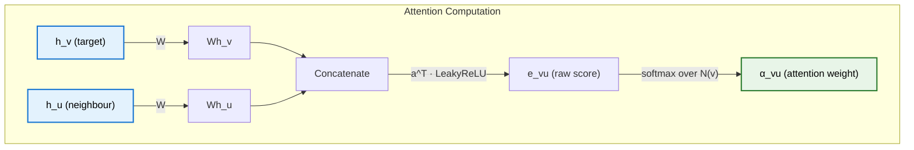

> **TL;DR**: Not all data lives on grids or in sequences. Social networks, molecules, citation graphs -- these are naturally graphs, and CNNs and RNNs cannot handle them. Graph Neural Networks solve this through message passing: each node aggregates information from its neighbours, combines it with its own features, and updates its representation. GCN (Kipf & Welling) does this with a fixed weighting scheme based on node degree -- symmetric normalisation that prevents feature blowup and acts as a learnable neighbourhood smoother. GAT (Velickovic et al.) replaces fixed weights with learned attention coefficients, letting the model decide which neighbours matter more. Both are instances of the same AGGREGATE-COMBINE-UPDATE framework, and understanding that framework makes every GNN variant click into place.

> These paper reviews are written more for me and less for others. LLMs have been used in formatting
{: .prompt-tip }

---

## Why Graphs?

Deep learning has conquered grids and sequences. CNNs exploit the regular pixel lattice of images. RNNs and Transformers process sequential tokens. But not all data fits these structures.

Consider a social network -- users are nodes, friendships are edges. A molecule -- atoms are nodes, bonds are edges. A citation network -- papers are nodes, citations are edges. A knowledge graph, a road network, a protein interaction map. These are all **graphs**: irregular, non-Euclidean structures with no fixed notion of "left", "right", or "next". You cannot flatten a social network into a sequence without destroying its topology. You cannot arrange a molecule on a pixel grid without losing bond information.

The question is straightforward: **can we build neural networks that operate directly on graphs?**

The answer is Graph Neural Networks (GNNs), and the unifying idea behind them is surprisingly simple -- message passing.

---

## Graph Basics: Notation

A graph $G = (V, E)$ consists of a set of nodes $V$ and edges $E$. For $n$ nodes:

- **Adjacency matrix** $A \in \mathbb{R}^{n \times n}$: entry $A\_{ij} = 1$ if there is an edge from node $i$ to node $j$, and $0$ otherwise. For undirected graphs, $A$ is symmetric.
- **Feature matrix** $X \in \mathbb{R}^{n \times d}$: each row $x\_i \in \mathbb{R}^d$ is the feature vector of node $i$. In a citation network, this might be a bag-of-words representation of the paper. In a social network, it might encode user attributes.
- **Degree matrix** $D$: a diagonal matrix where $D\_{ii} = \sum\_j A\_{ij}$, the number of edges connected to node $i$.

The goal of a GNN is to learn a **node embedding** $h\_i \in \mathbb{R}^{d'}$ for each node that captures both the node's own features and the structure of its local neighbourhood. These embeddings can then be used for node classification, link prediction, or graph-level tasks.

---

## Message Passing: The Unifying Framework

Every GNN layer -- GCN, GAT, GraphSAGE, and dozens of others -- does the same thing at a high level. Each node:

1. **Aggregates** messages from its neighbours
2. **Combines** the aggregated message with its own representation
3. **Updates** its representation through a learnable transformation

This is the **message passing** framework. A single layer looks like this:

$$h_v^{(l)} = \text{UPDATE}\left(h_v^{(l-1)},\ \text{AGGREGATE}\left(\left\{ h_u^{(l-1)} : u \in \mathcal{N}(v) \right\}\right)\right)$$

where $h\_v^{(l)}$ is the embedding of node $v$ at layer $l$, and $\mathcal{N}(v)$ is the set of neighbours of $v$.

{: w="600" }
_GCNs, GATs, and GraphSAGE are simply different architectural flavours of how to aggregate these messages._

The different GNN variants differ only in **how** they implement these three steps:

- **What messages are sent?** Raw features? Linearly transformed features?
- **How are messages aggregated?** Sum? Mean? Attention-weighted sum?
- **How is the node's own information combined?** Concatenation? Addition?

Stacking $L$ message passing layers means each node's final embedding incorporates information from its $L$-hop neighbourhood. One layer = one hop. Two layers = two hops. The receptive field grows with depth, just like in CNNs.

---

## GCN: Graph Convolutional Networks

The Graph Convolutional Network (Kipf & Welling, 2017) is arguably the most influential GNN architecture. It starts from spectral graph theory but simplifies aggressively to arrive at an elegant, practical layer.

### The Key Equation

A single GCN layer computes:

$$H^{(l+1)} = \sigma\left(\tilde{D}^{-1/2} \tilde{A} \tilde{D}^{-1/2} H^{(l)} W^{(l)}\right)$$

where:

- $\tilde{A} = A + I$ is the adjacency matrix with **self-loops** added (so each node also "receives a message from itself")
- $\tilde{D}$ is the degree matrix of $\tilde{A}$, i.e., $\tilde{D}\_{ii} = \sum\_j \tilde{A}\_{ij}$
- $H^{(l)} \in \mathbb{R}^{n \times d}$ is the matrix of node embeddings at layer $l$ (with $H^{(0)} = X$)
- $W^{(l)} \in \mathbb{R}^{d \times d'}$ is a learnable weight matrix
- $\sigma$ is a nonlinear activation (typically ReLU)

That is the entire layer. Let us unpack what each piece does.

### Why Self-Loops?

Without self-loops, the aggregation step gathers information only from a node's neighbours -- the node's own features are ignored. Adding $I$ to $A$ means every node is connected to itself. When we aggregate, the node's own feature vector participates in the sum alongside its neighbours' features. This is the COMBINE step folded into the AGGREGATE step.

### Why Symmetric Normalisation?

The term $\tilde{D}^{-1/2} \tilde{A} \tilde{D}^{-1/2}$ is the **symmetric normalisation** of the adjacency matrix. To understand why it matters, consider what happens without it.

If we just compute $\tilde{A} H W$, we are summing the (transformed) features of all neighbours plus the node itself. A node with 1,000 neighbours gets a sum 100 times larger than a node with 10 neighbours. The feature magnitudes blow up for high-degree nodes, causing training instability.

A simple fix would be to divide by the degree: $\tilde{D}^{-1} \tilde{A} H W$. This computes the **mean** of neighbour features. But this treats source and target nodes asymmetrically -- it normalises by the target node's degree but ignores the source node's degree.

The symmetric normalisation $\tilde{D}^{-1/2} \tilde{A} \tilde{D}^{-1/2}$ accounts for the degree of **both** endpoints. For a single node $v$, the update becomes:

$$h_v^{(l+1)} = \sigma\left(\sum_{u \in \mathcal{N}(v) \cup \{v\}} \frac{1}{\sqrt{\tilde{d}_v} \cdot \sqrt{\tilde{d}_u}} h_u^{(l)} W^{(l)}\right)$$

where $\tilde{d}\_v = \tilde{D}\_{vv}$. Messages from high-degree nodes are downweighted -- the intuition being that a celebrity in a social network sends the same generic information to millions of followers, so their message should carry less weight per recipient.

### A Numerical Example

Consider a small citation network with three papers:

- **Paper A** (ML paper): feature vector $[1, 0]$
- **Paper B** (DL paper): feature vector $[0, 1]$
- **Paper C** (ML + DL): feature vector $[1, 1]$

Edges: A cites B, A cites C, B cites C.

$$A = \begin{bmatrix} 0 & 1 & 1 \\ 0 & 0 & 1 \\ 0 & 0 & 0 \end{bmatrix}$$

Adding self-loops:

$$\tilde{A} = A + I = \begin{bmatrix} 1 & 1 & 1 \\ 0 & 1 & 1 \\ 0 & 0 & 1 \end{bmatrix}$$

The degree matrix $\tilde{D} = \text{diag}(3, 2, 1)$ (row sums of $\tilde{A}$). Then:

$$\tilde{D}^{-1/2} \tilde{A} \tilde{D}^{-1/2} = \begin{bmatrix} 1/3 & 1/\sqrt{6} & 1/\sqrt{3} \\ 0 & 1/2 & 1/\sqrt{2} \\ 0 & 0 & 1 \end{bmatrix}$$

Multiplying by the feature matrix $X$:

$$\hat{A}X = \begin{bmatrix} 1/3 & 1/\sqrt{6} & 1/\sqrt{3} \\ 0 & 1/2 & 1/\sqrt{2} \\ 0 & 0 & 1 \end{bmatrix} \begin{bmatrix} 1 & 0 \\ 0 & 1 \\ 1 & 1 \end{bmatrix}$$

Node A (which cites both B and C) aggregates information from all three nodes including itself. Node C (cited by others but citing nobody) only sees its own features. The asymmetry in the directed graph shows up directly in the aggregated representations -- nodes that cite more papers get richer feature mixtures.

This is the **feature smoothing** effect of GCN. The weight matrix $W$ and activation $\sigma$ then transform this aggregated representation into something useful for the downstream task. The key point: **GCN acts as a learnable neighbourhood smoother**.

### Stacking Layers = Multi-Hop

A single GCN layer mixes one-hop neighbourhoods. Stacking two layers means each node's representation incorporates two-hop information -- neighbours of neighbours. Three layers, three hops.

But there is a catch: **over-smoothing**. Too many layers and every node's representation converges to the same vector -- all local structure is washed out. In practice, 2-3 layers works best for most tasks.

### Viewing GCN Through Message Passing

In the message passing framework, GCN implements:

- **Message**: $m\_{u \to v} = \frac{1}{\sqrt{\tilde{d}\_v \cdot \tilde{d}\_u}} h\_u W$
- **Aggregation**: sum over neighbours (including self)
- **Update**: apply activation $\sigma$

The weights are fully determined by the graph structure (node degrees). No learnable parameters in the aggregation itself -- only in the transformation $W$.

{: w="560" }
_GCNs weight neighbours by degree alone. A trusted signal and spam get the same treatment -- we need a way to learn connection value from content, not just topology._

---

## GAT: Graph Attention Networks

GCN treats all neighbours the same (modulo degree normalisation). But not all neighbours are equally informative. In a citation network, a paper might cite a foundational work and a tangentially related paper -- these should not contribute equally to the representation.

Graph Attention Networks (Velickovic et al., 2018) address this by replacing the fixed degree-based weighting with **learned attention coefficients**. The model itself decides how much weight to give each neighbour.

If you are familiar with the attention mechanism from Transformers, the intuition is similar -- but applied to graph-structured data rather than sequences. For a detailed treatment of attention, see .

### The Attention Mechanism

For a target node $v$ and a neighbour $u$, GAT computes an **attention score** $e\_{vu}$ that measures how important $u$'s message is to $v$:

$$e_{vu} = \text{LeakyReLU}\left(\mathbf{a}^\top \left[W h_v \, \| \, W h_u\right]\right)$$

where:

- $W \in \mathbb{R}^{d' \times d}$ is a learnable linear projection (shared across all nodes)
- $\mathbf{a} \in \mathbb{R}^{2d'}$ is a learnable attention vector
- $\lVert$ denotes concatenation
- LeakyReLU introduces nonlinearity

The raw attention scores are then **normalised** across the neighbourhood using softmax:

$$\alpha_{vu} = \text{softmax}_u(e_{vu}) = \frac{\exp(e_{vu})}{\sum_{k \in \mathcal{N}(v)} \exp(e_{vk})}$$

These normalised coefficients $\alpha\_{vu}$ sum to 1 over all neighbours of $v$.

{: w="520" }
_Each neighbour gets a learned attention weight. The model assigns 0.8 to the most informative neighbour and 0.1 to the rest — all softmax-normalised._

The node update is then:

$$h_v' = \sigma\left(\sum_{u \in \mathcal{N}(v)} \alpha_{vu} \, W h_u\right)$$

### Why Attention Matters

Compare GCN and GAT for a target node $v$:

- **GCN**: the weight of neighbour $u$'s message is $\frac{1}{\sqrt{\tilde{d}\_v \cdot \tilde{d}\_u}}$ -- determined entirely by graph structure. A node with degree 100 always has its message downweighted, regardless of content.
- **GAT**: the weight $\alpha\_{vu}$ depends on the **features** of both $v$ and $u$. A highly relevant neighbour gets a large weight even if it has high degree. An irrelevant neighbour gets a small weight even if it has low degree.

This is strictly more expressive. The model can learn which neighbours to attend to based on the task.

### Multi-Head Attention

Just like in Transformers, GAT uses **multi-head attention** to stabilise training and capture different types of relationships. With $K$ attention heads:

$$h_v' = \Big\|_{k=1}^{K} \sigma\left(\sum_{u \in \mathcal{N}(v)} \alpha_{vu}^{(k)} \, W^{(k)} h_u\right)$$

where $\lVert$ denotes concatenation across heads. Each head has its own $W^{(k)}$ and $\mathbf{a}^{(k)}$, learning to attend to different aspects of the neighbourhood. For the final layer, concatenation is replaced by averaging:

$$h_v' = \sigma\left(\frac{1}{K}\sum_{k=1}^{K} \sum_{u \in \mathcal{N}(v)} \alpha_{vu}^{(k)} \, W^{(k)} h_u\right)$$

The original paper uses $K = 8$ heads in hidden layers and $K = 1$ (or averaged multi-head) in the output layer.

### GAT Through Message Passing

In the message passing framework:

- **Message**: $m\_{u \to v} = \alpha\_{vu} \, W h\_u$ (attention-weighted, linearly transformed)
- **Aggregation**: sum over neighbours
- **Update**: apply activation $\sigma$

The key difference from GCN: the aggregation weights $\alpha\_{vu}$ are **learned functions of the node features**, not fixed functions of graph topology.

---

## GraphSAGE: Sampling for Scale

GCN and GAT both require the full graph during training -- every node aggregates over all its neighbours. For graphs with millions of nodes, this is computationally intractable. The receptive field grows exponentially with depth: a 2-layer GCN on a node with average degree 100 touches $100^2 = 10{,}000$ nodes.

{: w="520" }
_The neighbourhood explosion problem. Each layer expands the receptive field — two hops in a dense graph quickly exceeds GPU memory._

GraphSAGE (Hamilton, Ying, Leskovec, 2017) addresses this with two key ideas:

**Neighbour sampling.** Instead of aggregating over all neighbours, sample a fixed number (say, 2-3) per layer. This caps the computational cost per node regardless of degree. Information is lost, but it makes training on massive graphs feasible.

**Inductive capability.** GCN is **transductive** -- it operates on a fixed graph and cannot generalise to unseen nodes without retraining on the full graph. GraphSAGE is **inductive**: because it learns an aggregation function (not node-specific embeddings), it can generate embeddings for new nodes by applying the same learned function to their neighbourhoods.

The GraphSAGE update rule explicitly separates the node's own features from the neighbourhood aggregation:

$$h_v^{(l)} = \sigma\left(W^{(l)} \cdot \left[h_v^{(l-1)} \, \| \, \text{AGG}\left(\{h_u^{(l-1)} : u \in \mathcal{N}_s(v)\}\right)\right]\right)$$

where $\mathcal{N}\_s(v)$ is a **sampled** subset of neighbours and $\lVert$ denotes concatenation. The aggregation function can be mean, LSTM, or max-pooling. The concatenation with the node's own features ensures self-information is preserved -- a design choice that GCN handles implicitly through self-loops.

---

## Comparison: GCN vs GAT

| | **GCN** | **GAT** |
|---|---|---|
| **Neighbour weighting** | Fixed, based on node degree | Learned, based on node features |
| **Aggregation** | Symmetric normalisation | Attention-weighted sum |
| **Expressiveness** | All neighbours of same degree are treated equally | Can distinguish between neighbours of same degree |
| **Parameters** | Only in transformation $W$ | In $W$, attention vector $\mathbf{a}$, and multi-head variants |
| **Computational cost** | Cheaper (no attention computation) | More expensive (pairwise attention scores) |
| **When to use** | Homogeneous graphs, limited compute | Heterogeneous neighbourhoods, when neighbour importance varies |

Both are instances of message passing. GCN is the simpler baseline -- fast, effective, and often good enough. GAT is more expressive but costs more. The choice depends on whether the task benefits from learning which neighbours matter.

{: w="560" }

---

## Key Takeaways

- Not all data is grids or sequences. Graphs are the natural structure for social networks, molecules, citation networks, and knowledge graphs. GNNs operate directly on this structure
- The **message passing framework** unifies all GNN variants: each node aggregates information from neighbours, combines it with its own features, and updates through a learnable transformation. AGGREGATE, COMBINE, UPDATE
- **GCN** implements message passing with symmetric degree normalisation: $H' = \sigma(\tilde{D}^{-1/2}\tilde{A}\tilde{D}^{-1/2}HW)$. Self-loops ensure a node's own features are included. The normalisation prevents feature blowup for high-degree nodes. It is effectively a learnable neighbourhood smoother
- Stacking GCN layers expands the receptive field -- $L$ layers means $L$-hop neighbourhood information. But too many layers cause **over-smoothing**, where all node representations converge
- **GAT** replaces fixed degree-based weights with learned attention coefficients. The attention mechanism uses LeakyReLU and softmax to compute per-edge weights that depend on the features of both source and target nodes. Multi-head attention stabilises this and captures different relationship types
- **GraphSAGE** enables GNNs on massive graphs through neighbour sampling and provides inductive capability -- new nodes can be embedded without retraining the full graph
- The progression from GCN to GAT mirrors a familiar pattern: start with a simple, fixed scheme (degree normalisation) and replace it with something learned (attention). The cost is compute; the gain is expressiveness

---

## Further Reading

- **Semi-Supervised Classification with Graph Convolutional Networks (GCN)**: [Kipf & Welling, 2017](https://arxiv.org/abs/1609.02907)
- **Graph Attention Networks (GAT)**: [Velickovic et al., 2018](https://arxiv.org/abs/1710.10903)
- **Inductive Representation Learning on Large Graphs (GraphSAGE)**: [Hamilton, Ying & Leskovec, 2017](https://arxiv.org/abs/1706.02216)
- **Neural Message Passing for Quantum Chemistry (MPNN)**: [Gilmer et al., 2017](https://arxiv.org/abs/1704.01212)
- **How Powerful are Graph Neural Networks? (GIN)**: [Xu et al., 2019](https://arxiv.org/abs/1810.00826)
- **Attention Mechanism**: []() -- the attention mechanism that GAT adapts from sequence models to graphs

---
